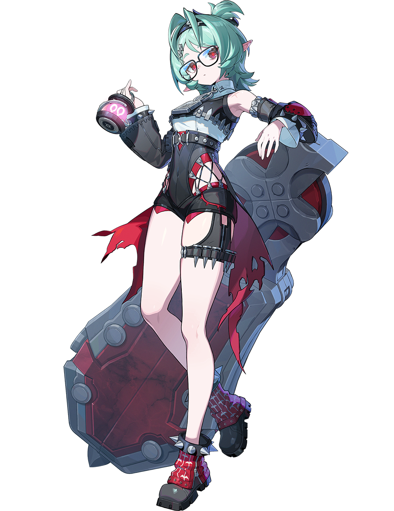

# 火与辉光 · 洛克茜 Roxy — 2026.08.28
> 视频类型：A · 角色单人壁纸合集
> 角色名称：洛克茜·伊芙莉塔·普莱斯（Roxy Ifritta Price）
> 所属游戏：绝区零（Zenless Zone Zero）3.2「她与她的隐秘往事」
> 角色定位：S级 · 风属性 · 击破
> 所属阵营：罗斯凯利法 · 弗林特工坊（Flint Workshop）
> 身份：克拉蕾·弗林特的随从兼管家 / 神秘棺材商
> 热点背景：绝区零3.2版本前瞻直播于8月28日19:30正式开启，洛克茜作为版本双新S级代理人之一官方档案已于8月初公开，社区对「棺材商」「冷调暗黑+黑色幽默」人设讨论度持续走高
> 今日特殊：前瞻直播日当天，蹭版本前瞻峰值热度
> 选定类型与角色理由：前瞻直播为SKILL.md定义的最高优先级热点；洛克茜未在工作区覆盖；同版本另一新角色克拉蕾已于8月10日做过；社区对「弗林特工坊」「棺材梗」「一个人顶十个」等话题热度高
> 统一画风：highly detailed anime-style illustration, polished 3D-cel-shaded game-art quality, vibrant yet dark urban-fantasy atmosphere with teal and crimson accents

---

## 1（弗林特工坊 · 火与辉光 — 风格定义图）

Positive Prompt:
16:9 2K wallpaper, Roxy Ifritta Price from Zenless Zone Zero, highly detailed anime-style illustration, polished 3D-cel-shaded game-art quality, vibrant yet dark urban-fantasy atmosphere with teal and crimson accents.

Depict Roxy standing beside her massive coffin-shaped weapon-shield in the heart of the Flint Workshop, the industrial forge of Roscalifa. Her six defining features command the scene: teal-green hair swept into two upward-pointing twin-tails with a black headband, asymmetrical bangs swept to the right partially covering her right eye; large black-rimmed glasses framing her visible crimson-red eyes with a cool, deadpan gaze; small pointed pink elf-like ears peeking through her hair; a sleeveless white high-neck top layered with black mechanical shoulder armor and chest harness straps; a black leather corset-bodice with silver triangular studs and a silver-buckled belt; red diamond-lattice cutouts on her left hip revealing red fishnet beneath; red tattered fabric streamers hanging from her waist; her right arm equipped with a bulky cylindrical mechanical gauntlet featuring a glowing pink circular core displaying an infinity symbol; her left arm in a black-and-red arm guard with silver spikes; a black spiked thigh strap on her right thigh; chunky red-and-black platform boots with silver studded ankle straps. Perfect hands, five fingers on each hand, anatomically correct hands, well-defined fingers, natural hand pose, detailed hands, clean finger separation.

The Flint Workshop surrounds her: an industrial forge with roaring furnaces casting orange-red light, showers of golden sparks flying from an anvil, walls lined with weapon racks and coffin-blueprints, heavy iron chains hanging from the ceiling, and the workshop's motto "Fire and Radiance, Forge My Blood and Bone" glowing in neon teal on a steel beam overhead. Her massive coffin-shield — dark gray metal with large circular rivets and a crimson inner lining — stands upright beside her like a silent sentinel. Wind-element energy swirls around her feet in pale teal spirals, lifting sparks and ash into the air. Color palette: teal-green, crimson-red, gunmetal gray, forge-orange, industrial silver. Epic symmetrical composition with Roxy as the unmistakable focal point, dramatic rim lighting from the forge illuminating her glasses and the pink glow of her gauntlet core.

Negative Prompt:
low quality, worst quality, blurry, pixelated, bad anatomy, bad hands, extra fingers, fewer fingers, missing fingers, fused fingers, webbed fingers, merged fingers, overlapping fingers, deformed fingers, mutated fingers, six fingers, four fingers, three fingers, more than five fingers, less than five fingers, disfigured hands, poorly drawn hands, bad hand anatomy, asymmetrical hands, broken fingers, claw hands, blurry hands, indistinct fingers, smeared hands, extra limbs, chibi, photorealistic, wrong hair color, wrong eye color, missing glasses, missing elf ears, missing mechanical gauntlet, missing coffin-shield, casual modern clothing, text, watermark, logo, signature.

---

## 2（特写肖像 · 辉金棺材钉）

Refer to the attached image (Figure 1). Generate a cinematic close-up portrait of Roxy Ifritta Price from Zenless Zone Zero.

She holds a single gleaming golden coffin nail close to the right side of her face, the nail's sharp tip partially obscuring her right eye. Her visible left eye gazes directly at the viewer through her large black-rimmed glasses — crimson-red, luminous, and impossibly calm, staring with an expression that is simultaneously professional and quietly unhinged, the look of a butler who has catalogued seventeen "last times" and still shows up for work. Expression: detached, faintly amused indifference, the barest ghost of a smirk that never reaches her eyes, as if the coffin nail reminds her of a customer review she is genuinely curious to receive. Dramatic single-source lighting from the upper left casts deep chiaroscuro across her features, the golden nail glowing warm amber where the light catches its polished surface, a faint teal wind-energy wisp curling around its tip. Her pale skin contrasts sharply against a pure black background. Her signature teal-green twin-tails and asymmetrical bangs frame the composition; her black leather corset collar is only barely visible at the bottom edge. "A coffin merchant who believes in customer satisfaction, one burial at a time." 16:9 2K wallpaper.

Negative Prompt:
low quality, worst quality, blurry, pixelated, bad anatomy, bad hands, extra fingers, fewer fingers, missing fingers, fused fingers, webbed fingers, merged fingers, overlapping fingers, deformed fingers, mutated fingers, six fingers, four fingers, three fingers, more than five fingers, less than five fingers, disfigured hands, poorly drawn hands, bad hand anatomy, asymmetrical hands, broken fingers, claw hands, blurry hands, indistinct fingers, smeared hands, extra limbs, chibi, full body shot, wide shot, landscape, multiple subjects, busy background, bright cheerful lighting, outdoor scene, action pose, weapon drawn, wrong hair color, wrong eye color, missing glasses, missing elf ears, text, watermark, logo, signature.

---

## 3（风棺破阵 · 战斗动态）

Referring to the attached image (Figure 1), generate a similar style image for Roxy Ifritta Price from Zenless Zone Zero in a dynamic combat scene.

Depict Roxy mid-battle, her massive coffin-shield raised high above her head as she brings it down in a devastating overhead smash. She wears her full canonical design: the black leather corset with silver studs, red diamond-lattice hip cutouts, red tattered waist streamers, mechanical gauntlet with glowing pink infinity core, black spiked thigh strap, and chunky red-black platform boots. Her teal-green twin-tails whip upward in the wind of her own strike. Her crimson eyes behind black-rimmed glasses are narrowed in cold focus, her elf ears perked with alert tension. The coffin-shield — dark gray metal with large rivets and crimson lining — impacts the ground with explosive force, sending cracks through the pavement and releasing a shockwave of teal wind-element energy that spirals outward like a hurricane funnel. Sparks of forge-fire mix with the wind. Her left hand steadies the shield's edge. Each hand has exactly five perfectly defined fingers. Perfect hands, five fingers on each hand, anatomically correct hands, well-defined fingers, natural hand pose, detailed hands, clean finger separation.

The urban combat zone is a ruined street in New Eridu: shattered holographic billboards, twisted metal wreckage, and Hollow-corruption tendrils creeping along the walls. Neon signs flicker in teal and crimson. The composition is dynamic diagonal, capturing the moment of maximum impact. Color palette: teal wind energy, crimson lining glow, gunmetal gray, forge-spark orange, urban neon. Keep the same polished 3D-cel-shaded anime style and dark urban atmosphere as the reference image.

Negative Prompt:
low quality, worst quality, blurry, pixelated, bad anatomy, bad hands, extra fingers, fewer fingers, missing fingers, fused fingers, webbed fingers, merged fingers, overlapping fingers, deformed fingers, mutated fingers, six fingers, four fingers, three fingers, more than five fingers, less than five fingers, disfigured hands, poorly drawn hands, bad hand anatomy, asymmetrical hands, broken fingers, claw hands, blurry hands, indistinct fingers, smeared hands, extra limbs, chibi, peaceful scene, sunny day, cheerful atmosphere, missing glasses, missing elf ears, missing mechanical gauntlet, missing coffin-shield, wrong hair color, wrong eye color, text, watermark, logo, signature.

---

## 4（维尔乌姆深夜 · 锤声与棺影）

Referring to the attached image (Figure 1), generate a similar style image for Roxy Ifritta Price from Zenless Zone Zero in a noir urban night setting.

Depict Roxy leaning casually against her upright coffin-shield in a narrow back alley of Virum at midnight, the scene drenched in moody noir atmosphere. She wears her full canonical design, the black leather corset and red diamond-lattice cutouts catching the dim amber glow of a single flickering streetlamp overhead. Her teal-green hair is slightly disheveled, one twin-tail drooping while the other stands alert. Her crimson eyes behind black-rimmed glasses reflect the lamplight with an unreadable expression — neither threatening nor welcoming, simply inevitable, like a coffin merchant who knows you will eventually need her services. Her right mechanical gauntlet rests on the coffin-shield's riveted surface, the pink infinity core pulsing softly in the darkness. Her left hand is tucked into the pocket of her shorts. Each hand has exactly five perfectly defined fingers. Perfect hands, five fingers on each hand, anatomically correct hands, well-defined fingers, natural hand pose, detailed hands, clean finger separation.

The alley is pure noir cinematography: wet cobblestones reflecting the streetlamp in long shimmering lines, steam rising from a distant grate, graffiti-covered brick walls, and in the background, the faint silhouette of the Flint Workshop's smokestacks against a starless sky. A stray cat watches from a dumpster. The only sound implied is the distant "clank" of a hammer. Color palette: deep noir blue-black, amber streetlamp, teal hair glow, crimson eye reflection, gunmetal gray. Keep the same polished anime style, film-noir atmosphere, and urban mystery mood as the reference image.

Negative Prompt:
low quality, worst quality, blurry, pixelated, bad anatomy, bad hands, extra fingers, fewer fingers, missing fingers, fused fingers, webbed fingers, merged fingers, overlapping fingers, deformed fingers, mutated fingers, six fingers, four fingers, three fingers, more than five fingers, less than five fingers, disfigured hands, poorly drawn hands, bad hand anatomy, asymmetrical hands, broken fingers, claw hands, blurry hands, indistinct fingers, smeared hands, extra limbs, chibi, bright daylight, sunny weather, cheerful atmosphere, missing glasses, missing elf ears, missing mechanical gauntlet, missing coffin-shield, wrong hair color, wrong eye color, text, watermark, logo, signature.

---

## 5（工坊管家日常 · 遇到困难请大喊洛克茜）

Referring to the attached image (Figure 1), generate a similar style image for Roxy Ifritta Price from Zenless Zone Zero in the Flint Workshop library.

Depict Roxy standing before an impossibly tall bookshelf in the Flint Workshop, a heavy leather-bound ledger in her left hand and a mechanical stylus in her right. She wears her full canonical design, but with a black workshop apron tied over her corset — the apron bears the Flint Workshop crest in silver thread. Her teal-green hair is neatly tied with a silver clip. Her crimson eyes behind black-rimmed glasses scan the ledger with focused intensity, her elf ears twitching slightly as she notices the viewer. Her expression is the perfect deadpan of a butler who has just noted that the budget is 3.2 times the estimate for the seventeenth time. Her mechanical gauntlet rests at her side, the pink core dimmed to a sleepy glow. The coffin-shield stands in the corner like a piece of oversized furniture. Perfect hands, five fingers on each hand, anatomically correct hands, well-defined fingers, natural hand pose, detailed hands, clean finger separation.

The library is a chaotic wonder: books stacked by an arcane system known only to Roxy (sorted by publication year, author surname, and series number), blueprints pinned to corkboards, half-finished mechanical prototypes on workbenches, and a tea set precariously balanced on a stack of coffin-design manuals. Warm workshop lighting from industrial pendant lamps creates a cozy, cluttered atmosphere. Color palette: warm wood brown, teal accent lighting, silver metal, black leather, soft pink gauntlet glow. Keep the same polished anime style and intimate workshop atmosphere as the reference image.

Negative Prompt:
low quality, worst quality, blurry, pixelated, bad anatomy, bad hands, extra fingers, fewer fingers, missing fingers, fused fingers, webbed fingers, merged fingers, overlapping fingers, deformed fingers, mutated fingers, six fingers, four fingers, three fingers, more than five fingers, less than five fingers, disfigured hands, poorly drawn hands, bad hand anatomy, asymmetrical hands, broken fingers, claw hands, blurry hands, indistinct fingers, smeared hands, extra limbs, chibi, outdoor scene, bright sunlight, missing glasses, missing elf ears, missing mechanical gauntlet, wrong hair color, wrong eye color, text, watermark, logo, signature.

---

## 6（都市机能风改造 · 午夜送货人）

Referring to the attached image (Figure 1), generate a similar style image for Roxy Ifritta Price from Zenless Zone Zero in a modern techwear aesthetic.

Depict Roxy walking through a rain-soaked New Eridu street at 3 AM, dressed in a modern techwear reinterpretation of her design: a fitted black tactical vest with silver buckles over a cropped white compression top, black cargo shorts with red accent zippers and mesh side panels, a long red asymmetrical tech-fabric sash trailing from her waist, black fingerless tactical gloves on both hands, a thigh-mounted utility pouch on her right leg replacing the spiked strap, and chunky black combat boots with red LED accents. She retains her signature teal-green twin-tails, black-rimmed glasses, and crimson eyes. Her elf ears are covered by a black headband with a small teal LED strip. She pushes a wheeled industrial dolly carrying a sleek, coffin-shaped delivery crate marked with the Flint Workshop logo. Her expression is tired but professional — the face of someone who has canceled a meeting so her boss could sleep five more minutes. Perfect hands, five fingers on each hand, anatomically correct hands, well-defined fingers, natural hand pose, detailed hands, clean finger separation.

The New Eridu street is cyberpunk-dystopian: holographic advertisements flicker in teal and crimson, rain-slicked asphalt reflects the neon, automated delivery drones buzz overhead, and the distant Flint Workshop chimney glows like a lighthouse. The mood is tired, lonely, and quietly determined. Color palette: rain-blue, neon teal, crimson accent, black techwear, silver metal. Keep the same polished anime style and urban cyberpunk atmosphere as the reference image.

Negative Prompt:
low quality, worst quality, blurry, pixelated, bad anatomy, bad hands, extra fingers, fewer fingers, missing fingers, fused fingers, webbed fingers, merged fingers, overlapping fingers, deformed fingers, mutated fingers, six fingers, four fingers, three fingers, more than five fingers, less than five fingers, disfigured hands, poorly drawn hands, bad hand anatomy, asymmetrical hands, broken fingers, claw hands, blurry hands, indistinct fingers, smeared hands, extra limbs, chibi, medieval clothing, fantasy dress, formal gown, beach background, sunny weather, missing glasses, missing elf ears, wrong hair color, wrong eye color, text, watermark, logo, signature.

---

## 7（涂鸦墙街头风 · 棺匠街区女王）

Positive Prompt:
16:9 2K wallpaper, Roxy Ifritta Price from Zenless Zone Zero, highly detailed anime-style illustration, vibrant graffiti art style, urban street art aesthetic, spray paint texture, bold outlines, neon color accents.

Depict Roxy sitting casually in front of a bold graffiti wall in a post-apocalyptic urban sector. She is seated in a relaxed but confident posture, leaning back against the graffiti wall with one knee raised and her other leg stretched out casually atop her massive coffin-shield which lies horizontally on the ground like a bench, her body language calm, controlled, and slightly provocative. Her expression should show cold, disdainful eyes, aloof, sharp, and superior, as if she is silently judging the viewer.

Keep Roxy's recognizable features: her teal-green twin-tails with black headband, asymmetrical bangs swept to the right, large black-rimmed glasses framing her crimson-red eyes, small pointed pink elf-like ears, and her signature mechanical gauntlet with glowing pink infinity core. Blend her canonical design with a modern edgy streetwear aesthetic: she wears a black cropped tube top with a red diamond-mesh print, an open cropped black leather jacket with silver studs draped loosely off one shoulder, a high-waisted black pleated mini skirt with a silver chain belt and red tattered streamers, sheer black thigh-high stockings with a single silver spike band at the top, and chunky black platform boots with red laces and silver studs. Layered silver necklaces with a tiny coffin nail pendant, a choker with a pink infinity charm, and multiple thin bracelets on her gauntlet wrist complete the look. Preserve her identity while giving her a fresh urban street-style look.

The graffiti wall behind her should be vivid and layered, full of expressive abstract shapes and energetic street-art textures in teal and crimson tones, with graffiti elements including stylized "ROXY" lettering in flowing script, a large coffin silhouette spray-painted beside her head, forge-hammer and anvil motifs, flame stencils, the Flint Workshop logo, and dripping paint effects. A few spray paint cans in teal, crimson, and black sit casually on the ground beside the coffin-shield. The wall surface shows realistic cracked concrete and layered paint texture, with subtle neon light reflections casting a cool teal glow across the scene. Add subtle teal wind-energy wisps drifting lazily in the air and a few glowing pink sparks from her gauntlet core, reinforcing her identity without softening the mood.

Use a wide cinematic framing suitable for a 16:9 wallpaper, with Roxy as the main focal point while still showing enough of the graffiti wall and surrounding urban environment for atmosphere. The mood should feel cool, stylish, intimidating, and mysterious. Highly detailed background, rich shadows, teal and crimson glowing highlights, sharp focus on Roxy, and a refined high-end anime illustration look.

Negative Prompt:
low quality, worst quality, blurry, pixelated, bad anatomy, bad hands, extra fingers, fewer fingers, missing fingers, fused fingers, webbed fingers, merged fingers, overlapping fingers, deformed fingers, mutated fingers, six fingers, four fingers, three fingers, more than five fingers, less than five fingers, disfigured hands, poorly drawn hands, bad hand anatomy, asymmetrical hands, broken fingers, claw hands, blurry hands, indistinct fingers, smeared hands, extra limbs, chibi, photorealistic, standing, standing pose, upright posture, singing, open mouth singing, warm smile, gentle smile, cheerful expression, cute expression, adorable, sweet, innocent, game canonical outfit, official costume, fantasy dress, medieval clothing, armor, full gown, formal dress, beach background, ocean background, nature background, indoor background, plain background, minimal background, missing graffiti wall, low detail graffiti, generic graffiti, wrong graffiti colors, wrong streetwear, missing crop top, missing jacket, missing shorts, missing skirt, long dress, full pants, business suit, school uniform, wrong hair color, wrong eye color, missing glasses, missing elf ears, text, watermark, logo, signature.

---

## 8（3.2前瞻直播日特别版 · 后台调试中）

Referring to the attached image (Figure 1), generate a similar style image for Roxy Ifritta Price from Zenless Zone Zero in a livestream backstage setting.

Depict Roxy in the backstage control room of the Zenless Zone Zero Version 3.2 livestream studio, adjusting a broadcast camera with her mechanical gauntlet while glancing at a monitor showing the countdown to the live show. She wears her full canonical design, but with a Flint Workshop staff lanyard around her neck and a pair of oversized studio headphones pushed up onto her forehead above her glasses. Her teal-green twin-tails are slightly frizzy from the studio heat. Her crimson eyes behind black-rimmed glasses reflect the glow of multiple screens, showing a rare expression of mild stress — the "I am handling seventeen things at once and the budget is already 3.2 times over" face. Her left hand holds a clipboard with a checklist. The pink infinity core on her gauntlet pulses in sync with the broadcast lights. Perfect hands, five fingers on each hand, anatomically correct hands, well-defined fingers, natural hand pose, detailed hands, clean finger separation.

The backstage is chaotic energy: cables snaking across the floor, neon "ON AIR" signs in teal and crimson, holographic countdown timers floating in the air, stacks of coffin-shaped promotional boxes labeled "3.2," a half-empty coffee cup balanced on the console, and through the glass window behind her, the empty livestream stage waits with dramatic spotlights. The mood is frantic, professional, and secretly exciting. Color palette: studio blue, broadcast teal, crimson ON AIR glow, screen white, warm coffee brown. Keep the same polished anime style and contemporary backstage atmosphere as the reference image.

Negative Prompt:
low quality, worst quality, blurry, pixelated, bad anatomy, bad hands, extra fingers, fewer fingers, missing fingers, fused fingers, webbed fingers, merged fingers, overlapping fingers, deformed fingers, mutated fingers, six fingers, four fingers, three fingers, more than five fingers, less than five fingers, disfigured hands, poorly drawn hands, bad hand anatomy, asymmetrical hands, broken fingers, claw hands, blurry hands, indistinct fingers, smeared hands, extra limbs, chibi, outdoor scene, medieval setting, missing glasses, missing elf ears, missing mechanical gauntlet, wrong hair color, wrong eye color, text, watermark, logo, signature.

---

## 9（竖屏壁纸 · 棺匠之门）

Positive Prompt:
9:16 2K vertical wallpaper, Roxy Ifritta Price from Zenless Zone Zero, highly detailed anime-style illustration, polished 3D-cel-shaded game-art quality, dramatic vertical composition, cinematic low-angle shot.

Depict Roxy standing before the massive reinforced doors of the Flint Workshop, shot from a dramatically low angle that emphasizes her imposing presence despite her petite stature. The towering steel doors, decorated with rivets and the workshop's flaming-anvil emblem, frame her perfectly. She is backlit by the crimson glow of the forge streaming through the partially open doors, creating a powerful silhouette effect — her teal-green twin-tails glowing like a halo around her dark outline, her coffin-shield standing upright beside her. Her crimson eyes behind black-rimmed glasses are the only clearly visible facial features, glowing like embers in the darkness. She holds a massive forge hammer in her right mechanical gauntlet. Her left hand pushes the workshop door open. Each hand has exactly five perfectly defined fingers. Perfect hands, five fingers on each hand, anatomically correct hands, well-defined fingers, natural hand pose, detailed hands, clean finger separation.

The vertical composition draws the eye upward from the viewer's perspective at ground level, past the scattered metal scraps and tools on the workshop floor, up her black leather corset and red diamond-lattice cutouts, to her cool deadpan face, and finally to the inferno of sparks and flame beyond the doors where weapons are born. The scale is epic and humbling — a customer's view of approaching the coffin merchant. Color palette: gunmetal gray, forge crimson, teal-green, industrial silver, flame orange. Keep the same polished anime style and dramatic industrial atmosphere.

Negative Prompt:
low quality, worst quality, blurry, pixelated, bad anatomy, bad hands, extra fingers, fewer fingers, missing fingers, fused fingers, webbed fingers, merged fingers, overlapping fingers, deformed fingers, mutated fingers, six fingers, four fingers, three fingers, more than five fingers, less than five fingers, disfigured hands, poorly drawn hands, bad hand anatomy, asymmetrical hands, broken fingers, claw hands, blurry hands, indistinct fingers, smeared hands, extra limbs, chibi, horizontal composition, wide shot, bright cheerful colors, missing glasses, missing elf ears, missing mechanical gauntlet, missing coffin-shield, wrong hair color, wrong eye color, text, watermark, logo, signature.

---

## 10（跨领域参考图 · 工业锻造摄影 × 哥特圣棺油画融合）

Positive Prompt:
16:9 2K wallpaper, Roxy Ifritta Price from Zenless Zone Zero, highly detailed anime-style illustration merged with industrial forge photography and Gothic coffin-apotheosis oil painting aesthetics, polished game-art quality, dramatic chiaroscuro lighting, rich dark palette with crimson and teal accents.

Depict Roxy in a composition directly inspired by Baroque apotheosis paintings and high-speed industrial photography, but rendered in polished anime illustration style. She stands in the center of a swirling vortex of forge sparks and wind energy, her massive coffin-shield positioned behind her like a Gothic cathedral altarpiece — the dark metal surface painted with ornate Gothic scrollwork and crimson velvet lining visible where the doors stand slightly ajar. Her teal-green hair spreads in dynamic motion-capture frozen waves, individual strands catching the forge-light with photographic clarity. Her crimson eyes behind black-rimmed glasses are the emotional center — wide, luminous, and filled with the terrible calm of a craftsman who has built her thousandth coffin and still checks every nail. Her black leather corset with silver studs catches the industrial light like armor. Her mechanical gauntlet with the glowing pink infinity core is raised in the gesture of a blacksmith presenting a finished blade, but she is offering a gleaming coffin nail to the viewer. Each hand has exactly five perfectly defined fingers. Perfect hands, five fingers on each hand, anatomically correct hands, well-defined fingers, natural hand pose, detailed hands, clean finger separation.

The background is pure theatrical fusion: on the left, the gritty realism of an industrial forge — showers of golden sparks frozen mid-air by high-speed photography, heavy iron chains, and billowing steam; on the right, the ethereal grandeur of a Gothic oil painting — crimson drapery swirling like Rubens' dynamic fabric, putti-like mechanical drones playing among the sparks, and a mandorla of divine forge-light framing her figure. Oil paint texture is visible in the drapery and steam, while her face and hands remain in smooth anime rendering — a deliberate fusion of Eastern and Western artistic traditions. The mood is transcendent, industrial, and darkly beautiful. Color palette: forge crimson, gunmetal gray, teal-green, divine gold, industrial silver.

Negative Prompt:
low quality, worst quality, blurry, pixelated, bad anatomy, bad hands, extra fingers, fewer fingers, missing fingers, fused fingers, webbed fingers, merged fingers, overlapping fingers, deformed fingers, mutated fingers, six fingers, four fingers, three fingers, more than five fingers, less than five fingers, disfigured hands, poorly drawn hands, bad hand anatomy, asymmetrical hands, broken fingers, claw hands, blurry hands, indistinct fingers, smeared hands, extra limbs, chibi, flat lighting, modern casual clothing, photorealistic face, missing glasses, missing elf ears, missing mechanical gauntlet, missing coffin-shield, wrong hair color, wrong eye color, text, watermark, logo, signature.

---

## 注

**角色准确外观要点**（经官方立绘视觉确认）：
- 发色：青绿色，双向上翘双马尾，黑色发带，不对称刘海向右遮住右眼
- 瞳色：深红/玫红色，透过黑框大眼镜可见
- 面部：冷淡扑克脸，略带死气沉沉的平静感，小嘴
- 耳部：粉色尖端精灵耳，从发间露出
- 眼镜：黑色粗框大圆眼镜，标志性配饰
- 上衣：白色无袖高领内搭 + 黑色机械肩甲与胸 harness  strap
- 腰部：黑色皮质束腰/紧身衣，银色三角铆钉，银色腰带扣
- 下身：黑色短裤，左侧胯部有红色菱形网格镂空露出红色网袜/绑带内衬
- 腰部垂饰：红色破碎布带/流苏从两侧垂下
- 右臂：大型圆柱形机械拳套，带粉色发光圆形核心（显示∞无限符号）
- 左臂：黑红配色臂甲，带银色尖刺
- 腿部：右腿黑色带刺腿环；左腿无特殊装饰
- 鞋履：红黑厚底松糕靴，银色铆钉踝带
- 武器：巨型棺形盾牌——深灰色金属外壳，大型圆形铆钉，深红内衬，竖立时与她等高
- 体型：娇小但比例成熟，长腿
- 气质：冷调暗黑、黑色幽默、专业管家、棺材商人、死气沉沉的冷静

**参考图说明**：
- `splash-art.png`：B站WIKI角色立绘（透明背景），完整展示服装、发型、机械拳套、棺盾、眼镜、精灵耳
- `splash-art-official-intro.png`：官方档案介绍图（带背景与标语「火与辉光，铸我血骨」），展示表情与姿态

**社区热梗素材**（供titles.md使用）：
- 「棺材的功用虽说单一，但用户评价向来稳定」——官方台词，核心黑色幽默梗
- 「我暂时不曾有幸，受用如此无忧的安眠」——官方台词，棺材推销员气质
- 「所以我也很期待——您的体验反馈」——官方台词，售后评价梗
- 「洛克茜一个人就能顶十个！」——克拉蕾评价，万能管家梗
- 「『最后一次』——第17次；『就一点点』——预算的3.2倍；『我自有分寸』——存疑」——记录克拉蕾发言，吐槽拉满
- 「遇到困难请大喊洛克茜」——官方台词，可靠管家梗
- 「辉金前面的『弗林特』三个字，可不是白叫的」——工坊 pride
- 「再睡五分钟？好的，这就为您取消议事会议」——忠犬管家属性
- 「那位克拉蕾小姐？比起总务官，她更像是…整个罗斯凯利法的大债主吧」——吐槽老板
- 「神秘棺材商」——媒体通稿标签
- 「冷调暗黑与黑色幽默」——人设关键词
- 名字来源：阿拉伯神话火精灵伊芙利特（Ifrit），中间名Ifritta暗示火与锻造
- 8月28日3.2版本前瞻直播日——蹭前瞻峰值热度
