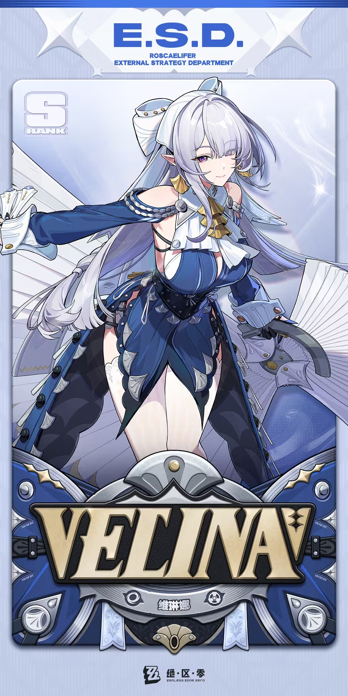
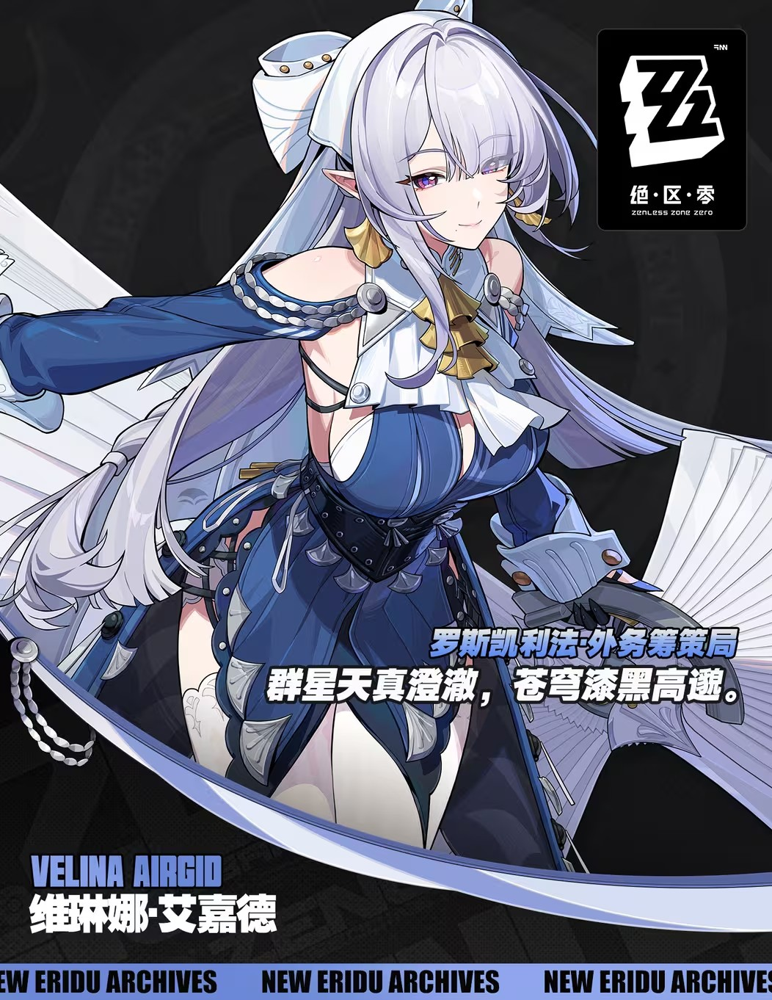

# 群星与苍穹·茶会总务官 — 维琳娜 Velina Airgid — 2026.09.11（补做）
> 视频类型：A · 角色单人壁纸合集
> 角色名称：维琳娜·艾嘉德（Velina Airgid）
> 所属游戏：绝区零（Zenless Zone Zero）· 3.0「某个梦游者的自白」实装，3.2「她与她的隐秘往事」罗斯凯利法篇章延续
> 角色定位：S级 · 风属性 · 异常（绝区零首位风属性角色；广域气旋 + 染色机制，降低敌人风属性异常积蓄抗性）
> 所属阵营：罗斯凯利法 · 外务筹策局（E.S.D. External Strategy Department），初代虚狩「挽昼」直属部下
> 身份：外务筹策局总务官 / 法厄同登上罗斯凯利法后的专属向导 / 茶会的女主人
> 配音：中配张安琪（原神罗莎莉亚、崩坏3伊甸）/ 日配斋藤千和（原神琴、崩铁遐蝶、魔法少女小圆晓美焰）
> 档案引言：「群星天真澄澈，苍穹漆黑高邈。」
> 热点背景：3.2 罗斯凯利法篇章热度延续——克拉蕾×洛克茜主线二创井喷，弗林特工坊相关内容三连发（9/6 壁纸 / 9/8 猫猫 / 9/10 表情包），维琳娜作为罗斯凯利法门面与法厄同向导角色顺势承接；3.2 下半卡池（洛克茜+普罗米娅复刻，9/30）上线后罗斯凯利法话题将持续占据社区
> 选定类型理由：原神 7.1 前瞻明日开播但新角色均已做过；崩铁无可靠当前热点 → 社区热度（25%）由 3.2 罗斯凯利法篇章主导 → 类型 A
> 选定角色理由：工作区全目录核查确认维琳娜从未做过（绝区零已做：11号/克拉蕾/南宫羽/希格莉德/普罗米娅/洛克茜/艾莲/蕾米埃尔）；篇章门面角色 + SP委托「维琳娜的茶会领域」抖音 36.6 万赞 + 「茶会一如既往」PV 名场面，素材与热度双达标
> 参考图校对：`splash-art.png`（B站WIKI 官方档案卡 1052×2104）与 `splash-art-b.png`（NEW ERIDU ARCHIVES 档案立绘 1052×1362）均已用视觉工具确认——银白偏薰衣草的极长卷发（侧边有细辫）、白色军帽式贝雷帽（金铆钉+白色蝴蝶结）、薰衣草紫双眼、尖耳、金色扇形/叶形耳饰、优雅含笑；白色褶皱高领领饰+金色扇形胸饰，深蓝露肩礼裙（右臂长蓝袖、左臂分离式白蓝袖口、肩部黑色束带）、银扣与银链、深蓝束腰（后系带）、层叠花瓣/鱼鳍状裙摆（银灰扇贝形包边）、右腿高开叉+白色蕾丝腿环；手持一把收拢的深灰折扇（金色扇镡）；官方视觉中大量折扇元素；色系：白银+皇家蓝+金+黑
> 修正记录：角色英文名为 VELINA AIRGID（档案卡与档案立绘双确认），此前搜索摘要中的「Welina」为误拼，本文档已统一为 VELINA
> 跨领域参考图：莫奈《撑阳伞的女人》（风元素 × 优雅女性 × 印象派户外光影）因沙盒网络限制未下载本地文件，第 10 条按公有领域名画公开常识做概念引用
> 统一画风：highly detailed anime-style illustration, polished 3D-cel-shaded game-art quality, elegant aristocratic atmosphere with silver-white, royal-blue and gold accents

---

# 必需

## 1 — 涂鸦墙街头风（Graffiti Wall Street Style）

Refer to the attached reference image (Figure 1). Generate a similar style image of Velina Airgid from Zenless Zone Zero sitting in front of a bold graffiti wall. Velina is seated with poised, unhurried elegance on a tall teacup-shaped sculptural stool, legs crossed, spine straight, one arm resting along the armrest while the other hand holds her closed grey folding fan with a gold guard, its tip tapping lightly against her knee like a chairman about to open proceedings. Her body language is refined, composed, and quietly in command — a general affairs director conducting an informal inspection of the street. Her expression should show a cool, subtly amused, evaluating gaze, aloof with the barest hint of a knowing smile, as if she has already decided whether the viewer is worth an invitation to the next tea party — and has not yet shared the verdict.

Keep Velina's recognizable features: extremely long silver-lavender wavy hair flowing past her waist with a thin side braid, a white military-style beret cap with gold studs and a white bow at the back, lavender-violet eyes with a calm elegant gaze, small pointed elf-like ears, and gold fan-shaped drop earrings. Blend her canonical design with a modern edgy streetwear aesthetic: a white ruffled high-neck blouse layered under a cropped royal-blue moto jacket worn off one shoulder, high-waisted pleated shorts with layered scalloped hem panels echoing her fin-shaped skirt edges, a black lace-up corset belt, a white lace garter strap kept on her thigh, and sleek heeled ankle boots in navy with gold buckles. Preserve her identity while giving her a fresh urban street-style look.

The graffiti wall behind her should be vivid and layered, full of expressive abstract shapes and energetic street-art textures in royal blue, silver-white, and gold tones, with graffiti elements including "VELINA" in elegant dripping stencil lettering, a large spray-painted folding fan half-open behind her, a delicate painted tea set motif — teapot, cups and saucers floating in a spiral — a painted wind vortex, and paint-drip effects, creating a rebellious yet refined urban backdrop that resonates with her character theme. Add subtle pale-blue wind spirals and drifting white paper cards around her to reinforce her identity.

Use a wide cinematic framing suitable for a 16:9 wallpaper, with Velina as the main focal point while still showing enough of the graffiti wall and surrounding environment for atmosphere. The mood should feel elegant, composed, quietly authoritative, and stylish. Highly detailed background, rich shadows, royal-blue and gold glowing highlights, sharp focus on Velina, and a refined high-end anime illustration look.

perfect hands, five fingers on each hand, anatomically correct hands, well-defined fingers, natural hand pose, one arm resting along the armrest, the other hand holding the closed fan against her knee.

Negative Prompt:
low quality, worst quality, blurry, pixelated, bad anatomy, extra limbs, bad hands, extra fingers, fewer fingers, missing fingers, fused fingers, webbed fingers, merged fingers, overlapping fingers, deformed fingers, mutated fingers, six fingers, four fingers, three fingers, more than five fingers, less than five fingers, disfigured hands, poorly drawn hands, bad hand anatomy, asymmetrical hands, broken fingers, claw hands, blurry hands, indistinct fingers, smeared hands, standing, standing pose, upright posture, slouching, open mouth singing, shouting, panicked expression, game canonical dress, official gown, fantasy ball gown, medieval clothing, armor, full petticoat, beach background, ocean background, nature background, indoor background, plain background, minimal background, missing graffiti wall, low detail graffiti, generic graffiti, wrong graffiti colors, wrong streetwear, missing beret, missing elf ears, wrong hair color, wrong eye color, text, watermark, logo, signature.

---

## 2 — 折扇半掩·下一席茶会（角色特写肖像 / Close-up Portrait）

Refer to the attached reference image (Figure 2). Generate a cinematic close-up portrait of Velina Airgid from Zenless Zone Zero. She holds her closed grey folding fan with a gold guard elegantly between slender fingers, raised vertically beside her cheek, its tip brushing her ear so that the fan partially veils one lavender-violet eye — the classic gesture of a hostess pausing mid-conversation to weigh what she has just heard. Her visible eye gazes directly at the viewer with serene, courteous poise layered over an unmistakable undertone of evaluation: the expression of a general affairs director deciding, politely and without hurry, whether the viewer deserves a seat at the next tea party — or a politely expedited departure from the guest list. A faint knowing smile rests on her lips, warm in shape and glacial in implication. Dramatic single-source lighting from the upper left casts deep chiaroscuro across her features; cool silver-blue ambient light rims her white beret and the fan's pleated edge, while warm gold light catches her fan-shaped earring. Her pale skin contrasts sharply against a pure black background. Her signature silver-lavender hair with its thin side braid spills over one shoulder; her pointed elf ear silhouettes against the darkness; a pale-blue wisp of wind curls around the fan's tip as if even the breeze is waiting for her verdict. "The hostess of Roscaelifa's eternal tea party — deciding, ever so graciously, whether your invitation will be sent." 16:9 2K wallpaper.

perfect hands, five fingers on each hand, anatomically correct hands, well-defined fingers, fingers elegantly gripping the closed fan's handle.

Negative Prompt:
low quality, worst quality, blurry, pixelated, bad anatomy, extra limbs, bad hands, extra fingers, fewer fingers, missing fingers, fused fingers, webbed fingers, merged fingers, overlapping fingers, deformed fingers, mutated fingers, six fingers, four fingers, three fingers, more than five fingers, less than five fingers, disfigured hands, poorly drawn hands, bad hand anatomy, asymmetrical hands, broken fingers, claw hands, blurry hands, indistinct fingers, smeared hands, full body shot, wide shot, landscape, multiple subjects, busy background, bright cheerful lighting, outdoor scene, action pose, weapon drawn, standing, chibi, missing beret, missing elf ears, wrong hair color, wrong eye color, text, watermark, logo, signature.

---

# 人物设定

## 3 — 外务筹策局·总务官的一天（身份/阵营场景）

Positive Prompt:
16:9 2K wallpaper, Velina Airgid from Zenless Zone Zero, highly detailed anime-style illustration, polished 3D-cel-shaded quality, refined executive atmosphere with royal-blue and gold accents.

Depict Velina in her office at the External Strategy Department of Roscaelifa, a luminous high-rise chamber suspended above the floating sky-city. She stands behind a sleek executive desk of dark lacquered wood, signing an embossed invitation card with a fountain pen held in precise, elegant fingers; her closed grey folding fan with gold guard rests on a neat stack of documents beside an antique blue-and-white tea set arranged in perfect order. Her unmistakable features: extremely long silver-lavender wavy hair with a thin side braid cascading past her waist, white military-style beret with gold studs and a white bow, lavender-violet eyes with a calm, capable gaze, pointed elf ears, and gold fan-shaped earrings. She wears her canonical outfit fully rendered: white ruffled high-neck jabot with a gold fan-shaped cravat ornament, deep royal-blue off-shoulder dress with one long blue sleeve and a detached white-and-blue cuff on the other arm, silver buttons and a silver chain across the chest, black under-straps at the shoulders, a dark navy corset cinch with lacing at the waist, and the layered petal-hem skirt with silver scalloped edges falling over one leg in a high slit, with a white lace garter below.

Around her: floor-to-ceiling arched windows revealing the cloud sea and floating architecture of Roscaelifa, a wall map of the sky-city pinned with silver-route markers, a silver tea service steaming on a side cart, floating pale-blue wind wisps drifting between paperwork, and a small queue of waiting boopui figurines on the shelf. A wall clock reads precisely on schedule — because in her office, 既定之约，绝不失期 — every appointment is kept. The mood is capable, elegant, and quietly majestic — the woman who runs the city's courtesies like a military campaign.

perfect hands, five fingers on each hand, anatomically correct hands, well-defined fingers, one hand signing with the fountain pen, the other hand resting flat on the invitation card.

Negative Prompt:
low quality, worst quality, blurry, pixelated, bad anatomy, extra limbs, bad hands, extra fingers, fewer fingers, missing fingers, fused fingers, webbed fingers, merged fingers, overlapping fingers, deformed fingers, mutated fingers, six fingers, four fingers, three fingers, more than five fingers, less than five fingers, disfigured hands, poorly drawn hands, bad hand anatomy, asymmetrical hands, broken fingers, claw hands, blurry hands, indistinct fingers, smeared hands, wrong hair color, wrong eye color, missing beret, missing elf ears, casual modern streetwear, chibi, photorealistic, horror, text, watermark, logo, signature.

---

## 4 — 茶会领域·既定之约绝不失期（主线名场面场景）

Positive Prompt:
16:9 2K wallpaper, Velina Airgid from Zenless Zone Zero, highly detailed anime-style illustration, polished 3D-cel-shaded game-art quality, surreal elegant tea-party atmosphere with wind elemental effects.

Depict the legendary "Tea Party Domain": Velina as the hostess of an impossibly elegant tea table suspended in a vast open-air pavilion above the cloud sea of Roscaelifa. She stands at the head of the long table in her canonical outfit fully rendered — white ruffled jabot with gold fan ornament, royal-blue off-shoulder dress with asymmetric sleeves, dark corset cinch, layered petal-hem skirt with silver scalloped edges, white lace garter — her silver-lavender hair and white beret perfectly composed despite the gale. With a flick of her wrist she half-opens her grey folding fan with gold guard; from its pleats erupts a controlled pale-blue cyclone that spirals around the banquet, lifting teacups, saucers, sugar cubes and folded invitation cards into an orderly floating carousel — chaos, but curated chaos, every piece of porcelain orbiting in graceful formation.

The long table gleams with a full tea service in blue-and-white porcelain, tiered cake stands, and candles whose flames bend but never extinguish; chairs stand empty and waiting. Pale-teal wind ribbons weave between the floating service, and soft golden evening light breaks through the cloud floor below. Her expression: serene, gracious, and faintly dangerous — the smile of a hostess who has noticed an uninvited guest at the far end of the table, with her visible lavender eye narrowing just slightly. The mood is elegant, surreal, and quietly menacing — a tea party where the weather itself has been assigned seating.

perfect hands, five fingers on each hand, anatomically correct hands, well-defined fingers, one hand holding the half-open fan at shoulder height, the other hand resting gracefully on the back of a chair.

Negative Prompt:
low quality, worst quality, blurry, pixelated, bad anatomy, extra limbs, bad hands, extra fingers, fewer fingers, missing fingers, fused fingers, webbed fingers, merged fingers, overlapping fingers, deformed fingers, mutated fingers, six fingers, four fingers, three fingers, more than five fingers, less than five fingers, disfigured hands, poorly drawn hands, bad hand anatomy, asymmetrical hands, broken fingers, claw hands, blurry hands, indistinct fingers, smeared hands, wrong hair color, wrong eye color, missing beret, missing elf ears, broken shattered porcelain, messy table, horror gore, fire destruction, extra characters at table, chibi, text, watermark, logo, signature.

---

## 5 — 广域气旋·染色协议（动态/战斗场景）

Positive Prompt:
16:9 2K wallpaper, Velina Airgid from Zenless Zone Zero, highly detailed anime-style illustration, dynamic action composition, dramatic Wind elemental anomaly effects, polished 3D-cel-shaded game-art quality, epic battle atmosphere.

Depict Velina mid-battle in a Hollow-corrupted plaza of Roscaelifa, both arms extended as she fully unfurls her grey folding fan with gold guard into a blazing conduit of wind: a colossal wide-area cyclone erupts from the fan's edge, a spiraling pale-teal hurricane column that sweeps Ethereal debris, rain and light shards into a rotating vortex. At the cyclone's heart, her signature "dyeing" effect blooms — the pale-teal wind ribbons shift and bleed into vivid ribbons of electric blue and crimson as the anomaly infuses the storm, painting the battlefield like pigment dispersing in water, while concentric shockwave rings flatten the cracked pavement.

She remains the calm center of the storm: canonical outfit fully rendered — white ruffled jabot with gold fan ornament, royal-blue off-shoulder dress with asymmetric sleeves, dark navy corset cinch, layered petal-hem skirt with silver scalloped edges streaming in the gale, white lace garter — her extremely long silver-lavender hair and thin side braid whipping upward, white beret somehow perfectly level, gold fan-shaped earrings glinting. Her lavender-violet eyes are narrowed in composed, businesslike focus, a faint smile of professional satisfaction — the general affairs director confirming the quarter's targets will be met on schedule. Dynamic diagonal composition with Velina and the fan at the luminous eye of the storm. The color palette contrasts cool silver-blue and royal blue with blazing teal wind energy and ribbons of dyed elemental color. The mood is exhilarating, elegant, and overwhelming — an anomaly applied with the courtesy of a written invitation.

perfect hands, five fingers on each hand, anatomically correct hands, well-defined fingers, both arms extended in elegant open gestures, one hand gripping the fully unfurled fan's handle.

Negative Prompt:
low quality, worst quality, blurry, pixelated, bad anatomy, extra limbs, bad hands, extra fingers, fewer fingers, missing fingers, fused fingers, webbed fingers, merged fingers, overlapping fingers, deformed fingers, mutated fingers, six fingers, four fingers, three fingers, more than five fingers, less than five fingers, disfigured hands, poorly drawn hands, bad hand anatomy, asymmetrical hands, broken fingers, claw hands, blurry hands, indistinct fingers, smeared hands, wrong hair color, wrong eye color, missing beret, missing elf ears, missing fan, weak effects, flat lighting, bright cheerful daylight, cute peaceful expression, fire effects, ice effects, chibi, text, watermark, logo, signature.

---

## 6 — 邦布年检·井然有序（情感/日常/反差）

Positive Prompt:
16:9 2K wallpaper, Velina Airgid from Zenless Zone Zero, highly detailed anime-style illustration, polished 3D-cel-shaded game-art quality, warm humorous daily-life atmosphere.

Depict Velina conducting the annual boopui inspection in a sunlit courtyard of Roscaelifa: a neat queue of small round boopui robots — each wearing a tiny numbered tag — waddles single-file toward her inspection desk, while one rebellious boopui at the back of the line attempts a clumsy escape, its little wheels squeaking. Velina kneels gracefully beside the queue in her canonical outfit — white ruffled jabot with gold fan ornament, royal-blue off-shoulder dress, dark corset cinch, layered petal-hem skirt with silver scalloped edges arranged carefully around her, white lace garter — holding a clipboard in one hand and a small rubber inspection stamp in the other, her closed grey folding fan resting across the clipboard. Her expression: gentle, patient, and faintly resigned — the elegant smile of a director who expected exactly one boopui to run, her lavender-violet eyes crinkled with soft amusement as her pointed ears tilt toward the escapee.

Around her: a checkered tea blanket with a finished tea service at the courtyard's edge, neatly arranged stamp pads and document folders, floating pale-blue wind wisps that gently herd the runaway boopui back into line for her, soft morning light through arched colonnades, and potted white flowers. The mood is warm, adorable, and quietly comedic — an annual inspection conducted with the precision of a state ceremony and the softness of a tea party.

perfect hands, five fingers on each hand, anatomically correct hands, well-defined fingers, one hand holding the clipboard, the other holding the stamp in a natural grip.

Negative Prompt:
low quality, worst quality, blurry, pixelated, bad anatomy, extra limbs, bad hands, extra fingers, fewer fingers, missing fingers, fused fingers, webbed fingers, merged fingers, overlapping fingers, deformed fingers, mutated fingers, six fingers, four fingers, three fingers, more than five fingers, less than five fingers, disfigured hands, poorly drawn hands, bad hand anatomy, asymmetrical hands, broken fingers, claw hands, blurry hands, indistinct fingers, smeared hands, wrong hair color, wrong eye color, missing beret, missing elf ears, battle scene, dark atmosphere, gore, giant boopui, chibi style characters, text, watermark, logo, signature.

---

## 7 — 云端茶沙龙·现代风改造（现代风）

Positive Prompt:
16:9 2K wallpaper, Velina Airgid from Zenless Zone Zero, highly detailed anime-style illustration, polished 3D-cel-shaded game-art quality, luxurious modern high-tea salon atmosphere.

Reimagine Velina as the proprietress of an exclusive sky-lounge afternoon tea salon in a modern metropolis. Her iconic features remain: extremely long silver-lavender wavy hair with the thin side braid, white beret restyled as a chic white fascinator with a bow, lavender-violet eyes, pointed elf ears, and gold fan-shaped earrings. Her modern outfit: a tailored royal-blue blazer dress with sculptural ruffled white high-neck blouse underneath, layered petal-hem asymmetric skirt with silver scalloped trim echoing her canonical design, a black lace-up corset belt at the waist, sheer navy stockings and navy-gold heeled pumps. She stands beside a floor-to-ceiling window table pouring tea from an antique blue-and-white porcelain teapot into a waiting cup, her closed grey folding fan with gold guard laid beside the pastry tier on the table like an executive's signature pen.

The salon glows with golden-hour light: a tiered stand of pastries and macarons, a curated wall of vintage fans and silver fan-shaped art pieces, white orchids, and the city skyline dissolving into cloud sea beyond the glass. A soft pale-blue wisp of wind curls around her wrist as she pours. The mood is luxurious, serene, and quietly exclusive — a tea salon where the reservation list is rumored to be curated by the wind itself.

perfect hands, five fingers on each hand, anatomically correct hands, well-defined fingers, one hand pouring from the teapot handle in a controlled elegant pose, the other hand resting lightly on the table edge.

Negative Prompt:
low quality, worst quality, blurry, pixelated, bad anatomy, extra limbs, bad hands, extra fingers, fewer fingers, missing fingers, fused fingers, webbed fingers, merged fingers, overlapping fingers, deformed fingers, mutated fingers, six fingers, four fingers, three fingers, more than five fingers, less than five fingers, disfigured hands, poorly drawn hands, bad hand anatomy, asymmetrical hands, broken fingers, claw hands, blurry hands, indistinct fingers, smeared hands, wrong hair color, wrong eye color, missing elf ears, game canonical dress, corset armor, battle scene, dark horror atmosphere, extra characters, chibi, spilled tea, text, watermark, logo, signature.

---

# 参考图

## 8 — 官方立绘重制（16:9 高清壁纸版）

Refer to the attached official art (Figures 3 and 4). Generate a high-fidelity 16:9 2K wallpaper version of Velina Airgid from Zenless Zone Zero, faithful to her canonical design in every detail: extremely long silver-lavender wavy hair with a thin side braid, white military-style beret with gold studs and white bow, lavender-violet eyes, pointed elf ears, gold fan-shaped earrings, elegant knowing smile; white ruffled high-neck jabot with gold fan-shaped cravat ornament, royal-blue off-shoulder dress with one long blue sleeve and a detached white-and-blue cuff, silver buttons and chain, black shoulder straps, dark navy corset cinch, layered petal-hem skirt with silver scalloped edges and high leg slit, white lace garter; her closed grey folding fan with gold guard held elegantly in one hand.

Place her in a dramatic environment worthy of a wallpaper: the grand colonnade terrace of Roscaelifa at dusk, the cloud sea rolling below floating marble arches, pale-teal wind spirals coiling gracefully around her, drifting white invitation cards catching the light, golden rim lighting outlining her silhouette against the vast sky. Keep the same polished 3D-cel-shaded anime style, crisp linework, and color accuracy as the reference images. The mood is elegant, composed, and quietly majestic — the general affairs director of the sky-city, surveying everything that is, for now, on schedule.

perfect hands, five fingers on each hand, anatomically correct hands, well-defined fingers, one hand holding the closed fan at her side, the other hand slightly raised in a welcoming gesture.

Negative Prompt:
low quality, worst quality, blurry, pixelated, bad anatomy, extra limbs, bad hands, extra fingers, fewer fingers, missing fingers, fused fingers, webbed fingers, merged fingers, overlapping fingers, deformed fingers, mutated fingers, six fingers, four fingers, three fingers, more than five fingers, less than five fingers, disfigured hands, poorly drawn hands, bad hand anatomy, asymmetrical hands, broken fingers, claw hands, blurry hands, indistinct fingers, smeared hands, wrong hair color, wrong eye color, missing beret, missing elf ears, missing fan, redesigned outfit, casual modern clothing, chibi, photorealistic, text, watermark, logo, signature.

---

## 9 — 官方立绘竖屏版（9:16 手机壁纸）

Refer to the attached official art (Figures 3 and 4). Generate a vertical 9:16 2K mobile wallpaper of Velina Airgid from Zenless Zone Zero, faithful to her canonical design: extremely long silver-lavender wavy hair with thin side braid, white military beret with gold studs and white bow, lavender-violet eyes, pointed elf ears, gold fan-shaped earrings, elegant knowing smile; white ruffled jabot with gold fan ornament, royal-blue off-shoulder dress with asymmetric sleeves, dark navy corset cinch, layered petal-hem skirt with silver scalloped edges, white lace garter, holding her closed grey folding fan with gold guard near her shoulder.

Compose the portrait full-height so the phone lock-screen format emphasizes her face, the fan, and the cascading fall of her extremely long silver-lavender hair, which should flow down nearly the full frame. Background: soft-focus floating architecture of Roscaelifa with pale-teal wind motes and drifting white paper cards rising past her, dark enough at the edges for strong lock-screen contrast. Keep the polished 3D-cel-shaded anime style and exact color accuracy of the references. The mood is gracious, mysterious, and faintly playful — as if she has just asked, with perfect courtesy, whether your invitation got lost in the wind.

perfect hands, five fingers on each hand, anatomically correct hands, well-defined fingers, one hand holding the closed fan near her shoulder in a relaxed elegant pose.

Negative Prompt:
low quality, worst quality, blurry, pixelated, bad anatomy, extra limbs, bad hands, extra fingers, fewer fingers, missing fingers, fused fingers, webbed fingers, merged fingers, overlapping fingers, deformed fingers, mutated fingers, six fingers, four fingers, three fingers, more than five fingers, less than five fingers, disfigured hands, poorly drawn hands, bad hand anatomy, asymmetrical hands, broken fingers, claw hands, blurry hands, indistinct fingers, smeared hands, wrong hair color, wrong eye color, missing beret, missing elf ears, missing fan, horizontal composition, landscape orientation, redesigned outfit, casual modern clothing, chibi, photorealistic, text, watermark, logo, signature.

---

# 跨领域参考图

## 10 — 撑伞的总务官·风之原野（参考莫奈《撑阳伞的女人》·印象派笔触融合）
> 注：参考图因沙盒网络限制未下载本地文件，本条按公有领域名画《撑阳伞的女人》（Claude Monet, Woman with a Parasol — Madame Monet and Her Son, 1875）的公开构图常识做概念引用生成。

Positive Prompt:
16:9 2K wallpaper, Velina Airgid from Zenless Zone Zero, highly detailed anime-style illustration fused with 19th-century French Impressionist plein-air painting technique, visible soft oil-brushwork texture over crisp cel-shaded character rendering.

Recompose Claude Monet's "Woman with a Parasol" with Velina as the lady on the windswept hillside: she stands on a rising meadow above Argenteuil-like grass and wildflowers, seen from below at a slight angle, her white military beret replaced in spirit by a white lace parasol held aloft in one raised hand while the wind — her own element, obedient and adoring — billows her veil, her extremely long silver-lavender hair streaming sideways in soft impasto strokes, and her layered petal-hem skirt with silver scalloped edges rippling like the grass itself. Her canonical outfit reinterpreted in impressionist light: white ruffled jabot with gold fan ornament, royal-blue off-shoulder dress with asymmetric sleeves, dark navy corset cinch, white lace garter; her closed grey folding fan with gold guard hangs from her other wrist by a silk cord. Her lavender-violet eyes gaze down toward the viewer from beneath the parasol with a serene, amused composure — the sky itself seems arranged by appointment.

Adopt Monet's composition grammar: low horizon, vast luminous sky filled with running cloud strokes, backlit veil and dress catching white-blue light, grass rendered in quick emerald flecks, the whole scene breathing with wind and spontaneity while the anime rendering keeps her features crisp. The mood is radiant, weightless, and quietly aristocratic — a wind anomaly on holiday, and even the breeze knows to mind its manners.

perfect hands, five fingers on each hand, anatomically correct hands, well-defined fingers, one hand raised holding the parasol handle, the other hand gathering her drifting skirt lightly.

Negative Prompt:
low quality, worst quality, blurry, pixelated, bad anatomy, extra limbs, bad hands, extra fingers, fewer fingers, missing fingers, fused fingers, webbed fingers, merged fingers, overlapping fingers, deformed fingers, mutated fingers, six fingers, four fingers, three fingers, more than five fingers, less than five fingers, disfigured hands, poorly drawn hands, bad hand anatomy, asymmetrical hands, broken fingers, claw hands, blurry hands, indistinct fingers, smeared hands, wrong hair color, wrong eye color, missing elf ears, indoor scene, city buildings, night scene, multiple figures, child figure, flat digital coloring, photorealistic photography, chibi, text, watermark, logo, signature.

---

## 注

- 跨领域参考方向说明：维琳娜的「风属性 × 优雅贵妇 × 自然光影」三重标签指向莫奈《撑阳伞的女人》——名画中逆风而立、裙裾与面纱被风扬起的女性构图，与她「风异常·染色」的能力和优雅从容的人设高度契合，同时为系列引入印象派户外光影差异化风格。
- 参考图说明：`splash-art.png` 为 B站WIKI 官方档案卡（含 E.S.D. 徽标与 S 级标识），`splash-art-b.png` 为 NEW ERIDU ARCHIVES 档案立绘（含档案引言「群星天真澄澈，苍穹漆黑高邈。」），两图均已视觉校对并核对服装细节；参考图经内置浏览器下载通道获取（curl 直连被沙盒阻断，浏览器下载可用）。
- 热点核查记录：原神 7.1 前瞻 9/12 晚 8 点（新角色薇斯纳、沃雅妮莎均已做过，周年庆实质热度需等前瞻后）；崩铁 9 月无可靠当前热点；ZZZ 3.2 罗斯凯利法篇章热度延续成立——克拉蕾三连后轮换，维琳娜为篇章门面且从未做过；维琳娜 3.0 实装、当前不在 UP 卡池（3.2 下半为洛克茜+普罗米娅复刻），发布文案中不做「抽卡必抽」类误导表述。
- 角色名拼写：官方英文名 VELINA AIRGID（档案卡「VELINA」+ 档案立绘「VELINA AIRGID」双确认）。
