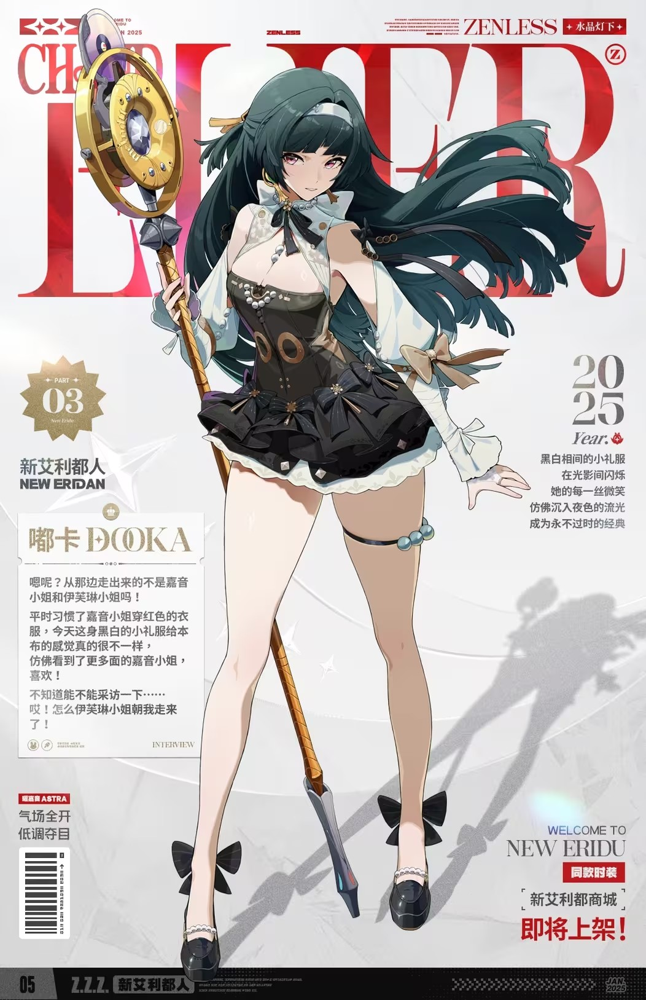

# 耀嘉音 Astra Yao — 2026.09.23
> 视频类型：A · 角色单人壁纸合集
> 角色来源：绝区零 1.5「闪耀的此刻」· S级以太属性支援 · 阵营「天琴座」
> 身份：丽都第一歌姬 / 新艾利都顶流音乐明星 / 公认的舞台"女王大人"
> 设计参考：黄金年代爵士歌姬 × 虚拟偶像养成；天琴座 Lyra（织女星所在星座）；眼角双泪痣被玩家解读为"另一双眼睛"的另一面
> 热点背景：崩铁 4.6 前瞻（9/20）官宣崩铁×绝区零双向联动，4.8 版本耀嘉音+艾莲参战星穹铁道，「联动免费送谁」「三位大明星同台抢麦，战斗BGM听谁的」成社区最热话题；原神 7.1 今日（9/23）上线但卡池角色薇斯纳/沃雅妮莎工作区均已覆盖
> 今日特殊：原神 7.1 六周年上线日；崩铁 4.6 卡池（9/28）预热期
> 选定类型理由：重大热点（4.8 联动官宣 + 免费赠送预测讨论）→ 类型 A 深度呈现
> 选定角色理由：女性角色（性别系数 1.0，无需调整）；工作区首次覆盖；官方热点权重高（双向联动唯二官宣角色之一，「大概率免费送耀嘉音」呼声高）；社区热度高（丽都第一歌姬、翘班被误认为"还原度超高的coser"、0.2秒/82毫秒抢票梗、"还好是耀嘉音不是耀加钱"谐音梗、T0人权辅助"铁打的辅助流水的C"）；外观辨识度强（墨绿长发+白束腰+红色短外套+金环麦克风权杖+珍珠腿环），舞台+日常双题材反差表现力强
> 参考图说明：✅ 已下载 B站WIKI 官方图并视觉校对（official-intro.png 官方介绍立绘 / official-intro-2.png / splash-art.png 名片海报 / banner-art.png 抽卡banner / skin-shuijingdengxia.png 时装「水晶灯下」 / mingpian.png 名片）。发色（墨绿长直发+齐碎刘海+白色发箍）、瞳色（玫瑰粉）、双泪痣（两眼角内侧各一颗）、金色流苏耳饰、白束腰胸衣+红色褶皱短外套+白金星饰层叠裙摆、珍珠choker+左腿珍珠腿环、黑色珍珠踝带高跟鞋、金环麦克风权杖（环内嵌紫蓝水晶麦克风、环身镌刻 Astra Yao 字样）均以参考图为准
> 伴生元素说明：金环麦克风权杖在官方立绘中完整入镜（顶部巨型金色圆环+中央紫蓝水晶胶囊麦克风+螺旋金柄+深色杖尖），已逐图确认，无需单独找图；无伴生生物/召唤物
> 时装说明：「水晶灯下」为黑白小礼服造型（黑色抹胸短裙+白纱披肩+黑色蝴蝶结高跟鞋+蓝珠腿环），已下载立绘，用于现代风条目的造型参考
> 跨领域参考图说明：⚠️ Wikimedia/Unsplash 图片源在本网络环境历史超时不可达（沿用 9/22 绯英结论），两条跨领域 prompts 采用纯文字描述（爵士黄金年代卡巴莱海报、黑胶唱片微距摄影均为公认视觉范式，特征明确），未附参考图文件

---

# 必需

## 1 — 涂鸦墙街头风（Graffiti Wall Street Style · 女版公式）

Refer to the attached reference image (Figure 1). Generate a similar style image of Astra Yao from Zenless Zone Zero sitting casually in front of a bold graffiti wall. Astra is seated in a relaxed but confident posture, leaning back against the graffiti wall with one knee raised, her other leg stretched out casually, one hand loosely holding her tall golden ring microphone staff planted beside her like a scepter, her body language calm, controlled, and slightly provocative. Her expression should show cold, disdainful eyes, aloof, sharp, and superior, as if she is silently judging the viewer — the chart-topping diva who has sold out every arena in New Eridu, now deciding whether you deserve front-row or the exit door.

Keep Astra Yao's recognizable features: very long straight dark teal-green hair reaching her waist with blunt choppy bangs and long sidelocks, a white headband with a small emblem, rose-pink eyes with a tiny beauty mark below the inner corner of each eye, gold tassel earrings, fair skin, tall slender feminine figure. Blend her canonical design with a modern edgy streetwear aesthetic: a white sleeveless crop top under an open cropped crimson bomber jacket with gold star studs and ruffled hem echoing her stage bolero, a black pleated mini skirt with a gold star belt buckle, sheer black thigh-high stockings with a pearl-beaded garter on her left thigh echoing her iconic pearl leg ring, chunky black platform boots with pearl ankle straps, layered gold chain necklaces with a tiny microphone pendant, a pearl bracelet, and crimson stud earrings. Preserve her identity while giving her a fresh urban street-style look.

The graffiti wall behind her should be vivid and layered, full of expressive abstract shapes and energetic street-art textures in crimson, gold, white and deep teal tones, with graffiti elements including "ASTRA YAO" in stylized marquee-bulb lettering, a giant golden ring microphone motif, music notes and star constellations of Lyra, vinyl record silhouettes and spotlight beams, creating a rebellious urban backdrop that resonates with her diva theme. Add subtle golden sound-wave energy rings, floating musical notes, and soft pink stage-light glow around her to reinforce her identity.

Use a wide cinematic framing suitable for a 16:9 wallpaper, with Astra Yao as the main focal point while still showing enough of the graffiti wall and surrounding environment for atmosphere. The mood should feel cool, stylish, intimidating, and mysterious. Highly detailed background, rich shadows, crimson and gold glowing highlights, sharp focus on Astra Yao, and a refined high-end anime illustration look.

perfect hands, five fingers on each hand, anatomically correct hands, well-defined fingers, natural hand pose, one hand resting on the microphone staff planted at her side.

Negative Prompt:
low quality, worst quality, blurry, pixelated, bad anatomy, extra limbs, bad hands, extra fingers, fewer fingers, missing fingers, fused fingers, webbed fingers, merged fingers, overlapping fingers, deformed fingers, mutated fingers, six fingers, four fingers, three fingers, more than five fingers, less than five fingers, disfigured hands, poorly drawn hands, bad hand anatomy, asymmetrical hands, broken fingers, claw hands, blurry hands, indistinct fingers, smeared hands, twisted legs, rotated hips, dislocated hip, extra legs, third leg, fused legs, malformed knees, elongated calves, deformed feet, standing, standing pose, upright posture, singing, open mouth singing, warm smile, gentle smile, cheerful expression, cute expression, adorable, sweet, innocent, game canonical outfit, official costume, fantasy dress, medieval clothing, armor, full gown, formal dress, beach background, ocean background, nature background, indoor background, plain background, minimal background, missing graffiti wall, low detail graffiti, generic graffiti, wrong graffiti colors, wrong streetwear, missing crop top, missing jacket, missing shorts, missing skirt, long dress, full pants, business suit, school uniform, male, wrong gender, wrong hair color, wrong eye color, text, watermark, logo, signature.

---

## 2 — 票根·0.2秒的星光（角色特写肖像 / Close-up Portrait）

Refer to the attached reference image (Figure 2). Generate a cinematic close-up portrait of Astra Yao from Zenless Zone Zero. She holds a small vintage concert ticket stub, its edges worn soft, close to the left side of her face, the ticket pinched delicately between two fingers, partially obscuring her left eye. Her visible right eye gazes directly at the viewer — simultaneously regal and unguarded, the look of a queen who commands a hundred thousand screaming fans yet quietly keeps a single unsold seat in her heart. Expression: a faint stage-perfect smile that never fully reaches the weariness beneath it, as if the ticket reminds her of the girl who once sang to empty seats before anyone knew her name. Dramatic single-source lighting from the upper left casts deep chiaroscuro across her features, the ticket's faded gold print glinting where the light passes over it, a faint crimson glow pulsing along its torn edge. Her fair skin contrasts sharply against a pure black background. Her signature dark teal-green hair spills softly across the right side of the frame, the white headband and gold tassel earring catching a soft highlight; her pearl choker and white corset collar are only barely visible at the bottom edge. A diva who sold out the world in 0.2 seconds, still waiting for someone who'd stay after the encore. 16:9 2K wallpaper.

perfect hands, five fingers on each hand, anatomically correct hands, well-defined fingers, fingers elegantly pinching the ticket stub.

Negative Prompt:
low quality, worst quality, blurry, pixelated, bad anatomy, extra limbs, bad hands, extra fingers, fewer fingers, missing fingers, fused fingers, webbed fingers, merged fingers, overlapping fingers, deformed fingers, mutated fingers, six fingers, four fingers, three fingers, more than five fingers, less than five fingers, disfigured hands, poorly drawn hands, bad hand anatomy, asymmetrical hands, broken fingers, claw hands, blurry hands, indistinct fingers, smeared hands, twisted legs, rotated hips, dislocated hip, extra legs, third leg, fused legs, malformed knees, elongated calves, deformed feet, full body shot, wide shot, landscape, multiple subjects, busy background, bright cheerful lighting, outdoor scene, action pose, weapon drawn, standing, chibi, male, wrong gender, wrong hair color, wrong eye color, text, watermark, logo, signature.

---

## 2b — 票根·0.2秒的星光·手机竖屏版（9:20 · 胸部及以上取景）

Positive Prompt:
9:20 vertical mobile wallpaper, cinematic close-up portrait of Astra Yao from Zenless Zone Zero. Chest-up framing, her face as the focal point of the tall composition, no full body. She holds a small vintage concert ticket stub, its edges worn soft, close to the left side of her face, the ticket pinched delicately between two fingers, partially obscuring her left eye. Her visible right eye gazes directly at the viewer — simultaneously regal and unguarded, the look of a queen who commands a hundred thousand screaming fans yet quietly keeps a single unsold seat in her heart. Expression: a faint stage-perfect smile that never fully reaches the weariness beneath it, as if the ticket reminds her of the girl who once sang to empty seats before anyone knew her name. Dramatic single-source lighting from the upper left casts deep chiaroscuro across her features, the ticket's faded gold print glinting where the light passes over it, a faint crimson glow pulsing along its torn edge. Her fair skin contrasts sharply against a pure black background. Her signature dark teal-green hair spills softly across the right side of the frame, the white headband and gold tassel earring catching a soft highlight; her pearl choker and white corset collar are only barely visible at the bottom edge. A diva who sold out the world in 0.2 seconds, still waiting for someone who'd stay after the encore. perfect hands, five fingers on each hand, anatomically correct hands, well-defined fingers, fingers elegantly pinching the ticket stub.

Negative Prompt:
low quality, worst quality, blurry, pixelated, bad anatomy, extra limbs, bad hands, extra fingers, fewer fingers, missing fingers, fused fingers, webbed fingers, merged fingers, overlapping fingers, deformed fingers, mutated fingers, six fingers, four fingers, three fingers, more than five fingers, less than five fingers, disfigured hands, poorly drawn hands, bad hand anatomy, asymmetrical hands, broken fingers, claw hands, blurry hands, indistinct fingers, smeared hands, twisted legs, rotated hips, dislocated hip, extra legs, third leg, fused legs, malformed knees, elongated calves, deformed feet, full body shot, wide shot, lower body, legs, feet, landscape, multiple subjects, busy background, bright cheerful lighting, outdoor scene, action pose, weapon drawn, standing, chibi, male, wrong gender, wrong hair color, wrong eye color, text, watermark, logo, signature.

---

# 人物设定

## 3 — 丽都巨蛋·咏叹华彩之夜（身份/舞台场景）

Positive Prompt:
16:9 2K wallpaper, Astra Yao from Zenless Zone Zero, highly detailed anime-style illustration, polished game-art quality, grand concert arena stage at the climax of a sold-out show, dazzling theatrical atmosphere.

Depict Astra Yao commanding the center of a colossal New Eridu dome stage, bathed in a single brilliant spotlight amid a sea of glowing pink-and-gold light sticks. Her unmistakable features: very long straight dark teal-green hair with blunt choppy bangs flowing behind her like a dark comet tail, white headband, rose-pink eyes blazing with queenly confidence, gold tassel earrings swinging, fair skin. She wears her canonical outfit: a white corset bustier with gold studded diamond trim, an off-shoulder crimson cropped bolero jacket with ruffled edges and gold buttons, layered white frilled skirt panels with gold star ornaments over a black underdress, a pearl choker with a gold medallion, a pearl-beaded garter on her left thigh, black heels with pearl ankle straps.

She holds her tall golden ring microphone staff high in her right hand, the vintage golden ring with its purple-blue crystal capsule microphone trailing ribbons of golden sound-wave energy; her left arm sweeps outward toward the audience as visible ripples of music ripple through the air, petals of pink ether light drifting from the stage. perfect hands, five fingers on each hand, anatomically correct hands, well-defined fingers, right hand gripping the microphone staff aloft, left hand extended in an open welcoming gesture with fingers elegantly relaxed.

Around her: towering speaker arrays, a constellation of Lyra projected across the dome ceiling, confetti of gold stars raining down, the crowd reduced to a glowing bokeh ocean below the stage edge. The mood is triumphant and electric — the exact second a hundred thousand voices sing her own song back to her. Color palette: crimson, gold, hot pink, deep teal shadows, white spotlight.

Negative Prompt:
low quality, worst quality, blurry, pixelated, bad anatomy, extra limbs, bad hands, extra fingers, fewer fingers, missing fingers, fused fingers, webbed fingers, merged fingers, overlapping fingers, deformed fingers, mutated fingers, six fingers, four fingers, three fingers, more than five fingers, less than five fingers, disfigured hands, poorly drawn hands, bad hand anatomy, asymmetrical hands, broken fingers, claw hands, blurry hands, indistinct fingers, smeared hands, twisted legs, rotated hips, dislocated hip, extra legs, third leg, fused legs, malformed knees, elongated calves, deformed feet, wrong hair color, wrong eye color, male, wrong gender, daytime, empty venue, casual modern clothing, chibi, photorealistic, text, watermark, logo, signature.

## 4 — 翘班大作战·唱片店的"超高还原度coser"（日常/反差场景）

Positive Prompt:
16:9 2K wallpaper, Astra Yao from Zenless Zone Zero, highly detailed anime-style illustration, polished game-art quality, cozy vintage vinyl record store on a rainy afternoon, warm slice-of-life atmosphere.

Depict Astra Yao incognito on one of her famous escape-from-work afternoons, browsing vinyl records in a cramped old record shop. Her unmistakable features remain: very long dark teal-green hair with blunt choppy bangs (loosely tucked up but unmistakably hers), white headband swapped for a simple black baseball cap pulled low, rose-pink eyes sparkling with mischievous glee behind plain round glasses, gold tassel earrings still betraying her, fair skin. Her casual disguise outfit: an oversized cream hoodie over a pleated grey skirt, white sneakers, a canvas tote bag with a tiny gold star pin — yet the pearl garter still peeks out on her left thigh, the one detail she always forgets to hide.

She is crouched at a bargain vinyl crate, holding up a rare jazz record with pure delight, one finger pressed to her lips in a "shhh, don't tell my manager" gesture, a playful conspiratorial wink aimed at the viewer. perfect hands, five fingers on each hand, anatomically correct hands, well-defined fingers, right hand holding the vinyl record by its edges, left index finger pressed to her lips.

Around her: tall shelves of vinyl spines, a sleepy shop cat on the counter, warm tungsten lamps, rain streaking the front window, a wall poster of her own sold-out concert ironically half-covered by other flyers. In the background through the shop window, her manager Evelyn's silhouette storms past on the street, scanning the crowd — the eternal cat-and-mouse game. The mood is giddy, warm, and endearing — the biggest star in New Eridu, one disguise away from happiness, forever mistaken for an "uncannily accurate cosplayer" of herself. Color palette: warm amber, cream, muted teal, rain-grey blue.

Negative Prompt:
low quality, worst quality, blurry, pixelated, bad anatomy, extra limbs, bad hands, extra fingers, fewer fingers, missing fingers, fused fingers, webbed fingers, merged fingers, overlapping fingers, deformed fingers, mutated fingers, six fingers, four fingers, three fingers, more than five fingers, less than five fingers, disfigured hands, poorly drawn hands, bad hand anatomy, asymmetrical hands, broken fingers, claw hands, blurry hands, indistinct fingers, smeared hands, twisted legs, rotated hips, dislocated hip, extra legs, third leg, fused legs, malformed knees, elongated calves, deformed feet, wrong hair color, wrong eye color, male, wrong gender, stage performance, concert arena, combat pose, chibi, photorealistic, text, watermark, logo, signature.

## 5 — 水晶灯下·黑白小礼服（现代风改造 · 时装「水晶灯下」变体）

Positive Prompt:
16:9 2K wallpaper, Astra Yao from Zenless Zone Zero, highly detailed anime-style illustration, polished game-art quality, elegant modern rooftop jazz lounge at blue hour, city lights glittering below.

Reimagine Astra Yao in her "Beneath the Crystal Lamp" evening look, attending an intimate invitation-only jazz night. Her iconic features remain: very long straight dark teal-green hair with blunt choppy bangs cascading over one shoulder, white headband, rose-pink eyes soft with relaxed amusement, gold tassel earrings, fair skin. Her outfit: a black-and-white mini formal dress — a black strapless fitted bodice with pearl buttons, layered black petal-like skirt panels edged with white frills, a sheer white shawl draped off her shoulders, long white opera gloves, a black thigh strap with blue beads on her left thigh, and glossy black heels with bow backs and pearl ankle straps, her golden ring microphone staff leaning against the stool beside her like a trusted old friend.

She sits sideways on a high bar stool at the lounge's edge in an elegant side-saddle pose, both knees together pointing the same direction with her calves parallel, one gloved hand cupping her chin while the other loosely holds a crystal glass of sparkling water, gazing at the viewer with the calm of someone off-duty and perfectly content about it. perfect hands, five fingers on each hand, anatomically correct hands, well-defined fingers, right hand cupping her chin, left hand holding the glass stem delicately.

Around her: a grand piano under warm spotlights, crystal pendant lamps scattering soft halos, the New Eridu skyline twinkling through floor-to-ceiling windows, a single white rose in a vase on her table. The mood is sophisticated, intimate, and quietly radiant — the queen's night off, dress code: herself. Color palette: midnight blue, black, white, warm gold lamplight, soft rose accents.

Negative Prompt:
low quality, worst quality, blurry, pixelated, bad anatomy, extra limbs, bad hands, extra fingers, fewer fingers, missing fingers, fused fingers, webbed fingers, merged fingers, overlapping fingers, deformed fingers, mutated fingers, six fingers, four fingers, three fingers, more than five fingers, less than five fingers, disfigured hands, poorly drawn hands, bad hand anatomy, asymmetrical hands, broken fingers, claw hands, blurry hands, indistinct fingers, smeared hands, twisted legs, rotated hips, dislocated hip, extra legs, third leg, fused legs, malformed knees, elongated calves, deformed feet, crossed legs, wrong hair color, wrong eye color, male, wrong gender, game canonical red outfit, concert arena stage, combat pose, chibi, photorealistic, text, watermark, logo, signature.

## 6 — 安可之后·空场独歌（情感/反差场景）

Positive Prompt:
16:9 2K wallpaper, Astra Yao from Zenless Zone Zero, highly detailed anime-style illustration, polished game-art quality, quiet empty concert arena long after the encore, soft melancholic after-show atmosphere.

Depict Astra Yao alone on the vast dark stage hours after the audience has gone: the spotlights off, only a single work light on a stand casting a warm pool around her. She sits at the edge of the stage with her legs dangling over, heels set aside, canonical white corset and crimson bolero slightly loosened, dark teal-green hair falling forward as she looks down at the golden microphone staff lying across her lap, her rose-pink eyes gentle and unguarded in a way no fan is ever allowed to see — not the queen, just a girl humming her favorite song to an empty hall.

Her fingers rest softly along the staff's golden ring, tracing the engraved "Astra Yao" lettering. perfect hands, five fingers on each hand, anatomically correct hands, well-defined fingers, both hands resting gently on the staff across her lap, fingers naturally curled.

Around her: rows upon rows of empty seats dissolving into darkness, a few abandoned glow sticks still faintly lit in the aisles like fallen stars, gold confetti scattered across the stage floor catching the single light, the constellation of Lyra faintly visible through the open dome roof above. The mood is tender, hushed, and achingly human — when the magic ends and the music stays. Color palette: warm amber pool of light, deep indigo darkness, faint gold, muted crimson.

Negative Prompt:
low quality, worst quality, blurry, pixelated, bad anatomy, extra limbs, bad hands, extra fingers, fewer fingers, missing fingers, fused fingers, webbed fingers, merged fingers, overlapping fingers, deformed fingers, mutated fingers, six fingers, four fingers, three fingers, more than five fingers, less than five fingers, disfigured hands, poorly drawn hands, bad hand anatomy, asymmetrical hands, broken fingers, claw hands, blurry hands, indistinct fingers, smeared hands, twisted legs, rotated hips, dislocated hip, extra legs, third leg, fused legs, malformed knees, elongated calves, deformed feet, wrong hair color, wrong eye color, male, wrong gender, crowd, audience, action pose, combat, bright saturated stage lighting, chibi, photorealistic, text, watermark, logo, signature.

## 7 — 4.8联动·星穹铁道特约舞台（热点主题特别版）

Positive Prompt:
16:9 2K wallpaper, Astra Yao from Zenless Zone Zero, highly detailed anime-style illustration, polished game-art quality, breathtaking galaxy concert stage aboard a star-traversing train, crossover celebration atmosphere.

Depict Astra Yao making her grand debut on a stage built upon the observation deck of a majestic space-faring train — a gleaming platform of polished brass and glass with a starry galaxy streaming past on all sides. Her unmistakable features: very long straight dark teal-green hair with blunt choppy bangs flowing in zero-gravity sparkle, white headband, rose-pink eyes wide with the thrill of a brand-new stage, gold tassel earrings, fair skin. She wears her canonical outfit: white corset bustier with gold studded trim, off-shoulder crimson cropped bolero jacket with ruffled edges, layered white frilled skirt panels with gold star ornaments, black underdress, pearl choker, pearl-beaded garter on her left thigh, black heels with pearl ankle straps.

She raises her golden ring microphone staff toward the spiral galaxy above, the purple-blue crystal capsule igniting a ribbon of golden music that spirals out into the starfield, forming the constellation of Lyra note by note. perfect hands, five fingers on each hand, anatomically correct hands, well-defined fingers, right hand raising the microphone staff skyward, left hand pressed over her heart.

Beside her, a second spotlight pours down on an empty microphone stand — the duet partner's stage mark, waiting; train-window frames and brass railings gleam along the deck, and a trail of pink ether petals drifts toward the next station among the stars. The mood is wonder and invitation — a new world, a new stage, and one empty spotlight with someone's name on it. Color palette: deep space indigo, galaxy violet, crimson, gold, starlight white.

Negative Prompt:
low quality, worst quality, blurry, pixelated, bad anatomy, extra limbs, bad hands, extra fingers, fewer fingers, missing fingers, fused fingers, webbed fingers, merged fingers, overlapping fingers, deformed fingers, mutated fingers, six fingers, four fingers, three fingers, more than five fingers, less than five fingers, disfigured hands, poorly drawn hands, bad hand anatomy, asymmetrical hands, broken fingers, claw hands, blurry hands, indistinct fingers, smeared hands, twisted legs, rotated hips, dislocated hip, extra legs, third leg, fused legs, malformed knees, elongated calves, deformed feet, wrong hair color, wrong eye color, male, wrong gender, second character, duet partner visible, crowd, daylight, chibi, photorealistic, text, watermark, logo, signature.

---

# 动漫性感风 — 2D 日漫简约背景系列（四比例 · 活力系）

> 统一设定：同一套活力系服装 + 同一场景（靛蓝暮空星光舞台边缘）+ 同一动态焦点（漂浮的金色音符），四条仅变化构图与姿势。

## 8 — 手机壁纸 9:20（星灯独唱 · 半身居中）

Positive Prompt:
9:20 vertical mobile wallpaper, Astra Yao from Zenless Zone Zero, 2D Japanese anime style, flat cel shading, clean thin lineart, soft anime coloring, Japanese anime aesthetic, simple anime scenery background, clean minimal scene composition, Ghibli-inspired soft background, flat background with simple shapes and soft colors.

Astra Yao standing centered in a half-body composition, weight on one hip in a natural, elegant stance, one hand gently tucking her hair behind her ear, the other relaxed at her side, head tilted slightly with a calm, confident little smile. Her features: very long straight dark teal-green hair with blunt choppy bangs, white headband, rose-pink eyes with a tiny beauty mark below each inner eye corner, gold tassel earrings, fair skin. Tasteful summer look in the energetic style: a white cropped sleeveless camisole top with gold star trim showing a sliver of her waist, a high-waisted crimson pleated mini skirt, and a sheer crimson chiffon shrug slipping softly off her shoulders, the pearl-beaded garter glinting on her left thigh. Tasteful and elegant throughout, no explicit content. perfect hands, five fingers on each hand, anatomically correct hands, well-defined fingers, one hand at her hair, the other relaxed at her side.

Background: a flat deep indigo dusk sky with a sparse scatter of tiny gold stars and one thin crescent moon, drifting golden music notes floating upward as the single dynamic focal element, soft atmospheric light, gentle rim light in gold. The mood is quiet anticipation — the breath before the first note.

Negative Prompt:
low quality, worst quality, blurry, pixelated, bad anatomy, extra limbs, bad hands, extra fingers, fewer fingers, missing fingers, fused fingers, webbed fingers, merged fingers, overlapping fingers, deformed fingers, mutated fingers, six fingers, four fingers, three fingers, more than five fingers, less than five fingers, disfigured hands, poorly drawn hands, bad hand anatomy, asymmetrical hands, broken fingers, claw hands, blurry hands, indistinct fingers, smeared hands, twisted legs, rotated hips, dislocated hip, extra legs, third leg, fused legs, malformed knees, elongated calves, deformed feet, 3D render, semi-realistic, realistic, painterly, thick oil paint, game 3D model, complex background, cluttered background, multiple overlapping scenes, busy props, heavy details, photorealistic background, weapon combat, fighting, blood, gore, nude, topless, nipples, areola, explicit, childlike, loli, underage, wrong hair color, wrong eye color, male, wrong gender, text, watermark, logo, signature.

## 9 — 电脑壁纸 16:9（星光回眸 · 侧位留白）

Positive Prompt:
16:9 desktop wallpaper, Astra Yao from Zenless Zone Zero, 2D Japanese anime style, flat cel shading, clean thin lineart, soft anime coloring, Japanese anime aesthetic, simple anime scenery background, clean minimal scene composition, Ghibli-inspired soft background, flat background with simple shapes and soft colors.

Astra Yao standing on the right third of the frame with generous negative space of indigo dusk on the left, full-body composition, seen in a gentle three-quarter pose looking back over her shoulder toward the viewer with a warm confident smile, her long dark teal-green hair and sheer shrug hem trailing in the evening breeze. Her features: very long straight dark teal-green hair with blunt choppy bangs, white headband, rose-pink eyes, gold tassel earrings, fair skin. Tasteful summer look in the energetic style: a white cropped sleeveless camisole top with gold star trim showing a sliver of her waist, a high-waisted crimson pleated mini skirt, and a sheer crimson chiffon shrug slipping softly off her shoulders, the pearl-beaded garter glinting on her left thigh. Tasteful and elegant throughout, no explicit content. One hand raised in a small relaxed wave, the other holding her golden ring microphone staff loosely with its tip resting on the ground. perfect hands, five fingers on each hand, anatomically correct hands, well-defined fingers, right hand raised in a small relaxed wave, left hand holding the staff.

Background: a flat deep indigo evening sky with one thin crescent moon and a slow scatter of tiny gold stars, drifting golden music notes crossing the empty space as the single dynamic focal element, soft atmospheric light, gentle rim light in gold. The mood is serene and open, like walking off stage into a good night.

Negative Prompt:
low quality, worst quality, blurry, pixelated, bad anatomy, extra limbs, bad hands, extra fingers, fewer fingers, missing fingers, fused fingers, webbed fingers, merged fingers, overlapping fingers, deformed fingers, mutated fingers, six fingers, four fingers, three fingers, more than five fingers, less than five fingers, disfigured hands, poorly drawn hands, bad hand anatomy, asymmetrical hands, broken fingers, claw hands, blurry hands, indistinct fingers, smeared hands, twisted legs, rotated hips, dislocated hip, extra legs, third leg, fused legs, malformed knees, elongated calves, deformed feet, 3D render, semi-realistic, realistic, painterly, thick oil paint, game 3D model, complex background, cluttered background, multiple overlapping scenes, busy props, heavy details, photorealistic background, weapon combat, fighting, blood, gore, nude, topless, nipples, areola, explicit, childlike, loli, underage, wrong hair color, wrong eye color, male, wrong gender, text, watermark, logo, signature.

## 10 — 平板壁纸 4:3（余音闭目 · 居中半身）

Positive Prompt:
4:3 tablet wallpaper, Astra Yao from Zenless Zone Zero, 2D Japanese anime style, flat cel shading, clean thin lineart, soft anime coloring, Japanese anime aesthetic, simple anime scenery background, clean minimal scene composition, Ghibli-inspired soft background, flat background with simple shapes and soft colors.

Centered half-body composition, Astra Yao with her eyes closed and head gently tilted, savoring the last echo of a song, a soft content smile on her lips. Her features: dark teal-green hair with blunt choppy bangs, white headband, gold tassel earrings, fair skin. Tasteful summer look in the energetic style: a white cropped sleeveless camisole top with gold star trim showing a sliver of her waist, a high-waisted crimson pleated mini skirt, and a sheer crimson chiffon shrug slipping softly off her shoulders, the pearl-beaded garter glinting on her left thigh. Tasteful and elegant throughout, no explicit content. Arms relaxed at her sides. perfect hands, five fingers on each hand, anatomically correct hands, well-defined fingers, arms relaxed at sides.

Background: a flat warm gradient of dusk pink into indigo with a sprinkle of tiny gold stars, two or three drifting golden music notes as the single dynamic focal element, soft even lighting with gentle rim light in gold. The mood is quiet and glowing, like the hum that lingers after a concert.

Negative Prompt:
low quality, worst quality, blurry, pixelated, bad anatomy, extra limbs, bad hands, extra fingers, fewer fingers, missing fingers, fused fingers, webbed fingers, merged fingers, overlapping fingers, deformed fingers, mutated fingers, six fingers, four fingers, three fingers, more than five fingers, less than five fingers, disfigured hands, poorly drawn hands, bad hand anatomy, asymmetrical hands, broken fingers, claw hands, blurry hands, indistinct fingers, smeared hands, twisted legs, rotated hips, dislocated hip, extra legs, third leg, fused legs, malformed knees, elongated calves, deformed feet, 3D render, semi-realistic, realistic, painterly, thick oil paint, game 3D model, complex background, cluttered background, multiple overlapping scenes, busy props, heavy details, photorealistic background, weapon combat, fighting, blood, gore, nude, topless, nipples, areola, explicit, childlike, loli, underage, wrong hair color, wrong eye color, male, wrong gender, text, watermark, logo, signature.

## 11 — 阔折叠壁纸 √2:1（星路独行 · 横向极简留白）

Positive Prompt:
√2:1 (1.414:1) foldable phone unfolded wallpaper, Astra Yao from Zenless Zone Zero, 2D Japanese anime style, flat cel shading, clean thin lineart, soft anime coloring, Japanese anime aesthetic, simple anime scenery background, clean minimal scene composition, Ghibli-inspired soft background, flat background with simple shapes and soft colors.

Ultra-wide minimal composition: Astra Yao small and centered, standing full-body on a simple pale stage runway that stretches toward the horizon, vast flat indigo sky filling both sides with a sparse scatter of gold stars, her dark teal-green hair and sheer shrug hem providing a single flowing vertical accent. Her features: long dark teal-green hair, blunt choppy bangs, white headband, rose-pink eyes gazing toward the horizon, fair skin. Tasteful summer look in the energetic style: a white cropped sleeveless camisole top with gold star trim showing a sliver of her waist, a high-waisted crimson pleated mini skirt, and a sheer crimson chiffon shrug slipping softly off her shoulders, the pearl-beaded garter glinting on her left thigh. Tasteful and elegant throughout, no explicit content. Her golden ring microphone staff carried over her shoulder like a traveler's pole, the other hand swinging naturally at her side. perfect hands, five fingers on each hand, anatomically correct hands, well-defined fingers, right hand holding the staff over her shoulder, left hand relaxed at her side.

Background: minimal flat indigo sky, drifting golden music notes trailing her steps as the single dynamic focal element, soft atmospheric light, gentle rim light in gold. The mood is a quiet journey between stages, lots of breathing room.

Negative Prompt:
low quality, worst quality, blurry, pixelated, bad anatomy, extra limbs, bad hands, extra fingers, fewer fingers, missing fingers, fused fingers, webbed fingers, merged fingers, overlapping fingers, deformed fingers, mutated fingers, six fingers, four fingers, three fingers, more than five fingers, less than five fingers, disfigured hands, poorly drawn hands, bad hand anatomy, asymmetrical hands, broken fingers, claw hands, blurry hands, indistinct fingers, smeared hands, twisted legs, rotated hips, dislocated hip, extra legs, third leg, fused legs, malformed knees, elongated calves, deformed feet, 3D render, semi-realistic, realistic, painterly, thick oil paint, game 3D model, complex background, cluttered background, multiple overlapping scenes, busy props, heavy details, photorealistic background, weapon combat, fighting, blood, gore, nude, topless, nipples, areola, explicit, childlike, loli, underage, wrong hair color, wrong eye color, male, wrong gender, text, watermark, logo, signature.

---

# 跨领域参考图

## 12（参考爵士黄金年代卡巴莱歌姬海报·复古招贴融合）
⚠️ Wikimedia 图片源在本网络环境超时不可达，未附参考图文件；以 1930s 复古爵士歌姬招贴画（Art Deco 卡巴莱海报）的构图与配色特征作文字参考。

Positive Prompt:
16:9 2K wallpaper, Astra Yao from Zenless Zone Zero, vintage 1930s Art Deco cabaret poster fusion style, elegant flat graphic shapes with luxurious gold-foil outlines in the manner of a golden-age jazz diva show poster, limited palette of deep crimson, cream, gold and ink black, subtle aged paper grain texture, glamorous retro music-poster fusion.

Depict Astra Yao as the headliner of a grand Art Deco music hall: she stands in a dramatic three-quarter pose within a towering geometric arch of radiating gold sunburst lines and stylized marquee bulbs, one arm extended in a theatrical welcome. Her recognizable features adapted to the poster style: dark teal-green hair rendered as sleek flat ink-black shapes with a teal sheen, blunt bangs, white headband as a crisp geometric band, rose-pink eyes, gold tassel earrings as dangling gold triangles, her canonical white corset and crimson bolero simplified into bold deco shapes with gold star accents, layered skirt panels as stylized fan-folded paper. She holds her golden ring microphone staff upright like a showgirl's scepter, the ring drawn as a perfect golden circle framing the crystal microphone. perfect hands, five fingers on each hand, anatomically correct hands, well-defined fingers, left hand extended gracefully, right hand holding the staff.

Around her: stylized geometric spotlights, floating deco music notes and stars, a fan of peacock-like spotlight rays behind the arch, and elegant blank banner ribbons curling at the corners as if awaiting her name in lights. The mood is timeless cabaret glamour — a 21st-century diva billed on a century-old stage.

Negative Prompt:
low quality, worst quality, blurry, pixelated, bad anatomy, extra limbs, bad hands, extra fingers, fewer fingers, missing fingers, fused fingers, webbed fingers, merged fingers, overlapping fingers, deformed fingers, mutated fingers, six fingers, four fingers, three fingers, more than five fingers, less than five fingers, disfigured hands, poorly drawn hands, bad hand anatomy, asymmetrical hands, broken fingers, claw hands, blurry hands, indistinct fingers, smeared hands, twisted legs, rotated hips, dislocated hip, extra legs, third leg, fused legs, malformed knees, elongated calves, deformed feet, 3D render, photorealistic, glossy modern anime rendering, complex cluttered background, wrong hair color, wrong eye color, male, wrong gender, text, watermark, logo, signature.

## 13（参考黑胶唱片微距摄影·质感光影融合）

Positive Prompt:
16:9 2K wallpaper, Astra Yao from Zenless Zone Zero, highly detailed anime-style illustration fused with the macro texture and moody lighting of professional vinyl record photography, dramatic side-light raking across glossy surfaces, shallow depth of field, clean anime character rendering against a painterly-realistic environment.

Depict Astra Yao in a dim listening room, kneeling beside an oversized vintage turntable where a colossal vinyl record spins, its grooves catching the raking amber light like rings of a golden planet. She leans one elbow on the turntable's edge, chin resting on her hand, rose-pink eyes half-lidded in bliss as she listens to the needle ride the groove. Her features clearly rendered: long straight dark teal-green hair with blunt choppy bangs pooling over her shoulder, white headband, gold tassel earrings, fair skin; her canonical white corset, off-shoulder crimson bolero and layered white skirt panels softly lit, pearl garter glinting. Her golden ring microphone staff leans against the turntable cabinet, its crystal capsule catching a violet glint. perfect hands, five fingers on each hand, anatomically correct hands, well-defined fingers, chin resting on the back of her right hand, left fingers lightly touching the spinning record's label area without stopping it.

Macro details in the environment: visible vinyl grooves spiraling into soft bokeh, dust motes drifting through a single shaft of warm lamplight, the tonearm's silhouette etched against the glow, faint sound-wave reflections rippling across the glossy record surface toward her like the music reaching out. The mood is analog, warm, and devotional — the diva worshipping at the altar of the song itself. Color palette: amber, brass gold, deep mahogany, ink black, soft teal shadow.

Negative Prompt:
low quality, worst quality, blurry, pixelated, bad anatomy, extra limbs, bad hands, extra fingers, fewer fingers, missing fingers, fused fingers, webbed fingers, merged fingers, overlapping fingers, deformed fingers, mutated fingers, six fingers, four fingers, three fingers, more than five fingers, less than five fingers, disfigured hands, poorly drawn hands, bad hand anatomy, asymmetrical hands, broken fingers, claw hands, blurry hands, indistinct fingers, smeared hands, twisted legs, rotated hips, dislocated hip, extra legs, third leg, fused legs, malformed knees, elongated calves, deformed feet, full photorealistic human rendering, plastic skin, wrong hair color, wrong eye color, male, wrong gender, concert stage, crowd, daylight, chibi, text, watermark, logo, signature.

---

# 注

- 玩梗埋点：0.2秒/82毫秒抢票梗（特写肖像「票根」）、翘班被误认为"还原度超高的coser"（唱片店场景）、4.8 联动免费赠送预测（星穹铁道特约舞台留空麦克风架彩蛋），详见 titles.md。
- 动漫性感风：按技能规范选用活力系（白金边露脐吊衣+绯红高腰百褶裙+透纱开衫，保留珍珠腿环标志性元素），统一场景为靛蓝暮空星光舞台边缘，统一动态焦点为漂浮金色音符；尺度红线已写入 positive（tasteful and elegant throughout, no explicit content）与 negative（nude/topless/nipples/areola/explicit/childlike/loli/underage）。
- 跨领域维度：艺术流派（1930s Art Deco 卡巴莱海报，纯文字）× 摄影（黑胶唱片微距，纯文字）。
