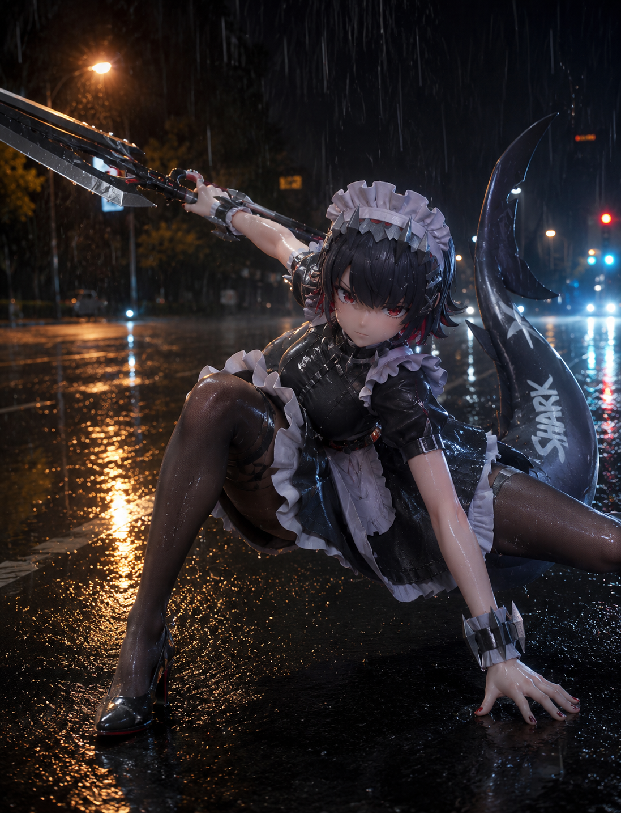

# 必需

refer to the attached pic, generate Ellen Joe from Zenless Zone Zero The same pose as in the picture, along with similar modern rebellious clothing, and a disdainful look at the camera. Half body, 16:9 2k wallpaper format

# 人物设定
## 1
@Create image Prompt:
16:9 wallpaper 2K
Ellen Joe from Zenless Zone Zero, highly detailed anime-style illustration, soft cinematic lighting, cozy indoor atmosphere, peaceful slice-of-life mood, polished character art.

Depict Ellen Joe lying on a bed, fast asleep, in a relaxed and natural sleeping pose. She is hugging her large shark tail tightly like a pillow, showing a softer and more vulnerable side of her personality. Her expression should be calm and sleepy, with her eyes fully closed and her face relaxed, as if she has fallen into a deep, comfortable sleep.

Keep her recognizable features: short black hair with red highlights, red eyes (closed in this scene), maid-inspired aesthetic, shark tail, and cool, slightly tired charm. Her hair can be slightly messy from sleep, with a few loose strands resting on the pillow. Her posture should look natural and cozy, curled slightly around her tail.

She should be lying on a soft bed in a quiet bedroom, surrounded by pillows and blankets. The room can have a dim, warm, restful atmosphere, with soft light coming from a bedside lamp or faint moonlight / early morning light filtering through the curtains. The bedding should look plush and comfortable, enhancing the peaceful sleeping scene.

The overall mood should be gentle, intimate, warm, and comforting, emphasizing the contrast between Ellen’s cool personality and this cute, sleepy private moment. Composition can be a full-body or three-quarter-body view, showing both Ellen and her shark tail clearly.

Negative Prompt：

low quality, blurry, pixelated, bad anatomy, malformed hands, extra fingers, wrong character, missing shark tail, sharp shark teeth showing, open eyes, awake, aggressive expression, tense pose, formal maid dress, heavy armor, messy dirty room, harsh bright light, daytime sunlight, harsh shadows, ugly, deformed, unlit dark room, scared expression.

# 参考图
## 2（参考立绘）

generate a pic of her, refer to above info and her characteristic

## 3（3D立体感）

Prompt:

Ellen Joe from Zenless Zone Zero, full-body portrait, high-quality 3D stylized character render, matching the 3D figure-like visual style shown in Figure 1, with smooth shading, clean modeling, soft rim lighting, and a polished collectible-figure / game-CG appearance.

Depict Ellen Joe standing alone on a realistic street after the rain at night. Keep her recognizable features: short dark gray-black hair with red highlights at the tips, red eyes, maid headpiece, black-and-white maid outfit, shark tail, and cool, slightly tired expression. Her pose should be calm and composed, with a subtle sense of quiet loneliness or cool detachment.

The background should be realistic, inspired by Figure 2: a wet nighttime street after rainfall, reflective asphalt, glowing streetlights, distant headlights, trees along the roadside, and puddles reflecting warm yellow and white light. The road should feel cinematic, moist, and atmospheric, with a natural urban realism. Add faint lingering rain droplets or a just-stopped-raining feeling to enhance the mood.

Show Ellen as the clear subject in the foreground, with her full body fully visible. Her 3D stylized appearance should contrast naturally with the realistic street environment, creating a visually striking blend of character rendering and real-world background. Her shark tail should be clearly visible and integrated naturally into the pose.

Lighting should be cinematic, with warm streetlamp reflections on the wet ground, soft highlights on her outfit and hair, and gentle backlighting to separate her silhouette from the dark street. The mood should be quiet, cool, elegant, and slightly melancholic.

## 4（3D立体感）

generate an image of her. She fights in the rain, the drizzle heavy. She crouches on one leg to cushion the impact (a posture used to absorb force after being knocked back), one hand on the ground, the other holding a weapon (similar to the attached image). Raindrops fall on her stockings and face, highlighting the texture and realism of the stockings.