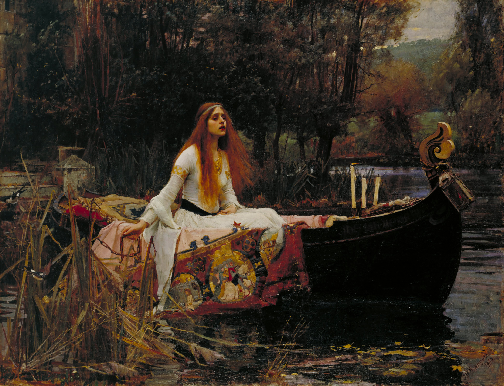
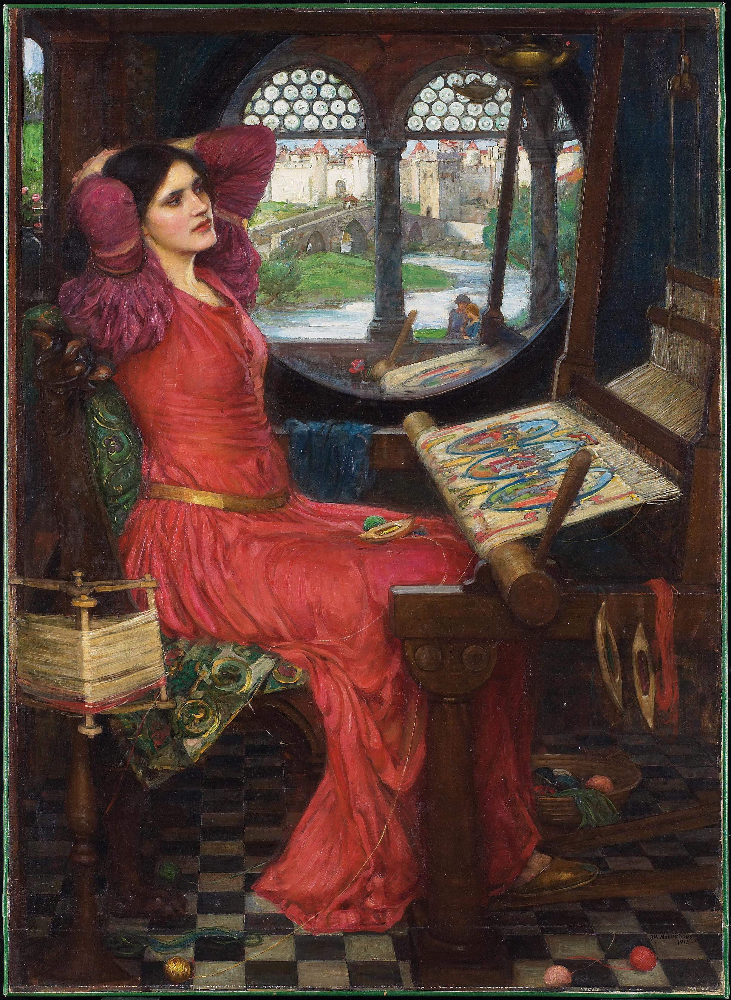

# 菲欧妮 Phoenix — 2026.10.07
> 视频类型：A · 角色单人壁纸合集
> 角色来源：绝区零 3.3「重返天空的旅程」· S级火属性异常代理人 · 坎卜斯黑枝
> 身份：坎卜斯黑枝裁决官（全名：菲欧妮·蕾法爱菈 Phoenix Reffaella），档案台词「我叫菲欧妮，黑枝的…算是裁决官吧。站着说话有点累，我能坐下吗？」
> 设计参考：凤凰（不死鸟）+ 医疗急救（胸口创可贴、腰间红绷带卷、葡萄糖）双主题；红白黑配色、安卡十字、心形缎带
> 热点背景：3.3 前瞻特别节目定档 10/9 19:30（本期发布为前瞻前 2 天，卡预热流量峰值）；「从天而降的菲欧妮」为官方官宣钩子，解读视频 8 万播放、前瞻分析帖 1925 楼热议
> 选定角色理由：①3.3 前瞻（10/9）为当期三游最强时效热点，菲欧妮为双新角色中社区热度最高者；②女性角色系数 1.0，无性别调整；③工作区从未做过菲欧妮单人集；④同人设反差极强（黑枝不败战神 vs 厄运体质迷糊搞笑女「很适合在路上晕倒呢」）标题素材密度高。赛维里安为男性，不作单人集，未来可入 B/E 合集消化。

# 必需

## 1 — 涂鸦墙街头风（封面级）

Positive Prompt:
Refer to the attached reference image (Figure 1). Generate a similar style image of Phoenix (Feoni Reffaella) from Zenless Zone Zero sitting casually in front of a bold graffiti wall. Phoenix is seated in a relaxed but confident posture, leaning back against the graffiti wall with one knee raised and her other leg bent with her foot flat on the ground, her body language calm, controlled, and slightly provocative. Her expression should show cold, disdainful eyes, aloof, sharp, and superior, as if she is silently judging the viewer.

Keep Phoenix's recognizable features: champagne-blonde short hair with pale pink inner highlights, two thin low braids tied with blue-grey bands, one braid fastened with a red heart-shaped hair tie, small golden crown-shaped hairclip, round golden disc hair ornaments on both sides of her head, large golden-amber eyes with drowsy lower lashes, white high-collar choker with a metal ring, red ankh cross pendant. She has a slender feminine figure. Blend her canonical design with a modern edgy streetwear aesthetic: white cropped tube top with a black lace-up band across the chest, an open cropped bomber jacket in white and black with red trim slung off one shoulder, black denim shorts with a red bandage-wrap bracelet on her left wrist, sheer black tights, chunky red-and-white sneakers, a thin chain necklace with a small red ankh pendant. Preserve her identity while giving her a fresh urban street-style look.

The graffiti wall behind her should be vivid and layered, full of expressive abstract shapes and energetic street-art textures in crimson, orange and charcoal-black tones, with graffiti elements including her name "PHOENIX" in bold wildstyle lettering, a stylized burning wing silhouette, an ankh cross and heart-shaped tags, a pair of curled ram-horn emblems of the Krampus faction, spray-paint drips and peeling wall texture, a spray can resting beside her on the ground, creating a rebellious urban backdrop that resonates with her fire attribute. Add subtle ember-like flame energy effects, faint pink-orange feather glow drifting in the air, and a rolled red bandage propped against her hip to reinforce her identity.

Use a wide cinematic framing suitable for a 16:9 wallpaper, with Phoenix as the main focal point while still showing enough of the graffiti wall and surrounding environment for atmosphere. The mood should feel cool, stylish, intimidating, and mysterious. Highly detailed background, rich shadows, crimson glowing highlights, sharp focus on Phoenix, and a refined high-end anime illustration look.

Negative Prompt:
low quality, worst quality, blurry, pixelated, jpeg artifacts, bad anatomy, extra limbs, wrong hair color, wrong eye color, incorrect character, text, watermark, logo, signature, bad hands, extra fingers, fewer fingers, missing fingers, fused fingers, webbed fingers, merged fingers, overlapping fingers, deformed fingers, mutated fingers, six fingers, four fingers, three fingers, more than five fingers, less than five fingers, disfigured hands, poorly drawn hands, bad hand anatomy, asymmetrical hands, broken fingers, claw hands, blurry hands, indistinct fingers, smeared hands, missing legs, missing feet, missing calves, cropped legs, legs out of frame, twisted legs, rotated hips, dislocated hip, extra legs, third leg, fused legs, malformed knees, knees bending in opposite directions, unnatural sitting pose, disproportionate limbs, elongated calves, deformed feet, standing, standing pose, upright posture, singing, open mouth singing, warm smile, gentle smile, cheerful expression, cute expression, adorable, sweet, innocent, game canonical outfit, official costume, fantasy dress, medieval clothing, armor, full gown, formal dress, beach background, ocean background, nature background, indoor background, plain background, minimal background, missing graffiti wall, low detail graffiti, generic graffiti, wrong graffiti colors, wrong streetwear, missing crop top, missing jacket, missing shorts, missing skirt, long dress, full pants, business suit, school uniform

# 人物设定

## 2 — 判席落座（黑枝审判室）

Positive Prompt:
16:9 2K wallpaper, Phoenix (Feoni Reffaella) from Zenless Zone Zero, highly detailed anime-style illustration. Phoenix sits on an oversized dark judge's chair at the end of a long tribunal table in the Krampus faction's Dim Branch hearing chamber, knees together, feet dangling slightly above the floor because the chair is far too big for her, hands folded calmly in her lap. Her expression is sleepy yet authoritative, heavy-lidded golden-amber eyes half open, a tiny unconcerned yawn suppressed behind her fingers-free smile, as if a gavel decision is the last thing keeping her awake. Keep her recognizable design: champagne-blonde short hair with pale pink inner highlights, two thin low braids with blue-grey bands and one red heart-shaped hair tie, small golden crown hairclip, round golden disc hair ornaments, white high-collar choker, white corset-style top with black lace-up band and pleated book-page frill across the chest, golden badge, small band-aid on her right chest, black puffy sleeve on one shoulder, white sleeve on the other, red ankh pendant, dark high-waist shorts with white slit skirt drape, a large red ribbon bow and trailing white bandage at the small of her back, a fat roll of red bandage resting on the table beside a stack of case files. The chamber features tall arched windows with dim violet dusk light, carved ram-horn motifs on the chair, floating red wax seals and verdict documents mid-air. Warm candle-like rim light in crimson and orange from one side, deep shadows, cinematic contrast, rich crimson-gold color scheme, sharp focus on Phoenix.

Negative Prompt:
low quality, worst quality, blurry, pixelated, jpeg artifacts, bad anatomy, extra limbs, wrong hair color, wrong eye color, incorrect character, text, watermark, logo, signature, bad hands, extra fingers, fewer fingers, missing fingers, fused fingers, webbed fingers, merged fingers, overlapping fingers, deformed fingers, mutated fingers, six fingers, four fingers, three fingers, more than five fingers, less than five fingers, disfigured hands, poorly drawn hands, bad hand anatomy, asymmetrical hands, broken fingers, claw hands, blurry hands, indistinct fingers, smeared hands, missing legs, missing feet, missing calves, cropped legs, legs out of frame, twisted legs, rotated hips, dislocated hip, extra legs, third leg, fused legs, malformed knees, knees bending in opposite directions, unnatural sitting pose, disproportionate limbs, elongated calves, deformed feet, one leg crossed over the other, leg stretched out toward the viewer

## 3 — 超市采购日常（葡萄糖与购物清单）

Positive Prompt:
16:9 2K wallpaper, Phoenix (Feoni Reffaella) from Zenless Zone Zero, highly detailed anime-style illustration. Phoenix pushes a shopping cart down a bright convenience-store aisle at golden hour, pausing to solemnly place three bottles of glucose drink into the cart, her phone in her other hand showing an emergency-call speed dial screen glowing faintly, a paper shopping list tucked between her fingers. Her expression is serious and focused like she is defusing a bomb, one eyebrow slightly raised, golden-amber eyes sparkling with determination. Keep her recognizable design: champagne-blonde short hair with pale pink inner highlights, two thin low braids with blue-grey bands and one red heart-shaped hair tie, small golden crown hairclip, round golden disc hair ornaments, white high-collar choker, white corset-style top with black lace-up band, golden badge, band-aid on her right chest, black puffy sleeve on one shoulder, white sleeve on the other, red ankh pendant, dark high-waist shorts with white slit skirt drape, red ribbon bow and white bandage trailing at the back of her waist. The cart already contains a first-aid kit, a rolled red bandage and snacks; shelves of colorful products line both sides, soft warm ceiling light mixed with sunset glow from the storefront windows, cozy everyday atmosphere, clean bright color palette with red accents, sharp focus on Phoenix.

Negative Prompt:
low quality, worst quality, blurry, pixelated, jpeg artifacts, bad anatomy, extra limbs, wrong hair color, wrong eye color, incorrect character, text, watermark, logo, signature, bad hands, extra fingers, fewer fingers, missing fingers, fused fingers, webbed fingers, merged fingers, overlapping fingers, deformed fingers, mutated fingers, six fingers, four fingers, three fingers, more than five fingers, less than five fingers, disfigured hands, poorly drawn hands, bad hand anatomy, asymmetrical hands, broken fingers, claw hands, blurry hands, indistinct fingers, smeared hands, missing legs, missing feet, missing calves, cropped legs, legs out of frame, twisted legs, rotated hips, dislocated hip, extra legs, third leg, fused legs, malformed knees, knees bending in opposite directions, unnatural sitting pose, disproportionate limbs, elongated calves, deformed feet

## 4 — 长椅小憩（马路上不让睡觉！）

Positive Prompt:
16:9 2K wallpaper, Phoenix (Feoni Reffaella) from Zenless Zone Zero, highly detailed anime-style illustration. Phoenix lies curled asleep on a park bench under a big autumn tree in New Eridu's waterfront district, using a rolled red bandage as a pillow, her white jacket draped over her body like a blanket, one braid slipping off the edge of the bench, chest rising and falling in peaceful rhythm, face relaxed in blissful unaware sleep with a tiny drool-free serene smile. Beside the bench a small rabbit-shaped patrol robot companion flails its stubby arms in comic panic (weakly stylized, simple rounded silhouette), tiny alarm marks popping above its head, desperate to wake her before trouble finds her. Golden afternoon sunlight filters through orange and crimson leaves, a few falling leaves drift toward her hair, soft bokeh city background with distant skyscrapers and holographic billboards, warm cozy palette of cream, coral and red, gentle rim light outlining her hair, sharp focus on Phoenix's sleeping face.

Negative Prompt:
low quality, worst quality, blurry, pixelated, jpeg artifacts, bad anatomy, extra limbs, wrong hair color, wrong eye color, incorrect character, text, watermark, logo, signature, bad hands, extra fingers, fewer fingers, missing fingers, fused fingers, webbed fingers, merged fingers, overlapping fingers, deformed fingers, mutated fingers, six fingers, four fingers, three fingers, more than five fingers, less than five fingers, disfigured hands, poorly drawn hands, bad hand anatomy, asymmetrical hands, broken fingers, claw hands, blurry hands, indistinct fingers, smeared hands, missing legs, missing feet, missing calves, cropped legs, legs out of frame, twisted legs, rotated hips, dislocated hip, extra legs, third leg, fused legs, malformed knees, knees bending in opposite directions, unnatural sitting pose, disproportionate limbs, elongated calves, deformed feet

## 5 — 慵懒居家改造（oversized卫衣）

Positive Prompt:
16:9 2K wallpaper, Phoenix (Feoni Reffaella) from Zenless Zone Zero, highly detailed anime-style illustration, modern casual outfit redesign. Phoenix sits side-saddle on a wide sofa in a cozy apartment at night, both knees together and pointing in the same direction, calves hanging down side by side in natural parallel alignment, drowning in an oversized crimson hoodie with white drawstrings that slips off one shoulder, black safety-pin-detail shorts underneath, white fuzzy socks, a half-unrolled red bandage sprawled across the sofa arm like a pet. She cradles a warm mug of cocoa with both hands, golden-amber eyes drowsy and content, cheeks slightly flushed, hair messier than usual with her crown hairclip tilted, TV light and a floor lamp mixing in soft warm glow. Blankets, snack wrappers and a first-aid kit casually stacked on the coffee table tell her whole life story. Warm intimate color palette of red, cream and amber, soft even lighting with gentle rim light in crimson, clean composition, sharp focus on Phoenix.

Negative Prompt:
low quality, worst quality, blurry, pixelated, jpeg artifacts, bad anatomy, extra limbs, wrong hair color, wrong eye color, incorrect character, text, watermark, logo, signature, bad hands, extra fingers, fewer fingers, missing fingers, fused fingers, webbed fingers, merged fingers, overlapping fingers, deformed fingers, mutated fingers, six fingers, four fingers, three fingers, more than five fingers, less than five fingers, disfigured hands, poorly drawn hands, bad hand anatomy, asymmetrical hands, broken fingers, claw hands, blurry hands, indistinct fingers, smeared hands, missing legs, missing feet, missing calves, cropped legs, legs out of frame, twisted legs, rotated hips, dislocated hip, extra legs, third leg, fused legs, malformed knees, knees bending in opposite directions, unnatural sitting pose, disproportionate limbs, elongated calves, deformed feet, one leg crossed over the other

## 6 — 热点特别版：从天而降（3.3「重返天空的旅程」）

Positive Prompt:
16:9 2K wallpaper, Phoenix (Feoni Reffaella) from Zenless Zone Zero, highly detailed anime-style illustration, version 3.3 key visual style. Phoenix falls gracefully backward through the night sky above a glowing New Eridu shoreline cityscape, arms gently spread, eyes serenely closed with a sleepy smile as if fainting in the most beautiful way possible, her braids and white bandage ribbons floating weightlessly upward around her. From her back unfurl magnificent wings of crimson-orange phoenix flame scattering embers and glowing pink-orange feathers, the firelight illuminating her white corset-style top with black lace-up band, golden badge, red ankh pendant, dark shorts and white slit skirt drape, the red ribbon bow at her back burning like a comet tail. Below her the city lights blur into a sea of warm bokeh, a full moon haloed in red behind her, cinematic vertical light shafts, dramatic contrast between cool indigo night and burning crimson wings, epic yet gentle mood, ultra-detailed fire particle effects, sharp focus on Phoenix at the center.

Negative Prompt:
low quality, worst quality, blurry, pixelated, jpeg artifacts, bad anatomy, extra limbs, wrong hair color, wrong eye color, incorrect character, text, watermark, logo, signature, bad hands, extra fingers, fewer fingers, missing fingers, fused fingers, webbed fingers, merged fingers, overlapping fingers, deformed fingers, mutated fingers, six fingers, four fingers, three fingers, more than five fingers, less than five fingers, disfigured hands, poorly drawn hands, bad hand anatomy, asymmetrical hands, broken fingers, claw hands, blurry hands, indistinct fingers, smeared hands, missing legs, missing feet, missing calves, cropped legs, legs out of frame, twisted legs, rotated hips, dislocated hip, extra legs, third leg, fused legs, malformed knees, knees bending in opposite directions, unnatural sitting pose, disproportionate limbs, elongated calves, deformed feet, standing on ground, sitting

# 动漫性感风 — 2D 日漫简约背景系列（JK 系）

## 7 — 手机竖屏 9:20

Positive Prompt:
9:20 vertical mobile wallpaper, Phoenix (Feoni Reffaella) from Zenless Zone Zero, 2D Japanese anime style, flat cel shading, clean thin lineart, soft anime coloring, Japanese anime aesthetic. Full-body centered composition. Phoenix stands in her JK-style school outfit: crisp white short-sleeve blouse with a red heart-shaped ribbon tie, black pleated mini skirt, a red bandage-wrap ribbon woven into her hair, white over-knee socks and red-brown loafers, a rolled red bandage as a wristband. Keep her recognizable features: champagne-blonde short hair with pale pink inner highlights, two thin low braids with blue-grey bands and one red heart-shaped hair tie, small golden crown hairclip, round golden disc hair ornaments, golden-amber eyes, white high-collar choker, red ankh pendant. She stands with one hand lightly holding her skirt hem and the other raised in a lazy two-finger salute beside her temple, head tilted, a drowsy playful smile, eyes glancing sideways at the viewer. Simple anime scenery background, clean minimal scene composition, Ghibli-inspired soft background: a warm cream-and-coral sunset sky with a few flat soft clouds and drifting ember sparks, flat background with simple shapes and soft colors echoing her fire theme. Soft even lighting, gentle rim light in crimson, tasteful and elegant throughout, no explicit content.

Negative Prompt:
low quality, worst quality, blurry, pixelated, jpeg artifacts, bad anatomy, extra limbs, wrong hair color, wrong eye color, incorrect character, text, watermark, logo, signature, bad hands, extra fingers, fewer fingers, missing fingers, fused fingers, webbed fingers, merged fingers, overlapping fingers, deformed fingers, mutated fingers, six fingers, four fingers, three fingers, more than five fingers, less than five fingers, disfigured hands, poorly drawn hands, bad hand anatomy, asymmetrical hands, broken fingers, claw hands, blurry hands, indistinct fingers, smeared hands, missing legs, missing feet, missing calves, cropped legs, legs out of frame, twisted legs, rotated hips, dislocated hip, extra legs, third leg, fused legs, malformed knees, knees bending in opposite directions, unnatural sitting pose, disproportionate limbs, elongated calves, deformed feet, 3D render, semi-realistic, realistic, painterly, thick oil paint, game 3D model, complex background, cluttered background, multiple overlapping scenes, busy props, heavy details, photorealistic background, weapon combat, fighting, blood, gore, nude, topless, nipples, areola, explicit, childlike, loli, underage

## 8 — 电脑横屏 16:9

Positive Prompt:
16:9 desktop wallpaper, Phoenix (Feoni Reffaella) from Zenless Zone Zero, 2D Japanese anime style, flat cel shading, clean thin lineart, soft anime coloring, Japanese anime aesthetic. Phoenix stands on the right third of the frame leaving breathing space on the left, same JK-style outfit as the series: crisp white short-sleeve blouse with a red heart-shaped ribbon tie, black pleated mini skirt, red bandage-wrap ribbon in her hair, white over-knee socks, red-brown loafers, rolled red bandage wristband. Keep her recognizable features: champagne-blonde short hair with pale pink inner highlights, two thin low braids with blue-grey bands and one red heart-shaped hair tie, small golden crown hairclip, round golden disc hair ornaments, golden-amber eyes, white high-collar choker, red ankh pendant. She stands with weight on one hip in a natural stance, hands relaxed at sides with one hand loosely holding her school bag strap, gazing back over her shoulder at the viewer with a drowsy confident smile. Simple anime scenery background, clean minimal scene composition, Ghibli-inspired soft background: the same warm cream-and-coral sunset sky with flat soft clouds and drifting embers, flat background with simple shapes and soft colors. Soft even lighting, gentle rim light in crimson, tasteful and elegant throughout, no explicit content.

Negative Prompt:
low quality, worst quality, blurry, pixelated, jpeg artifacts, bad anatomy, extra limbs, wrong hair color, wrong eye color, incorrect character, text, watermark, logo, signature, bad hands, extra fingers, fewer fingers, missing fingers, fused fingers, webbed fingers, merged fingers, overlapping fingers, deformed fingers, mutated fingers, six fingers, four fingers, three fingers, more than five fingers, less than five fingers, disfigured hands, poorly drawn hands, bad hand anatomy, asymmetrical hands, broken fingers, claw hands, blurry hands, indistinct fingers, smeared hands, missing legs, missing feet, missing calves, cropped legs, legs out of frame, twisted legs, rotated hips, dislocated hip, extra legs, third leg, fused legs, malformed knees, knees bending in opposite directions, unnatural sitting pose, disproportionate limbs, elongated calves, deformed feet, 3D render, semi-realistic, realistic, painterly, thick oil paint, game 3D model, complex background, cluttered background, multiple overlapping scenes, busy props, heavy details, photorealistic background, weapon combat, fighting, blood, gore, nude, topless, nipples, areola, explicit, childlike, loli, underage

## 9 — iPad 4:3

Positive Prompt:
4:3 tablet wallpaper, Phoenix (Feoni Reffaella) from Zenless Zone Zero, 2D Japanese anime style, flat cel shading, clean thin lineart, soft anime coloring, Japanese anime aesthetic. Centered half-body composition. Same JK-style outfit: crisp white short-sleeve blouse with a red heart-shaped ribbon tie, black pleated mini skirt, red bandage-wrap ribbon in her hair, rolled red bandage wristband. Keep her recognizable features: champagne-blonde short hair with pale pink inner highlights, two thin low braids with blue-grey bands and one red heart-shaped hair tie, small golden crown hairclip, round golden disc hair ornaments, golden-amber eyes, white high-collar choker, red ankh pendant. She leans slightly forward toward the viewer with both hands clasped behind her back, chin tilted up in a proud but sleepy pout, eyes half-lidded and looking straight at the camera, a stray ember spark reflected in her golden eyes. Simple anime scenery background, clean minimal scene composition, Ghibli-inspired soft background: warm cream-and-coral sunset sky, flat soft clouds and drifting embers, flat background with simple shapes and soft colors. Soft even lighting, gentle rim light in crimson, tasteful and elegant throughout, no explicit content.

Negative Prompt:
low quality, worst quality, blurry, pixelated, jpeg artifacts, bad anatomy, extra limbs, wrong hair color, wrong eye color, incorrect character, text, watermark, logo, signature, bad hands, extra fingers, fewer fingers, missing fingers, fused fingers, webbed fingers, merged fingers, overlapping fingers, deformed fingers, mutated fingers, six fingers, four fingers, three fingers, more than five fingers, less than five fingers, disfigured hands, poorly drawn hands, bad hand anatomy, asymmetrical hands, broken fingers, claw hands, blurry hands, indistinct fingers, smeared hands, missing legs, missing feet, missing calves, cropped legs, legs out of frame, twisted legs, rotated hips, dislocated hip, extra legs, third leg, fused legs, malformed knees, knees bending in opposite directions, unnatural sitting pose, disproportionate limbs, elongated calves, deformed feet, 3D render, semi-realistic, realistic, painterly, thick oil paint, game 3D model, complex background, cluttered background, multiple overlapping scenes, busy props, heavy details, photorealistic background, weapon combat, fighting, blood, gore, nude, topless, nipples, areola, explicit, childlike, loli, underage

## 10 — 阔折叠 √2:1

Positive Prompt:
√2:1 (1.414:1) foldable phone unfolded wallpaper, Phoenix (Feoni Reffaella) from Zenless Zone Zero, 2D Japanese anime style, flat cel shading, clean thin lineart, soft anime coloring, Japanese anime aesthetic. Wide horizontal minimalist composition with generous negative space, Phoenix placed in the left third of the frame. Same JK-style outfit: crisp white short-sleeve blouse with a red heart-shaped ribbon tie, black pleated mini skirt, red bandage-wrap ribbon in her hair, white over-knee socks, rolled red bandage wristband. Keep her recognizable features: champagne-blonde short hair with pale pink inner highlights, two thin low braids with blue-grey bands and one red heart-shaped hair tie, small golden crown hairclip, round golden disc hair ornaments, golden-amber eyes, white high-collar choker, red ankh pendant. She walks lazily with her eyes closed and a blissful sleepy smile, one hand stretched mid-yawn and the other swinging her school bag, a trail of tiny ember sparks floating behind her like dream bubbles. Simple anime scenery background, clean minimal scene composition, Ghibli-inspired soft background: a vast warm cream-and-coral sunset sky stretching across the wide frame, flat soft clouds, a single stylized sun disc, flat background with simple shapes and soft colors. Soft even lighting, gentle rim light in crimson, tasteful and elegant throughout, no explicit content.

Negative Prompt:
low quality, worst quality, blurry, pixelated, jpeg artifacts, bad anatomy, extra limbs, wrong hair color, wrong eye color, incorrect character, text, watermark, logo, signature, bad hands, extra fingers, fewer fingers, missing fingers, fused fingers, webbed fingers, merged fingers, overlapping fingers, deformed fingers, mutated fingers, six fingers, four fingers, three fingers, more than five fingers, less than five fingers, disfigured hands, poorly drawn hands, bad hand anatomy, asymmetrical hands, broken fingers, claw hands, blurry hands, indistinct fingers, smeared hands, missing legs, missing feet, missing calves, cropped legs, legs out of frame, twisted legs, rotated hips, dislocated hip, extra legs, third leg, fused legs, malformed knees, knees bending in opposite directions, unnatural sitting pose, disproportionate limbs, elongated calves, deformed feet, 3D render, semi-realistic, realistic, painterly, thick oil paint, game 3D model, complex background, cluttered background, multiple overlapping scenes, busy props, heavy details, photorealistic background, weapon combat, fighting, blood, gore, nude, topless, nipples, areola, explicit, childlike, loli, underage

# 必需2 — 角色特写肖像

## 11 — 特写肖像·红绷带卷（16:9 横版）

Positive Prompt:
Refer to the attached reference image (Figure 2). Generate a cinematic close-up portrait of Phoenix (Feoni Reffaella) from Zenless Zone Zero. She holds a roll of deep red medical bandage close to the left side of her face, the loose trailing end of the bandage curling between her fingers, partially obscuring her left eye. Her visible right eye gazes directly at the viewer — golden-amber, half-lidded, impossibly weary yet soft. Expression: the drowsy tenderness of a girl about to nod off, crossed with the bottomless ancient fatigue of someone who has fallen and risen too many times to count; a faint drowsy warmth that never reaches relief, as if she finds her own immortality mildly inconvenient. Dramatic single-source lighting from the upper left casts deep chiaroscuro across her features, the red bandage fabric glowing ember-crimson where the light passes through its weave. Her fair skin contrasts sharply against a pure black background. Her signature champagne-blonde hair with pale pink inner highlights spills softly past her shoulders, two thin braids framing her face, the small golden crown hairclip catching a point of light; her white corset collar with the red ankh pendant is only barely visible at the frame edge. A judge who cannot die, carrying bandages for wounds that will never be allowed to happen. 16:9 2K wallpaper.

Negative Prompt:
low quality, worst quality, blurry, pixelated, jpeg artifacts, bad anatomy, extra limbs, wrong hair color, wrong eye color, incorrect character, text, watermark, logo, signature, bad hands, extra fingers, fewer fingers, missing fingers, fused fingers, webbed fingers, merged fingers, overlapping fingers, deformed fingers, mutated fingers, six fingers, four fingers, three fingers, more than five fingers, less than five fingers, disfigured hands, poorly drawn hands, bad hand anatomy, asymmetrical hands, broken fingers, claw hands, blurry hands, indistinct fingers, smeared hands, missing legs, missing feet, missing calves, cropped legs, legs out of frame, twisted legs, rotated hips, dislocated hip, extra legs, third leg, fused legs, malformed knees, knees bending in opposite directions, unnatural sitting pose, disproportionate limbs, elongated calves, deformed feet, full body shot, wide shot, landscape, multiple subjects, busy background, bright cheerful lighting, outdoor scene, action pose, weapon drawn

## 12 — 特写肖像·红绷带卷（9:20 手机竖屏版）

Positive Prompt:
Refer to the attached reference image (Figure 2). Generate a cinematic close-up portrait of Phoenix (Feoni Reffaella) from Zenless Zone Zero, framed as a chest-up vertical composition with her face as the absolute focal point, no lower body in frame. She holds a roll of deep red medical bandage close to the left side of her face, the loose trailing end of the bandage curling between her fingers, partially obscuring her left eye. Her visible right eye gazes directly at the viewer — golden-amber, half-lidded, impossibly weary yet soft. Expression: the drowsy tenderness of a girl about to nod off, crossed with the bottomless ancient fatigue of someone who has fallen and risen too many times to count; a faint drowsy warmth that never reaches relief, as if she finds her own immortality mildly inconvenient. Dramatic single-source lighting from the upper left casts deep chiaroscuro across her features, the red bandage fabric glowing ember-crimson where the light passes through its weave. Her fair skin contrasts sharply against a pure black background. Her signature champagne-blonde hair with pale pink inner highlights spills softly past her shoulders, two thin braids framing her face, the small golden crown hairclip catching a point of light; her white corset collar with the red ankh pendant is only barely visible at the bottom edge. A judge who cannot die, carrying bandages for wounds that will never be allowed to happen. 9:20 vertical mobile wallpaper.

Negative Prompt:
low quality, worst quality, blurry, pixelated, jpeg artifacts, bad anatomy, extra limbs, wrong hair color, wrong eye color, incorrect character, text, watermark, logo, signature, bad hands, extra fingers, fewer fingers, missing fingers, fused fingers, webbed fingers, merged fingers, overlapping fingers, deformed fingers, mutated fingers, six fingers, four fingers, three fingers, more than five fingers, less than five fingers, disfigured hands, poorly drawn hands, bad hand anatomy, asymmetrical hands, broken fingers, claw hands, blurry hands, indistinct fingers, smeared hands, missing legs, missing feet, missing calves, cropped legs, legs out of frame, twisted legs, rotated hips, dislocated hip, extra legs, third leg, fused legs, malformed knees, knees bending in opposite directions, unnatural sitting pose, disproportionate limbs, elongated calves, deformed feet, full body shot, wide shot, lower body, legs, feet, landscape, multiple subjects, busy background, bright cheerful lighting, outdoor scene, action pose, weapon drawn

# 跨领域参考图

## 13 — 参考《夏洛特夫人》沃特豪斯 1888·殉美之舟（融合）

Positive Prompt:
Referring to the attached painting (John William Waterhouse, "The Lady of Shalott", 1888) for composition, pose, lighting and atmosphere only, generate a highly detailed anime-style illustration of Phoenix (Feoni Reffaella) from Zenless Zone Zero. Phoenix sits alone in a carved black boat drifting through a dark autumn river toward the far shore, her white corset-style dress with red ribbon accents echoing the Lady's white gown, her champagne-blonde hair with pale pink inner highlights flowing loose in the wind, both thin braids undone. Her mouth is slightly open, eyes drowsy and misty as she sings her last half-asleep song — except she is Phoenix, so this is just another Tuesday: a neat coil of red bandage sits beside her like luggage, and her red ankh pendant glows faintly. Keep her golden disc hair ornaments, white choker and the red heart hair tie visible. Recreate the painting's candle-lantern at the prow, the embroidered crimson-and-gold tapestry draped over the boat's side now woven with phoenix-wing and ankh patterns, the reeds and dark trees along the banks, the deep melancholic twilight atmosphere with Pre-Raphaelite oil-painting texture blended into clean anime rendering. Faint crimson phoenix embers rise from the water surface where moonlight touches, replacing the painting's dying light with warm rebirth glow. 16:9 2K wallpaper, her hands resting loosely in her lap, one hand having just let go of the boat chain, natural relaxed fingers.

Negative Prompt:
low quality, worst quality, blurry, pixelated, jpeg artifacts, bad anatomy, extra limbs, wrong hair color, wrong eye color, incorrect character, text, watermark, logo, signature, bad hands, extra fingers, fewer fingers, missing fingers, fused fingers, webbed fingers, merged fingers, overlapping fingers, deformed fingers, mutated fingers, six fingers, four fingers, three fingers, more than five fingers, less than five fingers, disfigured hands, poorly drawn hands, bad hand anatomy, asymmetrical hands, broken fingers, claw hands, blurry hands, indistinct fingers, smeared hands, missing legs, missing feet, missing calves, cropped legs, legs out of frame, twisted legs, rotated hips, dislocated hip, extra legs, third leg, fused legs, malformed knees, knees bending in opposite directions, unnatural sitting pose, disproportionate limbs, elongated calves, deformed feet, 3D render, chibi, photorealistic photograph, modern clothing, modern objects

## 14 — 参考《I am half-sick of shadows》沃特豪斯 1915·倦怠判官（融合）

Positive Prompt:
Referring to the attached painting (John William Waterhouse, "I am half-sick of shadows", 1915) for composition, stretch pose, lighting and atmosphere only, generate a highly detailed anime-style illustration of Phoenix (Feoni Reffaella) from Zenless Zone Zero. Phoenix sits side-saddle on an ornate carved chair in the Dim Branch tribunal office, both knees together and pointing in the same direction, arms raised above her head in a long luxurious stretching pose, leaning back over the chair's arm as she glances sideways at the viewer with a drowsy, half-amused sigh — the immortal judge thoroughly bored of paperwork. Her flowing crimson-red dress from the painting is restyled as her canonical palette: a white corset-style bodice with black lace-up band, a long loose crimson skirt with gold trim, red ankh pendant, golden disc hair ornaments, small crown hairclip, red heart hair tie on one braid. Before her, the woven tapestry loom of the painting becomes a tribunal desk buried under an avalanche of case scrolls and verdict documents with red wax seals, the arched window behind her opening onto a sunlit cityscape of New Eridu towers and a bridge over water, rendered in Pre-Raphaelite oil-painting texture blended with clean anime rendering. Warm interior light, rich reds and golds, checkered marble floor, a ball of red yarn (her bandage) rolled loose on the floor. 16:9 2K wallpaper, hands stretched safely in empty air away from her face, natural relaxed fingers.

Negative Prompt:
low quality, worst quality, blurry, pixelated, jpeg artifacts, bad anatomy, extra limbs, wrong hair color, wrong eye color, incorrect character, text, watermark, logo, signature, bad hands, extra fingers, fewer fingers, missing fingers, fused fingers, webbed fingers, merged fingers, overlapping fingers, deformed fingers, mutated fingers, six fingers, four fingers, three fingers, more than five fingers, less than five fingers, disfigured hands, poorly drawn hands, bad hand anatomy, asymmetrical hands, broken fingers, claw hands, blurry hands, indistinct fingers, smeared hands, missing legs, missing feet, missing calves, cropped legs, legs out of frame, twisted legs, rotated hips, dislocated hip, extra legs, third leg, fused legs, malformed knees, knees bending in opposite directions, unnatural sitting pose, disproportionate limbs, elongated calves, deformed feet, one leg crossed over the other, leg stretched out toward the viewer, 3D render, chibi, photorealistic photograph, modern clothing, modern objects
