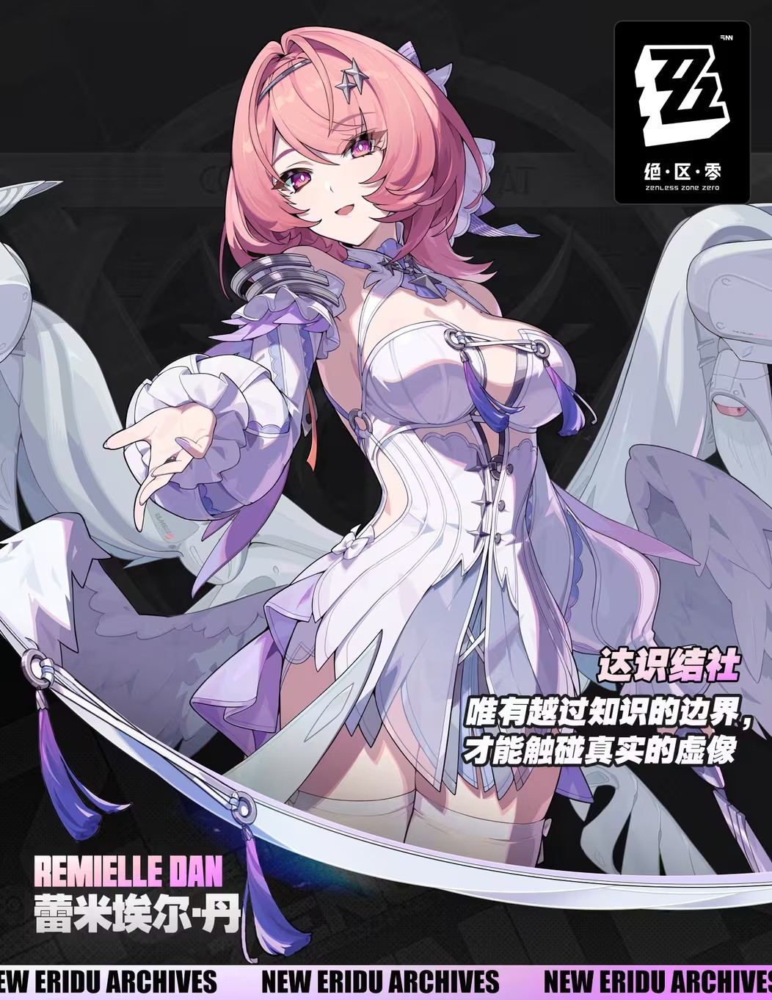
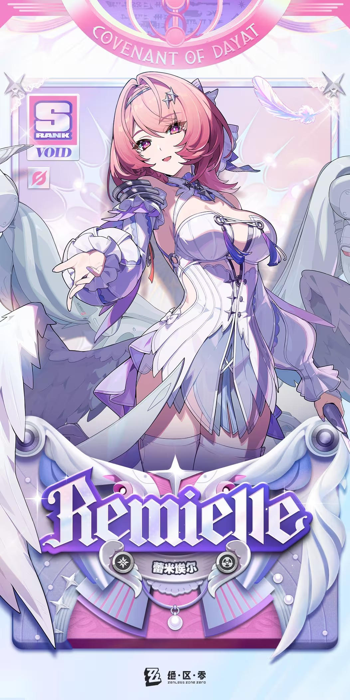
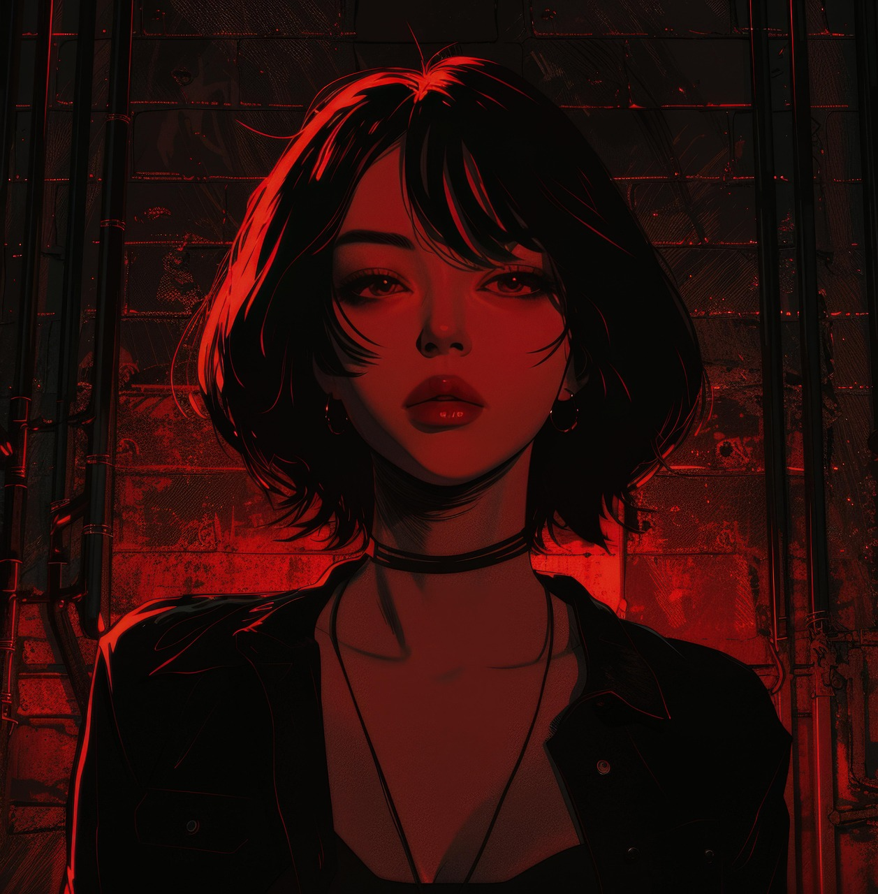

# 蕾米埃尔·丹 Remielle Dan — 2026.08.02
> 视频类型：A · 角色单人壁纸合集
> 角色来源：绝区零 3.1「漫长的告别」· S级流明属性异常型
> 身份：初代虚狩之一 / 前节杖军中校 / 达识结社成员
> 设计参考：六翼天使 + 虚狩武器「塔乌弥尔」化为机械翼
> 热点背景：绝区零3.1二周年庆版本7月29日上线，蕾米埃尔为上半卡池限定角色，首位虚狩+首位流明属性角色，社区讨论热度极高
> 今日特殊：周日，3.1版本上线后第一个周末，周年庆流量高峰期

# 必需

Refer to the attached reference image (Figure 1). Generate a similar style image of Remielle Dan from Zenless Zone Zero sitting in front of a bold graffiti wall with a sly, enigmatic smirk, looking at the camera with playful superiority. She is wearing modern street-fashion: a cropped white bomber jacket with pink and silver metallic accents worn open over a dark fitted crop top, paired with high-waisted black shorts and chunky white sneakers. Keep her recognizable features: short tousled pink hair, violet eyes with a teasing glint, pointed ears, small star and cross hair clips on one side. The graffiti wall behind her should feature pink, white, and silver wing motifs, feather tags, and abstract geometric patterns echoing her six-wing weapon design. Hands resting naturally at her sides, perfect hands, five fingers on each hand, well-defined fingers, natural hand pose. 16:9 2K wallpaper format.

Negative Prompt: low quality, worst quality, blurry, pixelated, bad anatomy, bad hands, extra fingers, fewer fingers, missing fingers, fused fingers, webbed fingers, merged fingers, overlapping fingers, deformed fingers, mutated fingers, six fingers, four fingers, three fingers, more than five fingers, less than five fingers, disfigured hands, poorly drawn hands, bad hand anatomy, asymmetrical hands, broken fingers, claw hands, blurry hands, indistinct fingers, smeared hands, extra limbs, chibi, childish, wrong hair color, wrong eye color, round ears, cheerful innocent expression, warm earthy colors, fire effects, text, watermark, logo, signature.

# 人物设定

## 1 — 苍白荒秽中苏醒（百年沉睡终结）

Positive Prompt:
16:9 wallpaper, Remielle Dan from Zenless Zone Zero, highly detailed anime-style illustration, polished game-art quality, cinematic composition, ethereal and haunting atmosphere, emotional storytelling.

Depict the moment Remielle awakens from her century-long slumber in the depths of a pale, desolate hollow void. She rises slowly from a bed of crystallized white corruption — the "pale desolation" — fragments of hollow matter suspended weightlessly around her like frozen snow. Her six mechanical wings (her Void Hunter weapon Tawmir) unfurl behind her in a slow, magnificent spread, transitioning from dormant dark grey to radiant white-gold as they reactivate, shedding motes of Lumiflux energy that scatter like stardust. Her short pink hair lifts gently in the energy updraft, and her violet eyes open with a gaze that carries the weight of a hundred years — half-lidded, melancholic, yet sharp with renewed purpose.

Keep her canonical design: short pink hair, violet eyes, pointed ears, star and cross hair ornaments, light-colored flowing outfit with dark metallic trim and layered feather-fabric details. Her outfit should show signs of age — frost patterns and faint cracks in the fabric that glow softly with Lumiflux light as her body reawakens.

Her hands rest at her sides, fingers relaxed, perfect hands, five fingers on each hand, well-defined fingers, natural hand pose.

The background is a vast hollow cavern with pale white and grey crystalline formations stretching into darkness, faint luminescent veins pulsing in the walls. The composition centers on Remielle rising from the center of the frame, wings spreading to fill the upper half of the image, the desolation below and around her. The mood should evoke her line: "She awoke from pale desolation. A century's dream was too long."

Negative Prompt:
low quality, worst quality, blurry, bad anatomy, bad hands, extra fingers, fewer fingers, missing fingers, fused fingers, webbed fingers, merged fingers, overlapping fingers, deformed fingers, mutated fingers, six fingers, four fingers, three fingers, more than five fingers, less than five fingers, disfigured hands, poorly drawn hands, bad hand anatomy, asymmetrical hands, broken fingers, claw hands, blurry hands, indistinct fingers, smeared hands, extra limbs, chibi style, flat lighting, bright cheerful scene, daytime outdoor, green nature, fire effects, wrong hair color, wrong eye color, missing wings, round ears, modern city background, casual clothing, text, watermark.

## 2 — 初代虚狩·百年前的黑墙之战

Positive Prompt:
16:9 wallpaper, Remielle Dan from Zenless Zone Zero, highly detailed anime-style illustration, polished game-art quality, epic battle scene, historical war atmosphere, dramatic cinematic lighting.

Depict Remielle one hundred years ago as a Lieutenant Colonel of the Guard of Staves, leading the charge against the "Black Wall" — the encroaching hollow corruption that threatened the old capital. She stands at the forefront of a battlefield, her six white mechanical wings fully deployed in combat configuration — the largest pair swept wide like main engines, the middle pair angled forward for acceleration, the smallest pair stabilizing behind her. Her hands grip her weapon firmly, perfect hands, five fingers on each hand, well-defined fingers, natural grip. Her weapon Tawmir glows with intense Lumiflux energy, the wings leaving brilliant trailing arcs of pink-white light as she slashes through the dark wall of corruption. Her expression is fierce, determined, and unyielding — the face of a young soldier who believes she can push back the darkness itself.

She wears her Guard of Staves military uniform: a structured white and silver officer's coat with dark navy and pink trim, ceremonial shoulder epaulettes, a sash bearing the Guard's emblem, fitted trousers, and polished boots. Her star and cross hair ornaments are pinned precisely in regulation style. Her pink hair is tied back in a neat military tail.

The background shows the old capital under siege: a massive dark wall of corruption looming from one side, cracked buildings and shattered streets, soldiers in formation behind her, the sky split between dark corruption above and pale dawn light breaking through where she has carved a path. The scene should feel like a historical epic — the moment heroes were made.

Dynamic diagonal composition with Remielle at the center of action, wings trailing light, the Black Wall visible as a looming dark mass. Wide cinematic framing showing the scale of the battle.

Negative Prompt:
low quality, blurry, bad anatomy, bad hands, extra fingers, fewer fingers, missing fingers, fused fingers, webbed fingers, merged fingers, overlapping fingers, deformed fingers, mutated fingers, six fingers, four fingers, three fingers, more than five fingers, less than five fingers, disfigured hands, poorly drawn hands, bad hand anatomy, asymmetrical hands, broken fingers, claw hands, blurry hands, indistinct fingers, smeared hands, deformed, extra limbs, stiff pose, weak motion, flat effects, static composition, incorrect outfit, missing wings, modern city, peaceful mood, chibi style, round ears, wrong hair color, text, watermark.

## 3 — 空洞英雄大奖赛·拉米尔伪装形态

Positive Prompt:
16:9 wallpaper, Remielle Dan from Zenless Zone Zero, highly detailed anime-style illustration, polished game-art quality, mysterious undercover atmosphere, tournament event setting.

Depict Remielle in her disguised persona "Ramiel" at the Hollow Hero Grand Prix registration event at Star Ring Tower. She stands casually leaning against a railing, arms crossed naturally over her chest, hands tucked, perfect hands, five fingers on each hand, well-defined fingers, with a sly, knowing smirk — the expression of someone hiding a century-old secret behind a playful mask. Her six wings are in their BLACK form — dark as midnight, feathered with an iridescent dark sheen that catches purple and pink highlights. She wears a black lace half-mask over the lower portion of her face, obscuring her identity. A translucent dark veil drapes from her hair ornaments.

Keep her recognizable features: short pink hair (slightly messier, more casual), violet eyes visible above the mask with a teasing glint, pointed ears, star and cross hair ornaments now in dark metal. Her outfit is a darker variant — a black and dark purple layered outfit with silver chain accents, replacing her usual light colors with a gothic-inspired dark palette while maintaining the same silhouette.

The background is the bustling Star Ring Tower registration area: holographic billboards advertising the Grand Prix, crowds of diverse participants, neon signs, a festive tournament atmosphere. The lighting is warm and energetic, contrasting with her cool, mysterious presence. White feather motes drift around her feet — the only hint of her true nature.

Medium shot composition, slightly from below to give her an air of confident mystery. The viewer should feel they are discovering her secret along with the protagonist.

Negative Prompt:
low quality, blurry, bad anatomy, bad hands, extra fingers, fewer fingers, missing fingers, fused fingers, webbed fingers, merged fingers, overlapping fingers, deformed fingers, mutated fingers, six fingers, four fingers, three fingers, more than five fingers, less than five fingers, disfigured hands, poorly drawn hands, bad hand anatomy, asymmetrical hands, broken fingers, claw hands, blurry hands, indistinct fingers, smeared hands, deformed, white wings, bright cheerful outfit, missing mask, round ears, wrong hair color, military uniform, combat scene, blood, gore, text, watermark.

## 4 — 罗斯凯利法浮空城对峙（真实身份揭露）

Positive Prompt:
16:9 wallpaper, Remielle Dan from Zenless Zone Zero, highly detailed anime-style illustration, polished game-art quality, dramatic confrontation atmosphere, floating city setting, cinematic tension.

Depict the climactic moment when Remielle reveals her true identity in the floating city of Rosé Kelly Law. She stands on the edge of a towering platform among the clouds, her six wings transformed from black to their true radiant white — a breathtaking metamorphosis, dark feathers dissolving into cascading light particles that reform as brilliant white-gold mechanical wings. She faces away from the viewer toward a distant figure (Wanzhou), her body language taut with a century of unanswered questions. Her hands hang relaxed at her sides, fingers slightly curled, perfect hands, five fingers on each hand, well-defined fingers, natural hand pose. Her black lace mask crumbles away, dissolving into Lumiflux particles, revealing her full face — expression cold, determined, and carrying the weight of a hundred years of silence.

Her outfit returns to its true form: light-colored flowing garments with dark metallic trim, layered feather-fabric details, star and cross ornaments now gleaming silver-gold. The full majesty of a Void Hunter restored.

The background is the magnificent floating city of Rosé Kelly Law: towering spires and platforms suspended among a sea of clouds, pale golden light filtering through, Lumiflux energy humming in the air. The city's architecture is grand and ethereal — white stone, crystal bridges, floating gardens. Below, an abyss of clouds and distant city lights. The scene should feel like the reveal of a legend.

Wide cinematic composition with Remielle at the right third, wings spreading wide, the floating city stretching behind her. Dramatic backlighting from the city creating a radiant halo around her wings.

Negative Prompt:
low quality, blurry, bad anatomy, bad hands, extra fingers, fewer fingers, missing fingers, fused fingers, webbed fingers, merged fingers, overlapping fingers, deformed fingers, mutated fingers, six fingers, four fingers, three fingers, more than five fingers, less than five fingers, disfigured hands, poorly drawn hands, bad hand anatomy, asymmetrical hands, broken fingers, claw hands, blurry hands, indistinct fingers, smeared hands, deformed, black wings, dark outfit, missing wings, round ears, wrong hair color, modern city, indoor scene, casual pose, cheerful expression, chibi style, text, watermark.

## 5 — 赛博朋克新艾利都（现代风·神秘御姐）

Positive Prompt:
16:9 wallpaper, Remielle Dan from Zenless Zone Zero, highly detailed anime-style illustration, cyberpunk aesthetic, neon-lit urban atmosphere, polished character art, stylish and mysterious.

Reimagine Remielle in a cyberpunk New Eridu setting. She stands on a rooftop overlooking the sprawling neon city at night, one hand resting on a holographic railing, the other hand resting casually at her side. Perfect hands, five fingers on each hand, well-defined fingers, natural hand pose. She wears a sleek white tech-wear jacket with pink luminescent circuit-line patterns along the seams, worn open over a dark bodysuit, high-waisted dark shorts, and knee-high white boots with pink LED sole accents. Her star and cross hair ornaments are redesigned as sleek cybernetic hairpins with tiny holographic displays.

Her short pink hair is styled with a slight undercut, cybernetic pointed ears visible. Her violet eyes glow faintly with digital enhancement, scanning data streams visible only to her. Her expression is the classic Remielle smirk — enigmatic, teasing, and three steps ahead of everyone else.

Behind her, six holographic wing-shaped drones hover in formation — a technological nod to her Tawmir weapon — each emitting a soft pink-white light. The background is a dense cyberpunk cityscape: towering buildings with glowing pink and blue neon signs, holographic billboards advertising the Hollow Hero Grand Prix, flying vehicles in the sky, steam rising from vents. The atmosphere is sleek, mysterious, and electric.

Cinematic wide composition with Remielle on the right third, the city skyline behind her, holographic drones forming a wing silhouette. Pink-white and deep blue color palette.

Negative Prompt:
low quality, blurry, bad anatomy, bad hands, extra fingers, fewer fingers, missing fingers, fused fingers, webbed fingers, merged fingers, overlapping fingers, deformed fingers, mutated fingers, six fingers, four fingers, three fingers, more than five fingers, less than five fingers, disfigured hands, poorly drawn hands, bad hand anatomy, asymmetrical hands, broken fingers, claw hands, blurry hands, indistinct fingers, smeared hands, deformed, warm tropical setting, bright sunshine, cheerful innocent expression, casual cute outfit, historical military outfit, fire effects, traditional Japanese aesthetic, round ears, wrong hair color, text, watermark.

## 6 — 流明相变时流（战斗美学·全火力释放）

Positive Prompt:
16:9 wallpaper, Remielle Dan from Zenless Zone Zero, highly detailed anime-style illustration, dynamic action composition, dramatic elemental effects, polished game-art quality, epic battle scene.

Depict Remielle in her "Phase Transition Flow" (相变时流) combat state — her ultimate form where her Void Hunter weapon Tawmir reaches full resonance. She hovers suspended in mid-air above a hollow battlefield, six wings spread to their maximum span, each wing glowing intensely with Lumiflux energy — the three pairs of wings now differentiated: the largest pair swept back like twin engines at full thrust, the middle pair curled forward projecting concentrated energy beams, the smallest pair spinning rapidly behind her like stabilizing rotors. Lumiflux energy pours from her wings in cascading streams of pink-white light, transforming the hollow corruption around her into crystallized "Lumen Accumulation Points" — small star-like markers that dot the battlefield.

Her outfit is in its activated state — the light fabric portions now glow with internal Lumiflux light, dark metallic trim crackling with energy, the layered feather details floating weightlessly around her. Her pink hair lifts and streams upward in the energy field. Her arms are spread wide, fingers extended, perfect hands, five fingers on each hand, well-defined fingers. Her expression is coldly focused — not angry, but the absolute precision of a century-old warrior executing a calculated strike. Her violet eyes blaze with white-gold Lumiflux.

The background is a hollow void being "purified" — dark corruption matter dissolving into white crystal formations radiating outward from her position. Enemy constructs shatter into luminous fragments. The sky above the hollow fractures into geometric light patterns.

Dynamic composition with Remielle at the upper center, wings spreading to fill the frame, the purified battlefield visible below. Strong upward energy flow. Epic scale.

Negative Prompt:
low quality, blurry, bad anatomy, bad hands, extra fingers, fewer fingers, missing fingers, fused fingers, webbed fingers, merged fingers, overlapping fingers, deformed fingers, mutated fingers, six fingers, four fingers, three fingers, more than five fingers, less than five fingers, disfigured hands, poorly drawn hands, bad hand anatomy, asymmetrical hands, broken fingers, claw hands, blurry hands, indistinct fingers, smeared hands, extra limbs, stiff pose, weak motion, flat effects, static composition, missing wings, indoor scene, peaceful mood, chibi, wrong outfit, cheerful expression, fire effects, warm colors, round ears, wrong hair color, text, watermark.

## 7 — 百年后的日常（反差萌·温馨）

Positive Prompt:
16:9 wallpaper, Remielle Dan from Zenless Zone Zero, highly detailed anime-style illustration, soft pastel lighting, cozy indoor atmosphere, adorable slice-of-life mood, polished character art.

Depict Remielle in a rare casual moment — a century-old soldier-hunter trying to navigate modern everyday life. She sits cross-legged on a plush white sofa in a cozy New Eridu apartment, deeply focused on a tablet screen showing a cooking tutorial, her hands holding the tablet naturally, perfect hands, five fingers on each hand, well-defined fingers, her lips slightly pursed in concentration. She wears an oversized pink knit sweater that slips off one shoulder, soft white shorts, and her hair is slightly messy — a far cry from her immaculate combat appearance. Her six wings are retracted to a dormant mini form — three small pairs of compact feathered appendages resting flat against her back, occasionally twitching like a cat's ears when she's absorbed in something.

A plate of freshly baked cookies (slightly burnt on one side — she's still learning) sits on the coffee table next to a mug of pink hot chocolate. Through the window behind her, the New Eridu skyline glitters at dusk. A small collection of hollow creature plushies — souvenirs from her century of experiences — line a shelf nearby.

Her expression is one of endearing frustration — brow furrowed, cheeks faintly flushed, the look of someone who has defeated eldritch horrors but cannot master an air fryer. This is the private Remielle that no one in her century of life has ever seen.

Composition: medium-close shot, slightly elevated angle looking down at her on the sofa, intimate and cozy framing. Warm indoor lighting with cool blue tones from the window.

Negative Prompt:
low quality, blurry, bad anatomy, bad hands, extra fingers, fewer fingers, missing fingers, fused fingers, webbed fingers, merged fingers, overlapping fingers, deformed fingers, mutated fingers, six fingers, four fingers, three fingers, more than five fingers, less than five fingers, disfigured hands, poorly drawn hands, bad hand anatomy, asymmetrical hands, broken fingers, claw hands, blurry hands, indistinct fingers, smeared hands, deformed, combat scene, weapon, full-size wings spread, armor, aggressive expression, harsh lighting, dark atmosphere, revealing outfit, outdoor scene, multiple characters, text, watermark.

## 8 — 二周年庆典特别版（周年舞会·盛装）

Positive Prompt:
16:9 wallpaper, Remielle Dan from Zenless Zone Zero, highly detailed anime-style illustration, polished game-art quality, grand ballroom atmosphere, celebration and nostalgia, cinematic dramatic lighting.

Create a special anniversary tribute artwork depicting Remielle at a grand celebratory ball — a callback to the historic ball where the first Void Hunters were honored. She stands at the center of a magnificent ballroom in Rosé Kelly Law, dressed in an elegant white and silver gown that incorporates her combat aesthetic — flowing feathered layers, metallic trim, and subtle Lumiflux-thread embroidery that glows softly. Her six wings are half-deployed in a relaxed, ornamental spread — not combat-ready, but displayed proudly like ceremonial banners. Her star and cross hair ornaments are upgraded with jeweled settings.

She extends one hand gracefully in an invitation to dance, fingers elegantly relaxed, perfect hands, five fingers on each hand, well-defined fingers, natural hand pose — a sly, warm smile on her face, the kind that says: "The ball is almost over, and you still haven't found a partner? Well, I suppose I can spare one dance." Her violet eyes sparkle with a mixture of century-old memories and genuine present-moment joy. This is Remielle at her most radiant — not the soldier, not the fugitive, but the girl who wrote her name among the heroes because she held ideals brighter than the sun.

The ballroom is breathtaking: crystal chandeliers, marble floors, tall windows showing the floating city and starry sky, other guests in formalwear visible as soft-focus background. Lumiflux particles drift like fireflies. A full moon is visible through the grand windows — "The city was captivated, the full moon lost its luster."

Symmetrical centered composition with Remielle as the focal point, wings spread behind her like a peacock's fan. The overall feel should be nostalgic, celebratory, and beautiful.

Negative Prompt:
low quality, blurry, bad anatomy, bad hands, extra fingers, fewer fingers, missing fingers, fused fingers, webbed fingers, merged fingers, overlapping fingers, deformed fingers, mutated fingers, six fingers, four fingers, three fingers, more than five fingers, less than five fingers, disfigured hands, poorly drawn hands, bad hand anatomy, asymmetrical hands, broken fingers, claw hands, blurry hands, indistinct fingers, smeared hands, deformed, combat outfit, military uniform, aggressive expression, dark atmosphere, grim mood, casual clothing, missing wings, round ears, wrong hair color, indoor dim lighting, text, watermark.

# 参考图

## 9（参考立绘生成战斗场景）

Refer to the attached splash art of Remielle Dan. Generate a dynamic 16:9 2K wallpaper of her in mid-combat. She descends from above, six wings folded in a dive-bomb configuration, weapon Tawmir glowing with concentrated Lumiflux energy. Below her, a hollow battlefield with corrupted enemies crumbling under the impact of her landing. Her pink hair whips upward from the speed of descent. Her arms swept back from the dive, perfect hands, five fingers on each hand, well-defined fingers. Her expression is cold and lethal — a Void Hunter executing judgment. Pink-white energy explosion on impact, geometric light patterns fracturing the air. Cinematic, epic scale, dramatic backlit composition.

Negative Prompt: low quality, blurry, bad anatomy, bad hands, extra fingers, fewer fingers, missing fingers, fused fingers, webbed fingers, merged fingers, overlapping fingers, deformed fingers, mutated fingers, six fingers, four fingers, three fingers, more than five fingers, less than five fingers, disfigured hands, poorly drawn hands, bad hand anatomy, asymmetrical hands, broken fingers, claw hands, blurry hands, indistinct fingers, smeared hands, extra limbs, stiff pose, flat background, indoor scene, peaceful mood, chibi, wrong outfit, missing wings, cheerful expression, fire effects, round ears, text, watermark.

## 10（参考立绘·手机竖屏壁纸）

Refer to the attached gacha art of Remielle Dan. Resize and adapt this image composition into a 9:16 2K resolution mobile wallpaper format. Expand the background upward and downward — extend the Lumiflux energy effects and wing feather motes above her head, and show her full outfit details and decorative floor pattern below. Maintain the same elegant pose with perfect hands, five fingers on each hand, well-defined fingers, art style, color palette, and level of detail. The character should be centered with comfortable spacing on all sides for mobile screen use.

Negative Prompt: low quality, blurry, cropped, bad anatomy, bad hands, extra fingers, fewer fingers, missing fingers, fused fingers, webbed fingers, merged fingers, overlapping fingers, deformed fingers, mutated fingers, six fingers, four fingers, three fingers, more than five fingers, less than five fingers, disfigured hands, poorly drawn hands, bad hand anatomy, asymmetrical hands, broken fingers, claw hands, blurry hands, indistinct fingers, smeared hands, wrong character, different art style, different color palette, different pose, text, watermark.

# 跨领域参考图

## 11（参考布格罗《天使之歌》·古典天使美学融合）

Positive Prompt:
16:9 wallpaper, Remielle Dan from Zenless Zone Zero, highly detailed illustration blending anime character design with 19th-century Academic painting style, soft luminous lighting, dreamy ethereal atmosphere, classical beauty.

Refer to the attached painting — William-Adolphe Bouguereau's "Song of the Angels" (1881). Recreate the masterpiece's composition and mood with Remielle replacing the central angelic figure. She is seated in a serene pose, her six mechanical wings reconfigured into a softer, more angelic form — the metallic edges softened, the feathered layers spreading gracefully behind her like the wings of Bouguereau's angels. She holds a delicate string instrument (a small harp or lute) resting gently against her, her hands cradling it naturally, perfect hands, five fingers on each hand, well-defined fingers, anatomically correct hands, her head tilted slightly with eyes half-closed in peaceful contemplation — a far cry from her usual sly smirk, this is the private peace of a century-old soul.

Crucially, blend two art styles: Remielle herself should retain her anime character design clarity (clean face, distinctive pink hair, violet eyes, pointed ears, star/cross ornaments), but the surrounding environment — the soft draped fabric, the marble architectural elements, the gentle chiaroscuro lighting — should be rendered in Bouguereau's Academic style with smooth blended brushwork, warm-cool light contrast, and that characteristic luminous skin quality. Add Remielle's unique twist: where Bouguereau's angels emanate divine warmth, Remielle's Lumiflux energy subtly tints the light with soft pink-white, creating an ethereal hybrid of classical angelic beauty and futuristic elemental power.

The overall mood should feel timeless, sacred, and hauntingly beautiful — as if a legend from a century ago was painted by a master who somehow glimpsed the future.

Negative Prompt:
low quality, blurry, bad anatomy, bad hands, extra fingers, fewer fingers, missing fingers, fused fingers, webbed fingers, merged fingers, overlapping fingers, deformed fingers, mutated fingers, six fingers, four fingers, three fingers, more than five fingers, less than five fingers, disfigured hands, poorly drawn hands, bad hand anatomy, asymmetrical hands, broken fingers, claw hands, blurry hands, indistinct fingers, smeared hands, extra limbs, stiff pose, fully photorealistic, fully 3D rendered, flat digital art with no painterly texture, modern background, combat scene, weapon drawn, harsh lighting, neon colors, chibi style, wrong character, wrong hair color, round ears, missing wings, text, watermark.

## 12（参考黑色电影 Noir 摄影·伪装形态暗调美学）

Positive Prompt:
16:9 wallpaper, Remielle Dan from Zenless Zone Zero, highly detailed illustration blending anime character design with film noir photography aesthetic, dramatic chiaroscuro lighting, mysterious and moody atmosphere, high-contrast monochrome with selective color.

Refer to the attached film noir style portrait photograph. Recreate the dramatic lighting and composition with Remielle in her black-winged "Ramiel" disguised form. She stands in profile with hands at her sides, perfect hands, five fingers on each hand, well-defined fingers, half her face hidden in deep shadow while the other half is lit by a single slant of pale light — the classic noir split-lighting. Her black lace half-mask is visible, her violet eye catching the light like a jewel in darkness. Her six black wings fold close behind her, barely distinguishable from the shadows. The composition emphasizes mystery, duality, and the weight of hidden identity — a woman who has lived a hundred years wearing masks.

Keep Remielle's recognizable features: short pink hair (rendered in muted mauve-pink tones rather than bright pink, respecting the noir palette), violet eye catching the light, pointed ear, star hair ornament (dark metal). Her outfit is the dark variant — black and dark purple layered clothing with silver accents.

The background is pure noir: deep blacks with faint geometric shapes suggesting an urban environment, a single window casting blade-of-light across the frame, cigarette smoke or mist curling in the light beam. The entire image should feel like a frame from a 1940s detective film — except the "detective" is a century-old angelic warrior in disguise.

The key is to preserve the photographic noir's dramatic shadow play and emotional weight — the loneliness and intrigue of a figure living in the margins — while translating it into Zenless Zone Zero's anime art style. Selective color: the entire image is near-monochrome (greys, blacks, muted tones) EXCEPT for her violet eye and faint Lumiflux particles, which glow with subtle pink-white luminescence.

Negative Prompt:
low quality, blurry, bad anatomy, bad hands, extra fingers, fewer fingers, missing fingers, fused fingers, webbed fingers, merged fingers, overlapping fingers, deformed fingers, mutated fingers, six fingers, four fingers, three fingers, more than five fingers, less than five fingers, disfigured hands, poorly drawn hands, bad hand anatomy, asymmetrical hands, broken fingers, claw hands, blurry hands, indistinct fingers, smeared hands, deformed, bright cheerful scene, full color, flat lighting, white wings, combat pose, weapon drawn, chibi style, photorealistic face, modern colorful background, outdoor daylight, round ears, wrong hair color, text, watermark.
