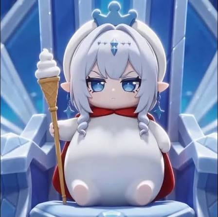

# 安娜丝塔夏·蜜雪雪王 — 2026.08.20
> 视频类型：D · 表情包合集
> 角色：安娜丝塔夏（Anastasya / 冰之女皇 / 冰神）
> 形象来源：原神社区热梗「冰神安娜丝塔夏 × 蜜雪冰城雪王」
> 梗图概念：冰之女皇的头部（银白麻花辫、冰蓝眼、精灵耳、额饰冰晶、小皇冠） + 蜜雪冰城雪王的圆滚滚白色雪人身体 + 红色披风 + 冰淇淋权杖
> 画面比例：1:1
> 今日特殊：社区梗热度持续，冰神7.0形象曝光后二创爆火

# 统一形象设定

所有表情包共享以下基础形象：

**头部（安娜丝塔夏特征）**：银白色双麻花辫垂于两侧，发尾微卷；冰蓝色大眼睛，眼神根据表情变化；尖精灵耳从发间露出；额头中央有一颗菱形冰晶装饰；头顶戴一顶小巧的冰蓝色皇冠。

**身体（蜜雪雪王特征）**：圆滚滚的白色雪人状身体，无脖子，头部直接连接在圆润的身体上；身体表面有轻微的雪粒质感；无明显的腿，底部是圆润的弧形；两只短小的白色圆手（像雪人的树枝手臂但圆润化）。

**服装**：背后披着红色斗篷（蜜雪雪王标志性红披风），斗篷边缘有金色镶边；身体中央有一条红色领结或红色腰带装饰。

**道具**：右手握着一支冰淇淋甜筒权杖 —— 金色锥形蛋筒底座，上面是三层螺旋白色冰淇淋，顶端插着一面小旗帜或冰晶装饰。

**画风**：可爱Q版（chibi）风格，线条柔和，色彩明亮饱和，卡通渲染，无复杂背景或纯白/淡蓝渐变背景。

---

## 1 — 冷漠女王

参考这张设定图，生成一张1:1表情包。安娜丝塔夏·蜜雪雪王端坐在冰晶王座上，双手放在圆滚滚的身体两侧，右手握着冰淇淋权杖。表情冷峻威严，冰蓝色眼睛微微眯起俯视前方，嘴角平直没有任何弧度，一脸"本皇不想说话"的高冷气场。头顶小皇冠微微闪光。背景是淡蓝色的冰晶宫殿。下方配文字"你爱我，我爱你，至冬冰城甜蜜蜜"（小字，位于图片底部）。chibi cute style, 1:1 emoji format.

Negative Prompt: low quality, blurry, bad anatomy, extra limbs, wrong hair color, wrong eye color, round ears, missing crown, missing cape, realistic style, photorealistic, dark background, text watermark.

## 2 — 请你吃冰淇淋

生成一张1:1表情包。安娜丝塔夏·蜜雪雪王把右手向前伸出，手里的冰淇淋甜筒权杖递向前方，像是在邀请对方品尝。冰蓝色眼睛微微弯起，嘴角带着一丝不易察觉的温柔笑意，但因为平日的高冷人设，这丝笑意显得很克制、很珍贵。圆滚滚的白色身体微微前倾，红色披风在身后轻轻扬起。背景纯白。下方配文字"吃吗？本皇亲手（权杖）做的"（底部居中，俏皮字体）。chibi cute style, 1:1 emoji format.

Negative Prompt: low quality, blurry, bad anatomy, extra limbs, wrong hair color, wrong eye color, round ears, missing crown, missing cape, realistic style, photorealistic, dark background.

## 3 — 震惊

生成一张1:1表情包。安娜丝塔夏·蜜雪雪王瞪大了冰蓝色的眼睛，瞳孔缩小，嘴巴张成小小的"O"型，一脸的不可置信。左手（圆手）抬起捂在嘴边，右手还紧紧握着冰淇淋权杖但微微倾斜。头顶的小皇冠歪向一边，额头的冰晶装饰闪烁。圆滚滚的白色身体向后微微倾斜，红色披风被震得飘起来。背景是淡蓝色渐变带白色闪电状裂纹。头顶配文字"啊？！"（大号字体，位于头顶上方）。chibi cute style, 1:1 emoji format.

Negative Prompt: low quality, blurry, bad anatomy, extra limbs, wrong hair color, wrong eye color, round ears, missing crown, missing cape, realistic style, photorealistic, dark background.

## 4 — 生气

生成一张1:1表情包。安娜丝塔夏·蜜雪雪王鼓起圆滚滚的白色脸颊（像生气的河豚），冰蓝色眼睛瞪大并带上怒意，眉毛竖起，嘴角向下撇。两只手都握紧成小拳头（圆手），冰淇淋权杖被她夹在胳膊和身体之间。头顶的小皇冠似乎在冒热气（用红色波浪线表示）。圆滚滚的身体因为生气而微微颤抖，红色披风在身后飘动。背景是淡红色渐变。头顶配文字"本皇很生气！"（红色字体，位于头顶）。chibi cute style, 1:1 emoji format.

Negative Prompt: low quality, blurry, bad anatomy, extra limbs, wrong hair color, wrong eye color, round ears, missing crown, missing cape, realistic style, photorealistic, dark background.

## 5 — 无语

生成一张1:1表情包。安娜丝塔夏·蜜雪雪王面无表情，冰蓝色眼睛半睁半闭呈死鱼眼状，嘴角微微抽搐向下，额头上挂着一个大大的汗滴（💧）。右手拿着冰淇淋权杖随意地垂在身侧，左手圆手摊开做出无奈的手势。圆滚滚的白色身体瘫坐着，红色披风无力地垂下。背景纯白。旁边配文字"……"（三个黑色省略号，位于身体右侧）。chibi cute style, 1:1 emoji format.

Negative Prompt: low quality, blurry, bad anatomy, extra limbs, wrong hair color, wrong eye color, round ears, missing crown, missing cape, realistic style, photorealistic, dark background.

## 6 — 偷笑

生成一张1:1表情包。安娜丝塔夏·蜜雪雪王眯起一只冰蓝色眼睛，另一只眼睛弯弯的，嘴角上扬露出一个狡黠得意的坏笑。右手拿着冰淇淋权杖扛在肩膀上（像扛着棒球棍的姿势），左手圆手叉在圆滚滚的腰间。圆滚滚的白色身体微微侧倾，红色披风在身后飘扬，一副"本皇知道些什么但不说"的腹黑表情。背景纯白。旁边配文字"呵，天真"（小字，位于右侧）。chibi cute style, 1:1 emoji format.

Negative Prompt: low quality, blurry, bad anatomy, extra limbs, wrong hair color, wrong eye color, round ears, missing crown, missing cape, realistic style, photorealistic, dark background.

## 7 — 哭泣

生成一张1:1表情包。安娜丝塔夏·蜜雪雪王冰蓝色大眼睛里涌出豆大的泪珠，泪珠呈淡蓝色冰晶状从脸颊滑落。嘴巴向下撇，表情委屈又倔强 —— 明明在哭但还在强撑女皇的尊严。右手拿着冰淇淋权杖，权杖顶端的冰淇淋似乎融化了一点（有融化的白色液体流下）。左手圆手抬起擦眼泪。圆滚滚的白色身体微微蜷缩，红色披风包裹住半边身体，像在寻求安慰。背景是淡蓝到淡紫的渐变。旁边配文字"冰神也会心碎……"（底部，淡蓝色小字）。chibi cute style, 1:1 emoji format.

Negative Prompt: low quality, blurry, bad anatomy, extra limbs, wrong hair color, wrong eye color, round ears, missing crown, missing cape, realistic style, photorealistic, dark background.

## 8 — 摆烂

生成一张1:1表情包。安娜丝塔夏·蜜雪雪王呈"大"字形平躺在地上（圆滚滚的身体完全摊开），冰蓝色眼睛变成两条横线（"_ _"表情），嘴巴是一条平直的线，整个人散发着"本皇累了毁灭吧"的气场。右手还握着冰淇淋权杖但随意地放在身旁，权杖顶端的冰淇淋完全融化成一滩白色液体淌在地上。头顶的小皇冠歪到一边快掉了，红色披风摊在地上像一滩红色水渍。背景纯白。旁边配文字"至冬国……今天不营业了"（小字，位于身体上方）。chibi cute style, 1:1 emoji format.

Negative Prompt: low quality, blurry, bad anatomy, extra limbs, wrong hair color, wrong eye color, round ears, missing crown, missing cape, realistic style, photorealistic, dark background.

## 9 — 思考

生成一张1:1表情包。安娜丝塔夏·蜜雪雪王右手拿着冰淇淋权杖，左手圆手托住下巴（做沉思状），冰蓝色眼睛看向斜上方，瞳孔中似乎有思考的螺旋状高光。头顶飘着一个半透明的蓝色问号气泡。圆滚滚的白色身体端正坐着，红色披风自然垂落。表情严肃认真，像是在思考"如何用神之心兑换一杯蜜雪冰城"。背景纯白。旁边配文字"嗯……按至冬的汇率…"（小字，位于右侧）。chibi cute style, 1:1 emoji format.

Negative Prompt: low quality, blurry, bad anatomy, extra limbs, wrong hair color, wrong eye color, round ears, missing crown, missing cape, realistic style, photorealistic, dark background.

## 10 — 顿悟

生成一张1:1表情包。安娜丝塔夏·蜜雪雪王冰蓝色眼睛突然睁大，瞳孔放大呈亮晶晶的星星状，嘴巴微张呈"啊！"的形状，头顶亮起一个金色灯泡💡（表示灵光一闪）。右手高举冰淇淋权杖，权杖顶端的冰淇淋发出耀眼的金色光芒。左手圆手拍在圆滚滚的身体上。圆滚滚的白色身体因为激动而微微后仰，红色披风在身后飞扬。背景从纯白变为放射状的炫彩光芒（金色、冰蓝、白色交织）。下方配文字"本皇悟了！"（金色大字，底部居中）。chibi cute style, 1:1 emoji format.

Negative Prompt: low quality, blurry, bad anatomy, extra limbs, wrong hair color, wrong eye color, round ears, missing crown, missing cape, realistic style, photorealistic, dark background.

## 11 — 疑惑

生成一张1:1表情包。安娜丝塔夏·蜜雪雪王歪着头（头部向左侧倾斜约15度），冰蓝色眼睛眨巴眨巴，一只眼睁大一只眼微眯，头顶冒出三个蓝色小问号"???"。右手拿着冰淇淋权杖，左手圆手挠挠头（做出挠头困惑的动作）。圆滚滚的白色身体微微向一侧倾斜，红色披风也跟着歪向一边。表情是"这是什么情况本皇没见过"的呆萌困惑。背景纯白。旁边配文字"？至冬国有这规矩？"（小字，位于右侧）。chibi cute style, 1:1 emoji format.

Negative Prompt: low quality, blurry, bad anatomy, extra limbs, wrong hair color, wrong eye color, round ears, missing crown, missing cape, realistic style, photorealistic, dark background.

## 12 — 点赞认可

生成一张1:1表情包。安娜丝塔夏·蜜雪雪王右手拿着冰淇淋权杖，左手圆手竖起大拇指👍（做出点赞的手势）。冰蓝色眼睛微微弯起，嘴角上扬，露出一个冷淡但真诚的认可微笑 —— 不是热情的笑容，而是"你还不错，本皇准许了"的傲娇式赞许。圆滚滚的白色身体端正站立，红色披风在身后整齐地飘扬，头顶小皇冠端正闪亮。背景纯白。旁边配文字"准了，赐你一杯冰淇淋"（小字，位于右侧）。chibi cute style, 1:1 emoji format.

Negative Prompt: low quality, blurry, bad anatomy, extra limbs, wrong hair color, wrong eye color, round ears, missing crown, missing cape, realistic style, photorealistic, dark background.

# 跨领域参考

本次表情包基于原神社区热梗「冰神 × 蜜雪冰城雪王」进行二次创作。蜜雪冰城雪王为蜜雪冰城品牌官方吉祥物，白色雪人身体 + 红色披风 + 皇冠 + 冰淇淋权杖是其标志性视觉元素。安娜丝塔夏为原神7.0版本登场的冰之女皇，银白长发、冰蓝眼、精灵耳、额头冰晶装饰为其标志性特征。
