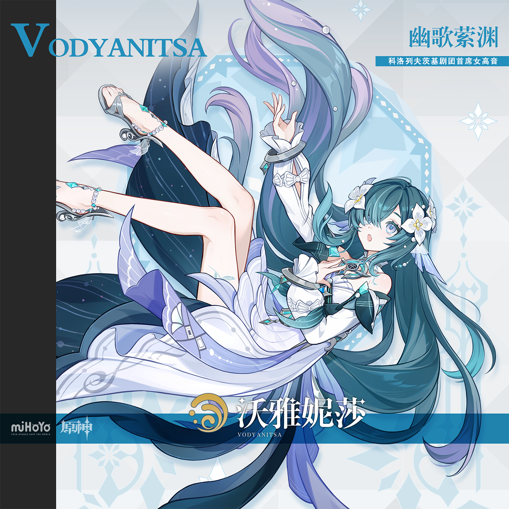

# 沃雅妮莎·正常形象表情包 — 2026.09.26
> 视频类型：D · 表情包合集
> 角色：沃雅妮莎 Vodyanitsa（原神 Genshin Impact）
> 形象类型：正常比例等身形象 · 科洛列夫茨基剧团首席女高音
> 热点背景：原神 7.1「往冥府的安魂歌」上线中，沃雅妮莎（幽歌萦渊·水）为上半卡池 UP 角色（9/23-10/13），卡池热度正处峰值；角色 PV「心之声」金句传播广泛；9/25 微博热帖「读懂沃雅妮莎｜藏在歌声里的温柔」（指引听障观众去后台、温柔对待听障人士）引发新一轮讨论；钓鱼梗「沃不知道噢」持续流行
> 决策理由：崩铁 4.6 明日上线（真珠/绯英/风堇均已覆盖，千冶·刃为男性不满足 A 类例外），原神 7.1 新角色均已出 A 类单人集，绝区零 3.2 无未覆盖新角色 → 今日切类型 D 调节节奏（本周 A×3 + C×1，D 类已空档 12 天）；沃雅妮莎卡池 UP 中、人设表情张力极强（优雅首席 × 呆萌水妖的反差）、社区梗素材丰富（「沃不知道噢」「嘻嘻，吓你的」「女士养女」「人鱼形态」），且从未出过表情包
> 统一形象设定（所有表情必须保持一致）：正常比例等身沃雅妮莎，深青绿色超长直发（发尾渐变淡紫色与浅蓝色）、齐刘海间别着珍珠珠串、右侧头发别白色三瓣小花发饰（金色花蕊）与蓝色丝带、浅蓝色清澈大瞳孔带淡色发光瞳、耳侧半透明淡蓝色鱼鳍形耳饰与水滴形珍珠耳坠、颈间白色荷叶边颈饰配青绿色宝石金边圆形胸饰、白色露肩歌剧礼裙（白色与淡蓝紫层叠裙摆、深蓝色鳍形肩饰、白色分离袖配黑色蝴蝶结）；构图以胸部以上半身像为主；背景为极简纯色色块，随表情情绪变换颜色
> 参考图校对：`ref-splash-art.png`（米游社官方立绘）与 `ref-avatar.png`（官方头像特写）已用视觉工具确认发色/瞳色/发型/服饰/配饰细节——发色为深青绿、发尾渐变淡紫与浅蓝、刘海为深青绿齐刘海非白色、花朵为白色三瓣带金色花蕊

---

## 1 — 谢幕致意·优雅屈膝礼

（首条形象基准图；后续表情保持同一形象）

1:1 表情包，等身比例沃雅妮莎 from 原神，highly detailed 2D anime style，flat cel shading，clean lineart，干净的浅冰蓝色纯色背景。沃雅妮莎保持官方立绘特征：深青绿色超长直发发尾渐变淡紫与浅蓝、齐刘海珍珠珠串、白色三瓣小花发饰金色花蕊、浅蓝清澈瞳孔、半透明淡蓝鱼鳍耳饰与水滴珍珠耳坠、白色荷叶边颈饰配青绿宝石金边圆胸饰、白色露肩歌剧礼裙深蓝鳍形肩饰。她双手提着裙摆在胸前摆出标准歌剧谢幕屈膝礼姿势，头微微低下、睫毛下垂，嘴角挂着优雅得体的浅笑，身边漂浮几颗淡蓝色水珠与一颗五角星特效，头顶飘着小字幕「首席的营业式微笑」。画面上方配大号圆润卡通文字「明天的演出，可别忘了来捧场哦」，下方小字「嘻嘻」。文字清晰可读，无乱码。排除：写实风格、复杂背景、乱码文字。

Negative Prompt:
low quality, worst quality, blurry, pixelated, bad anatomy, extra limbs, bad hands, extra fingers, fewer fingers, missing fingers, fused fingers, merged fingers, overlapping fingers, deformed fingers, mutated fingers, six fingers, four fingers, three fingers, disfigured hands, poorly drawn hands, bad hand anatomy, blurry hands, smeared hands, wrong hair color, wrong eye color, missing flower ornament, missing fin earrings, realistic, photorealistic, 3D render, chibi, two-head-tall proportions, complex detailed background, garbled text, wrong characters, misspelled text, extra text, watermark, logo, signature.

## 2 — 水妖之歌·开嗓高音

1:1 表情包，等身比例沃雅妮莎，2D anime style，flat cel shading，干净的深蓝色纯色背景配一圈青色漩涡状音波纹。沃雅妮莎保持统一形象：深青绿超长直发渐变淡紫浅蓝发尾、珍珠珠串齐刘海、白花金蕊发饰、浅蓝瞳孔、鱼鳍耳饰珍珠耳坠、荷叶颈饰青绿宝石胸饰、白歌剧裙。她一手优雅地按在胸前，另一手向外舒展，头部微扬、双眼闭合、嘴巴张成唱歌的圆润口型，发丝与裙摆随歌声飘起，周身荡开一圈圈淡蓝色水元素音波涟漪，几颗音符符号在漩涡中漂浮发光。画面上方配大号文字「据说，迷恋水妖歌声的人——」，下方小字「会深陷漩涡，再也看不见天日哦」。文字清晰，无乱码。

Negative Prompt:
low quality, worst quality, blurry, pixelated, bad anatomy, extra limbs, bad hands, extra fingers, fused fingers, deformed fingers, six fingers, disfigured hands, poorly drawn hands, wrong hair color, wrong eye color, missing flower ornament, realistic, photorealistic, 3D render, chibi, adult proportions with wrong features, complex detailed background, garbled text, wrong characters, misspelled text, watermark, logo, signature.

## 3 — 坏笑·嘻嘻，吓你的

1:1 表情包，等身比例沃雅妮莎，2D anime style，flat cel shading，干净的淡紫色纯色背景。沃雅妮莎保持统一形象：深青绿超长直发渐变发尾、珍珠珠串、白花发饰、浅蓝瞳孔弯成狡黠的月牙、鱼鳍耳饰、荷叶颈饰宝石胸饰、白歌剧裙。她双手背在身后、身体微微前倾凑近镜头，一只眼睛调皮地眨起 wink，嘴角歪出一个恶作剧得逞的坏笑，头侧漂浮一个「嘻嘻♪」的拟声文字气泡，身边漂着两三颗故作神秘的水泡。画面上方配特大号文字「……嘻嘻，吓你的！」，下方小字「明天还有我的演出呢」。文字清晰，无乱码。

Negative Prompt:
low quality, worst quality, blurry, pixelated, bad anatomy, extra limbs, bad hands, extra fingers, fused fingers, deformed fingers, six fingers, wrong hair color, wrong eye color, realistic, photorealistic, 3D render, chibi, scary horror atmosphere, dark tones, complex detailed background, garbled text, wrong characters, misspelled text, watermark, logo, signature.

## 4 — 无语·沃不知道噢

1:1 表情包，等身比例沃雅妮莎，2D anime style，flat cel shading，干净的灰蓝色纯色背景。沃雅妮莎保持统一形象：深青绿超长直发、珍珠珠串、白花发饰、浅蓝瞳孔半睁成两条懒洋洋的死鱼眼、鱼鳍耳饰、荷叶颈饰宝石胸饰、白歌剧裙。她一手托腮，另一手有气无力地拿着一根小鱼竿，鱼线垂在画面角落的简易水盆里，眼皮半耷拉着斜眼瞟向镜头，头顶漂浮一个巨大的省略号「……」，身侧漂着一条吐泡泡的呆滞小鱼。画面上方配大号文字「沃不知道噢」，下方小字「鱼来捣乱，找我做什么呢」。文字清晰，无乱码。

Negative Prompt:
low quality, worst quality, blurry, pixelated, bad anatomy, extra limbs, bad hands, extra fingers, fused fingers, deformed fingers, six fingers, wrong hair color, wrong eye color, realistic, photorealistic, 3D render, chibi, energetic expression, complex detailed background, garbled text, wrong characters, misspelled text, watermark, logo, signature.

## 5 — 破音惊慌·高音上去了吗

1:1 表情包，等身比例沃雅妮莎，2D anime style，flat cel shading，干净的浅红色纯色背景配放射状速度线。沃雅妮莎保持统一形象：深青绿超长直发吓得根根竖起发梢炸毛、珍珠珠串歪斜、白花发饰差点飞离、浅蓝瞳孔缩成小圆点、脸颊涨红、鱼鳍耳饰、荷叶颈饰宝石胸饰、白歌剧裙。她双手捧脸捂住嘴，头顶飘着一个碎裂的高音音符符号（音符裂成两半）和三颗大颗汗珠，旁边漂浮写着「啊——↑」的破音拟声气泡。画面上方配特大号文字「刚刚那下……破音了？！」，下方小字「今晚加练三小时」。文字清晰，无乱码。

Negative Prompt:
low quality, worst quality, blurry, pixelated, bad anatomy, extra limbs, bad hands, extra fingers, fused fingers, deformed fingers, six fingers, wrong hair color, wrong eye color, realistic, photorealistic, 3D render, chibi, calm expression, complex detailed background, garbled text, wrong characters, misspelled text, watermark, logo, signature.

## 6 — 生气·风旋卷走乐谱

1:1 表情包，等身比例沃雅妮莎，2D anime style，flat cel shading，深青灰色纯色背景配一圈旋转的风纹。沃雅妮莎保持统一形象：深青绿超长直发随风暴起、珍珠珠串、白花发饰、浅蓝瞳孔燃起淡蓝色小火苗、眉毛倒竖、腮帮微鼓、鱼鳍耳饰、荷叶颈饰宝石胸饰、白歌剧裙。她一手叉腰，另一手指向画面外，一只青绿色星辉风旋在她身侧盘旋，卷起五六张五线谱纸页在空中乱飞，纸页上印着音符。画面上方配特大号文字「谁动了我的乐谱？！」，下方小字「星辉风旋，启动」。文字清晰，无乱码。

Negative Prompt:
low quality, worst quality, blurry, pixelated, bad anatomy, extra limbs, bad hands, extra fingers, fused fingers, deformed fingers, six fingers, wrong hair color, wrong eye color, realistic, photorealistic, 3D render, chibi, happy expression, complex detailed background, garbled text, wrong characters, misspelled text, watermark, logo, signature.

## 7 — 职业假哭·入戏是修养

1:1 表情包，等身比例沃雅妮莎，2D anime style，flat cel shading，干净的淡金色纯色背景配舞台聚光灯效果。沃雅妮莎保持统一形象：深青绿超长直发、珍珠珠串、白花发饰、浅蓝瞳孔里汪着两颗超大颗滚圆泪珠（泪珠明显夸张大于正常比例）、嘴角却藏着矜持的弧度、鱼鳍耳饰、荷叶颈饰宝石胸饰、白歌剧裙。她一手捏着白色手帕按在眼角，另一手扶额侧仰，泪珠成串滚落但眼睛偷偷向上瞟，头顶飘着小字「泪腺：已开演」。画面上方配大号文字「入戏，是首席的基本修养」，下方小字「泪水位：完美」。文字清晰，无乱码。

Negative Prompt:
low quality, worst quality, blurry, pixelated, bad anatomy, extra limbs, bad hands, extra fingers, fused fingers, deformed fingers, six fingers, wrong hair color, wrong eye color, realistic, photorealistic, 3D render, chibi, genuinely sad atmosphere, dark tones, complex detailed background, garbled text, wrong characters, misspelled text, watermark, logo, signature.

## 8 — 私心时间·后台偷闲

1:1 表情包，等身比例沃雅妮莎，2D anime style，flat cel shading，柔和的奶油米色纯色背景。沃雅妮莎保持统一形象：深青绿超长直发松松披下、珍珠珠串、白花发饰、浅蓝瞳孔慵懒地半眯成两条缝、嘴角挂着放松的软笑、鱼鳍耳饰、荷叶颈饰宝石胸饰、白歌剧裙。她双手捧着一只冒着热气的超大号茶杯贴在脸颊边，整个人缩在一张高背椅里只露出上半身，头顶漂浮一个「~♪」的哼歌气泡，身侧漂着两颗水珠做的「Zzz」效果。画面上方配大号文字「希望被注视，希望被铭记——」，下方小字「也不过是私心的一种」。文字清晰，无乱码。

Negative Prompt:
low quality, worst quality, blurry, pixelated, bad anatomy, extra limbs, bad hands, extra fingers, fused fingers, deformed fingers, six fingers, wrong hair color, wrong eye color, realistic, photorealistic, 3D render, chibi, energetic expression, complex detailed background, garbled text, wrong characters, misspelled text, watermark, logo, signature.

## 9 — 傲娇·才不是想被夸

1:1 表情包，等身比例沃雅妮莎，2D anime style，flat cel shading，柔和的浅粉色纯色背景撒淡蓝色水珠光斑。沃雅妮莎保持统一形象：深青绿超长直发、珍珠珠串、白花发饰、浅蓝瞳孔偷偷向上瞟、整张脸绯红到耳根、鱼鳍耳饰、荷叶颈饰宝石胸饰、白歌剧裙。她双手交叠在胸前反复摩挲，脑袋扭向一边死活不看镜头，眼角飘着不好意思的「＞＜」符号，身侧漂浮三颗藏不住的淡蓝色小爱心。画面上方配大号文字「才、才不是为了被夸才唱的！」，下方小字「……但你想夸也行」。文字清晰，无乱码。

Negative Prompt:
low quality, worst quality, blurry, pixelated, bad anatomy, extra limbs, bad hands, extra fingers, fused fingers, deformed fingers, six fingers, wrong hair color, wrong eye color, realistic, photorealistic, 3D render, chibi, direct confident eye contact, complex detailed background, garbled text, wrong characters, misspelled text, watermark, logo, signature.

## 10 — 摆烂·今日谢绝练声

1:1 表情包，等身比例沃雅妮莎，2D anime style，flat cel shading，暗沉的灰紫色纯色背景。沃雅妮莎保持统一形象：深青绿超长直发凌乱地披散、珍珠珠串、白花发饰歪掉、浅蓝瞳孔无神地半睁、嘴巴微张呈灵魂出窍状、鱼鳍耳饰、荷叶颈饰宝石胸饰、白歌剧裙。她一手扶着脖子歪靠在琴谱架上，另一手有气无力地举着写有「休」字的木牌，头顶飘着一缕象征嗓子冒烟的灰色小烟圈和旋转的「练声曲谱」纸页。画面上方配大号文字「今天，谢绝练声」，下方小字「水妖的嗓子也是嗓子」。文字清晰，无乱码。

Negative Prompt:
low quality, worst quality, blurry, pixelated, bad anatomy, extra limbs, bad hands, extra fingers, fused fingers, deformed fingers, six fingers, wrong hair color, wrong eye color, realistic, photorealistic, 3D render, chibi, energetic expression, standing pose, complex detailed background, garbled text, wrong characters, misspelled text, watermark, logo, signature.

## 11 — 温柔·把歌写给你看

1:1 表情包，等身比例沃雅妮莎，2D anime style，flat cel shading，温暖的淡青色纯色背景撒柔和光斑。沃雅妮莎保持统一形象：深青绿超长直发、珍珠珠串、白花发饰、浅蓝瞳孔弯成温柔的月牙、嘴角挂着安静的软笑、鱼鳍耳饰、荷叶颈饰宝石胸饰、白歌剧裙。她微微俯身半蹲，双手递出一张写满音符与五线谱的白色小纸条，纸条边缘还画了一朵小花和一颗星星，指尖动作轻柔，纸条上方漂浮几颗淡金色光点，画面氛围安静温柔。画面上方配大号文字「听不见也没关系」，下方小字「我把歌，写给你看」。文字清晰，无乱码。

Negative Prompt:
low quality, worst quality, blurry, pixelated, bad anatomy, extra limbs, bad hands, extra fingers, fused fingers, deformed fingers, six fingers, wrong hair color, wrong eye color, realistic, photorealistic, 3D render, chibi, sad crying expression, complex detailed background, garbled text, wrong characters, misspelled text, watermark, logo, signature.

## 12 — 应援·这一首为你而唱

1:1 表情包，等身比例沃雅妮莎，2D anime style，flat cel shading，热血的蓝紫渐变纯色背景配淡青色放射状光束。沃雅妮莎保持统一形象：深青绿超长直发高高扬起、珍珠珠串、白花发饰、浅蓝瞳孔亮晶晶闪着星光、灿烂的元气笑容、鱼鳍耳饰、荷叶颈饰宝石胸饰、白歌剧裙。她一手握着淡蓝色荧光棒高举过头挥舞，荧光棒尾端拖出一道水色彩带光轨，另一手握拳收在胸前，脚下炸开一圈水花星形特效，发丝与裙摆随动作扬起漂亮的弧线。画面上方配大号描蓝边文字「这一首，为你而唱！」，下方小字「幽歌萦渊·满堂彩」。文字清晰，无乱码。

Negative Prompt:
low quality, worst quality, blurry, pixelated, bad anatomy, extra limbs, bad hands, extra fingers, fused fingers, deformed fingers, six fingers, wrong hair color, wrong eye color, realistic, photorealistic, 3D render, chibi, dull colors, sad expression, complex detailed background, garbled text, wrong characters, misspelled text, watermark, logo, signature.

## 注
- 12 个表情覆盖：营业致意、唱歌（水妖传说梗）、坏笑（名片原句梗）、无语（钓鱼「沃不知道噢」梗）、惊慌（破音）、生气（星辉风旋技能梗）、假哭（首席演技反差）、摆烂偷闲（PV「私心」金句梗）、傲娇比心、职场摆烂（练声）、温柔（9/25「藏在歌声里的温柔」听障观众热帖梗）、应援加油，兼顾日常聊天使用场景与角色专属梗
- 梗文案来源：好感度名片「据说，谁要是迷恋上水妖的歌声，就一定会深陷漩涡，从此再也不能看见天日…嘻嘻，吓你的！明天还有我的演出，可别忘了来捧场哦」、角色 PV「心之声」金句「艺术为理想而存，亦为私心而生」「希望被注视，希望被铭记，也不过是私心的一种」、社区钓鱼梗「沃不知道噢」（旅行者钓鱼被鱼捣乱，沃雅妮莎甩锅回答）、9/25 微博热帖「读懂沃雅妮莎｜藏在歌声里的温柔」（指引听障观众去后台的细节）、战斗技能「星辉风旋/流荡风旋」、社区爱称「沃不明白/沃不知道」句式
- 形象一致性：所有 prompt 使用同一套等身设定描述（深青绿渐变超长直发+珍珠珠串齐刘海+白花金蕊发饰+浅蓝瞳+鱼鳍耳饰珍珠耳坠+荷叶领青绿宝石胸饰+白歌剧裙深蓝鳍肩饰），仅表情/动作/背景/文字不同
- 构图安全：全部以胸部以上半身像为主，规避坐姿/腿部画崩风险；手部动作均为简单姿态（提裙、托腮、捧杯、递纸条、单手举荧光棒），配合手部穷举 negative
- 参考图：复用 9/3 A 类单人合集已校对的官方立绘（splash-art）与官方头像（avatar），无需重新下载
