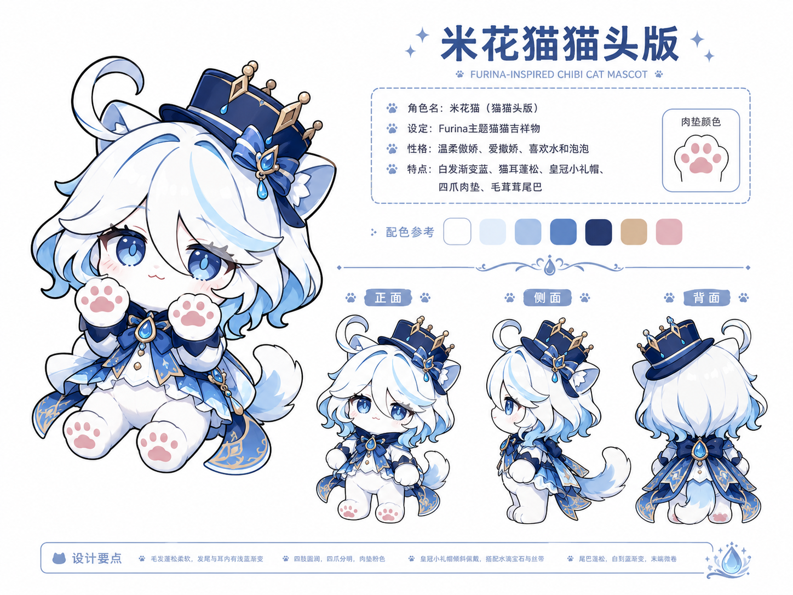
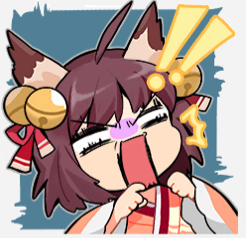
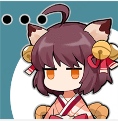
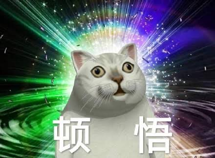

# 表情
## 得意

参考这张设定图，生成一张furina猫猫的图片。她得意地说“不愧是我”，双手叉腰，头向上扬。1:1比例，表情包图片

## 疑问
生成一张疑惑的表情包，头上一个问号，爪子放在下巴处

## 惊慌

参考附图，生成一张她惊恐的样子

## 无语

生成一张她沉默无语😓的表情包。参考图1，三个黑点（代表省略号）

## 喜欢
再生成一张，她星星眼，很喜欢的样子，蓄势待发，就想冲出去把东西拿到手。1:1比例，表情包图片

## 顿悟

生成一张恍然大悟的表情包。眼珠往外张开，双爪垂放在身体两侧，嘴巴微张，呆呆的样子。有两个字“顿悟”在图下方。背景是炫彩光芒放射（可直接复制附图1的）

## 思考
生成一张她严肃思考的表情包。一只手托住下巴