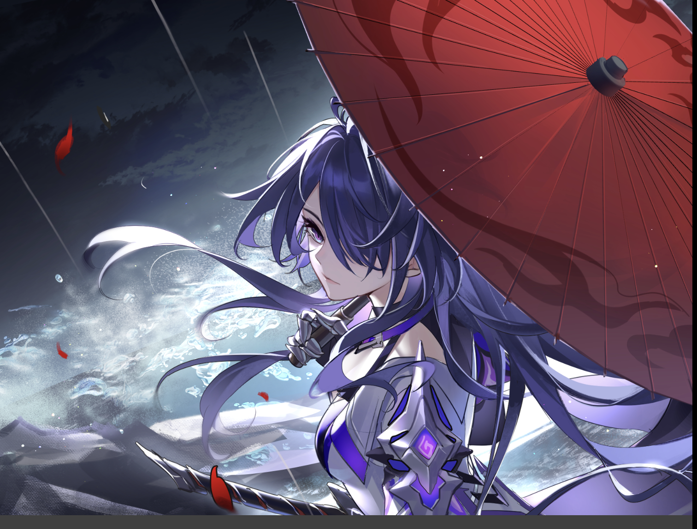
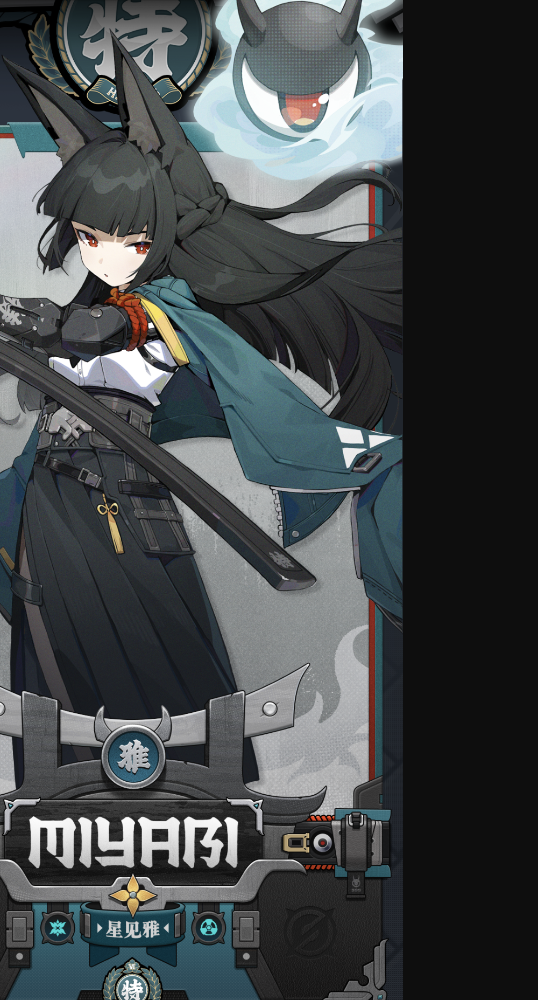

<!--
类型 G · 名场面巡礼 · 第 2 期
模式：模式二（三角色同一定位「车站月台」· 相同姿势相同角度相似着装）
选题：004 三月七（秒速五厘米·剧场版第2话） / 014 黄泉（银河铁道之夜·剧场版） / 018 星见雅（铃芽之旅·剧场版）
选角理由：三月七已有已校对参考图；黄泉、星见雅为本期新补官方参考图并已逐张目视校对入库；三人同属旅人气质，长外套月台回眸构成「同一个小世界」的系列感。
系列约定：统一 3:4 竖版壁纸；背景简洁强制条款；prompt 不写原作名，用构图描述还原名场面氛围；本系列不做名场面截图下载（见 bible 溯源规则第 2 条）。
-->

## 参考图（已校对）






> 参考图作用域（三条 prompt 通用）：`Referring to the attached artwork for character appearance only — hair color, hairstyle, eye color and facial features. Do not copy the outfit, pose, or composition of the reference.`

> 模式二统一项（三条 prompt 逐字一致的部分）：姿势 = 侧身立于月台、回眸望向镜头；角度 = 大腿以上半身构图；着装 = 长款旅行外套；差异仅在场景光线与角色外貌锚点。

---

## 1. 雪国站台·晨雾等车（选题 004 · 三月七 · 来源：秒速五厘米 剧场版第2话）

**背景场景**：雪国小站月台，晨雾弥漫，一座简易站牌与一张候车长椅，远处雪原隐入雾中。构图极简：角色 + 站牌 + 雾中雪原。

**Positive Prompt**：

```
masterpiece anime-style illustration, iconic anime scene recreation, clean simple background, minimalist uncluttered composition, soft cinematic lighting, vivid film-like color grading, highly detailed, 3:4 vertical portrait wallpaper, perfect hands, five fingers on each hand, anatomically correct hands, well-defined fingers, natural hand pose, clean finger separation, a young girl with short pink-white hair with a small ahoge and pink-to-purple gradient eyes (March 7th from Honkai: Star Rail), standing sideways on a small snow-country train platform in soft morning fog, looking back over her shoulder toward the viewer, thigh-up shot, wearing a long cream-colored travel coat with a light blue scarf, one gloved hand gently holding the collar of her coat, a small blue camera hanging at her hip, a simple wooden station sign and a single bench behind her, snow-covered fields fading into white mist, soft diffuse winter morning light, muted blue and white palette
```

**Negative Prompt**：

```
cluttered background, busy background, overly detailed background, stacked overlapping elements, excessive glowing particles, excessive bokeh, light clutter, messy composition, 3d render, photorealistic, western cartoon, lowres, bad anatomy, deformed, disfigured, mutation, blurry, jpeg artifacts, watermark, signature, text, logo, worst quality, low quality, bad hands, extra fingers, fewer fingers, missing fingers, fused fingers, webbed fingers, merged fingers, overlapping fingers, deformed fingers, mutated fingers, six fingers, four fingers, three fingers, more than five fingers, less than five fingers, disfigured hands, poorly drawn hands, bad hand anatomy, asymmetrical hands, broken fingers, claw hands, blurry hands, indistinct fingers, smeared hands, missing legs, missing feet, missing calves, cropped legs, legs out of frame, twisted legs, rotated hips, dislocated hip, extra legs, third leg, fused legs, malformed knees, knees bending in opposite directions, unnatural sitting pose, disproportionate limbs, elongated calves, deformed feet, extra limbs, disfigured, mutation, wrong hair color, wrong eye color, incorrect character
```

---

## 2. 星之夜站台·银河列车（选题 014 · 黄泉 · 来源：银河铁道之夜 剧场版）

**背景场景**：夜晚的银河铁道车站月台，一列银色发光列车载着一点暖黄车灯远远驶近，天穹一条星河横贯。构图极简：角色 + 列车灯 + 星河。

**Positive Prompt**：

```
masterpiece anime-style illustration, iconic anime scene recreation, clean simple background, minimalist uncluttered composition, soft cinematic lighting, vivid film-like color grading, highly detailed, 3:4 vertical portrait wallpaper, perfect hands, five fingers on each hand, anatomically correct hands, well-defined fingers, natural hand pose, clean finger separation, a woman with long dark violet hair fading to crimson at the tips and red-violet eyes (Acheron from Honkai: Star Rail), standing sideways on a quiet night train platform beneath a vast starry sky, looking back over her shoulder toward the viewer, thigh-up shot, wearing a long black travel coat over a dark red inner layer, a katana sheathed at her side, one hand gently holding the collar of her coat, a distant silver train approaching with a single warm headlamp glow, a river of stars stretching across the deep indigo night sky, deep indigo and silver starlight palette with a crimson accent
```

**Negative Prompt**：

```
cluttered background, busy background, overly detailed background, stacked overlapping elements, excessive glowing particles, excessive bokeh, light clutter, messy composition, 3d render, photorealistic, western cartoon, lowres, bad anatomy, deformed, disfigured, mutation, blurry, jpeg artifacts, watermark, signature, text, logo, worst quality, low quality, bad hands, extra fingers, fewer fingers, missing fingers, fused fingers, webbed fingers, merged fingers, overlapping fingers, deformed fingers, mutated fingers, six fingers, four fingers, three fingers, more than five fingers, less than five fingers, disfigured hands, poorly drawn hands, bad hand anatomy, asymmetrical hands, broken fingers, claw hands, blurry hands, indistinct fingers, smeared hands, missing legs, missing feet, missing calves, cropped legs, legs out of frame, twisted legs, rotated hips, dislocated hip, extra legs, third leg, fused legs, malformed knees, knees bending in opposite directions, unnatural sitting pose, disproportionate limbs, elongated calves, deformed feet, extra limbs, disfigured, mutation, wrong hair color, wrong eye color, incorrect character
```

---

## 3. 无人车站·晨雾之门（选题 018 · 星见雅 · 来源：铃芽之旅 剧场版）

**背景场景**：废弃无人车站月台，晨雾弥漫，月台尽头静静立着一扇古旧的白色大门，空轨与野草隐入雾中。构图极简：角色 + 一扇门 + 雾中月台。

**Positive Prompt**：

```
masterpiece anime-style illustration, iconic anime scene recreation, clean simple background, minimalist uncluttered composition, soft cinematic lighting, vivid film-like color grading, highly detailed, 3:4 vertical portrait wallpaper, perfect hands, five fingers on each hand, anatomically correct hands, well-defined fingers, natural hand pose, clean finger separation, a young woman with long black hair, dark fox ears and crimson eyes (Hoshimi Miyabi from Zenless Zone Zero), standing sideways on an overgrown abandoned station platform in soft morning fog, looking back over her shoulder toward the viewer, thigh-up shot, wearing a long dark navy travel coat over a white shirt and a dark hakama-style long skirt, a katana sheathed at her waist, one hand gently holding the collar of her coat, a single tall antique white door standing quietly at the end of the platform, empty rails and wild grasses fading into mist, soft diffuse morning light, muted green-grey and white palette
```

**Negative Prompt**：

```
cluttered background, busy background, overly detailed background, stacked overlapping elements, excessive glowing particles, excessive bokeh, light clutter, messy composition, 3d render, photorealistic, western cartoon, lowres, bad anatomy, deformed, disfigured, mutation, blurry, jpeg artifacts, watermark, signature, text, logo, worst quality, low quality, bad hands, extra fingers, fewer fingers, missing fingers, fused fingers, webbed fingers, merged fingers, overlapping fingers, deformed fingers, mutated fingers, six fingers, four fingers, three fingers, more than five fingers, less than five fingers, disfigured hands, poorly drawn hands, bad hand anatomy, asymmetrical hands, broken fingers, claw hands, blurry hands, indistinct fingers, smeared hands, missing legs, missing feet, missing calves, cropped legs, legs out of frame, twisted legs, rotated hips, dislocated hip, extra legs, third leg, fused legs, malformed knees, knees bending in opposite directions, unnatural sitting pose, disproportionate limbs, elongated calves, deformed feet, extra limbs, disfigured, mutation, wrong hair color, wrong eye color, incorrect character
```
