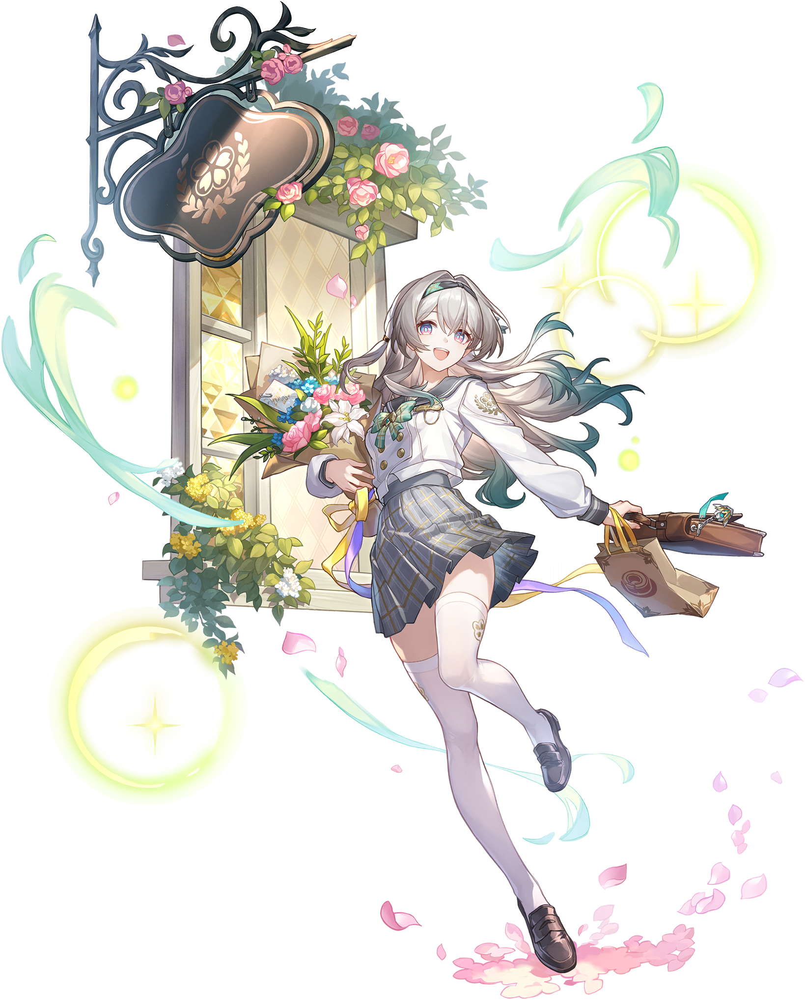

<!--
选定类型：G 视觉定位系列 · 名场面巡礼（第 1 期）
出图模式：模式一（单角色三连：同一角色，3 张姿势/角度/着装各不相同）
选定角色：流萤（崩坏星穹铁道）
选角理由：工作区已校对参考图可用（reference-registry 2026-10-01 登记）；角色气质适配"旅途/星海"类名场面（星核猎手设定×远方与归途意象）；三场景分别对应"海/天/夏"三种旅途维度，裂变维度互补。
系列约定：3:4 竖版统一比例；背景简洁强制条款生效；prompt 不写原作名，用构图描述还原名场面。
-->



> 参考图作用域（三条 prompt 通用）：`Referring to the attached artwork for character appearance only — hair color, hairstyle, eye color and facial features. Do not copy the outfit, pose, or composition of the reference.`
> 注：本系列不做名场面截图下载，构图/光线/色调由 prompt 构图描述还原（见 bible 溯源规则第 2 条）。

## 1. 海上列车·黄昏车窗（选题 001）

**背景场景**：复古绿皮列车车厢内部，黄昏时分，车窗外是一望无际的粼粼海面。构图极简：角色 + 车窗 + 海平线，无多余陈设。

**人物动作**：站在敞开的车窗边，单手轻搭窗框，另一手按住被海风掀起的草帽，银发随海风扬起，侧脸微笑望向海面。

**Positive Prompt**：
```
3:4 vertical portrait wallpaper, masterpiece anime-style illustration, iconic anime scene recreation, clean simple background, minimalist uncluttered composition, soft cinematic lighting, vivid film-like color grading, highly detailed, Firefly from Honkai: Star Rail, long silver-white hair with soft teal inner streaks, teal-green eyes, fair skin, slender figure, wearing a white sleeveless sundress with green ribbon accents, standing by the large open window of a vintage green train carriage at dusk, one hand resting lightly on the window frame, the other hand holding her straw hat against the sea breeze, perfect hands, five fingers on each hand, anatomically correct hands, well-defined fingers, silver hair flowing in the wind, gentle smile gazing at the sea, endless calm shimmering sea stretching to a single clean horizon line, warm golden dusk light streaming through the window, soft rim light on hair
```

**Negative Prompt**：
```
cluttered background, busy background, overly detailed background, stacked overlapping elements, excessive glowing particles, excessive bokeh, light clutter, messy composition, 3d render, photorealistic, western cartoon, low quality, worst quality, blurry, pixelated, bad anatomy, extra limbs, wrong hair color, wrong eye color, incorrect character, text, watermark, logo, signature, bad hands, extra fingers, fewer fingers, missing fingers, fused fingers, webbed fingers, merged fingers, overlapping fingers, deformed fingers, mutated fingers, six fingers, four fingers, three fingers, more than five fingers, less than five fingers, disfigured hands, poorly drawn hands, bad hand anatomy, asymmetrical hands, broken fingers, claw hands, blurry hands, indistinct fingers, smeared hands, missing legs, missing feet, missing calves, cropped legs, legs out of frame, twisted legs, rotated hips, dislocated hip, extra legs, third leg, fused legs, malformed knees, knees bending in opposite directions, disproportionate limbs, elongated calves, deformed feet
```

## 2. 黄昏石阶坡道·回望与彗星（选题 002）

**背景场景**：长长的石阶坡道向上延伸，深蓝紫色黄昏天空挂着一道彗星尾迹，坡道底端远处城市仅余几点微光。构图极简：石阶 + 天空 + 一道彗星。

**人物动作**：站在石阶中段回眸望向观者，双臂自然垂于身侧，微微扬起的下颌与平静而略带向往的眼神。

**Positive Prompt**：
```
3:4 vertical portrait wallpaper, masterpiece anime-style illustration, iconic anime scene recreation, clean simple background, minimalist uncluttered composition, soft cinematic lighting, vivid film-like color grading, highly detailed, Firefly from Honkai: Star Rail, long silver-white hair with soft teal inner streaks, teal-green eyes, fair skin, slender figure, wearing a navy sailor school uniform with pleated skirt, standing midway on a long stone stairway climbing a quiet hill at twilight, looking back over her shoulder toward the viewer, arms relaxed at her sides, natural hand pose, calm wistful expression with a hint of longing, deep blue-purple twilight sky with a single elegant comet trail above, only a few faint distant town lights far below the stairway, cool twilight ambient light with warm comet glow accent, soft cinematic contrast
```

**Negative Prompt**：
```
cluttered background, busy background, overly detailed background, stacked overlapping elements, excessive glowing particles, excessive bokeh, light clutter, messy composition, 3d render, photorealistic, western cartoon, low quality, worst quality, blurry, pixelated, bad anatomy, extra limbs, wrong hair color, wrong eye color, incorrect character, text, watermark, logo, signature, bad hands, extra fingers, fewer fingers, missing fingers, fused fingers, webbed fingers, merged fingers, overlapping fingers, deformed fingers, mutated fingers, six fingers, four fingers, three fingers, more than five fingers, less than five fingers, disfigured hands, poorly drawn hands, bad hand anatomy, asymmetrical hands, broken fingers, claw hands, blurry hands, indistinct fingers, smeared hands, missing legs, missing feet, missing calves, cropped legs, legs out of frame, twisted legs, rotated hips, dislocated hip, extra legs, third leg, fused legs, malformed knees, knees bending in opposite directions, unnatural sitting pose, disproportionate limbs, elongated calves, deformed feet
```

## 3. 夏日海边铁道口·电车掠过（选题 003）

**背景场景**：夏日海边铁道口，一辆绿白相间的电车正掠过背景（轻度动态模糊），身后是干净的海平线与积云一朵。构图极简：角色 + 遮断机 + 一辆电车 + 海。

**人物动作**：站在铁道口遮断机旁，单手提着帆布单肩包的背带，侧身面向观者，夏日晴空下的清爽笑容。

**Positive Prompt**：
```
3:4 vertical portrait wallpaper, masterpiece anime-style illustration, iconic anime scene recreation, clean simple background, minimalist uncluttered composition, soft cinematic lighting, vivid film-like color grading, highly detailed, Firefly from Honkai: Star Rail, long silver-white hair with soft teal inner streaks, teal-green eyes, fair skin, slender figure, wearing a pale yellow camisole blouse and white shorts, standing beside a seaside railway crossing, one hand holding the strap of her canvas shoulder bag, perfect hands, five fingers on each hand, anatomically correct hands, well-defined fingers, cheerful summer smile facing the viewer, a single green and cream train passing behind her in slight motion blur, calm blue sea with one clean horizon line and a single cumulus cloud, bright clear summer daylight, crisp shadows, refreshing coastal atmosphere
```

**Negative Prompt**：
```
cluttered background, busy background, overly detailed background, stacked overlapping elements, excessive glowing particles, excessive bokeh, light clutter, messy composition, 3d render, photorealistic, western cartoon, low quality, worst quality, blurry, pixelated, bad anatomy, extra limbs, wrong hair color, wrong eye color, incorrect character, text, watermark, logo, signature, bad hands, extra fingers, fewer fingers, missing fingers, fused fingers, webbed fingers, merged fingers, overlapping fingers, deformed fingers, mutated fingers, six fingers, four fingers, three fingers, more than five fingers, less than five fingers, disfigured hands, poorly drawn hands, bad hand anatomy, asymmetrical hands, broken fingers, claw hands, blurry hands, indistinct fingers, smeared hands, missing legs, missing feet, missing calves, cropped legs, legs out of frame, twisted legs, rotated hips, dislocated hip, extra legs, third leg, fused legs, malformed knees, knees bending in opposite directions, disproportionate limbs, elongated calves, deformed feet
```
