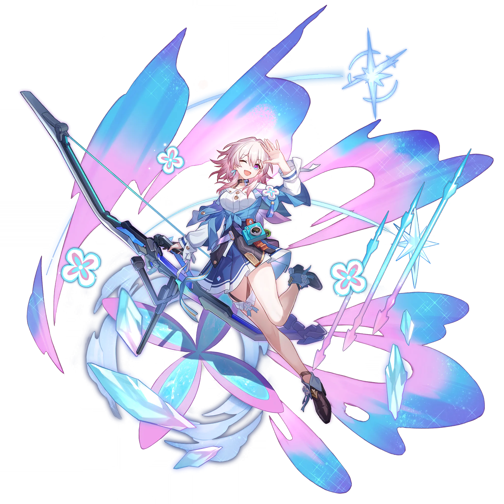

<!--
类型 G · 清纯风写真 · 第 1 期
模式：模式一（1 角色 × 固定场景固定构图固定光线，3 张为回眸姿势下的手部/视线细节变化）
选题：001 三月七 · JK西装制服
选角理由：矩阵第 1 期既定条目；三月七已有已校对参考图（开学季JK主题期入库），JK 制服与角色官方开学季形象高度契合，无年龄安全争议。
系列约定：场景 = 午后教室窗边 / 浅色简洁墙面 / 窗外绿意虚化（三不变逐字复用）；姿势 = 窗边半身回眸；光线 = 侧窗自然光；统一 3:4 竖版；尺度红线永久生效。
-->

## 参考图（已校对）



> 参考图作用域（三条 prompt 通用）：`Referring to the attached artwork for character appearance only — hair color, hairstyle, eye color and facial features. Do not copy the outfit, pose, or composition of the reference.`

---

## 1. 手扶窗框·回眸浅笑

**Positive Prompt**：

```
masterpiece anime-style illustration, clean simple background, minimalist uncluttered composition, standing by a classroom window in the afternoon, pale minimalist wall, softly blurred greenery outside the window, soft natural side window light, gentle warm tones, highly detailed, 3:4 vertical portrait wallpaper, a young girl with short pink-white hair with a small ahoge and pink-to-purple gradient eyes (March 7th from Honkai: Star Rail), half-body shot by the window, looking back over her shoulder toward the viewer with a soft smile, wearing a navy JK blazer uniform with a white shirt, red ribbon tie and pleated skirt, one hand resting lightly on the window frame
```

**Negative Prompt**：

```
cluttered background, busy background, overly detailed background, stacked overlapping elements, excessive glowing particles, excessive bokeh, light clutter, messy composition, lowres, bad anatomy, deformed, disfigured, mutation, blurry, jpeg artifacts, watermark, signature, text, logo, worst quality, low quality, bad hands, extra fingers, missing fingers, fused fingers, too many fingers, mutated hands, malformed hands, deformed hands, extra digits, fewer digits, bad legs, extra legs, missing legs, fused legs, deformed legs, mutated legs, malformed feet, extra feet, missing feet
```

---

## 2. 怀抱课本·视线望向窗外

**Positive Prompt**：

```
masterpiece anime-style illustration, clean simple background, minimalist uncluttered composition, standing by a classroom window in the afternoon, pale minimalist wall, softly blurred greenery outside the window, soft natural side window light, gentle warm tones, highly detailed, 3:4 vertical portrait wallpaper, a young girl with short pink-white hair with a small ahoge and pink-to-purple gradient eyes (March 7th from Honkai: Star Rail), half-body shot by the window, looking back over her shoulder with her gaze drifting toward the window light, wearing a navy JK blazer uniform with a white shirt, red ribbon tie and pleated skirt, both arms hugging two textbooks gently against her chest
```

**Negative Prompt**：

```
cluttered background, busy background, overly detailed background, stacked overlapping elements, excessive glowing particles, excessive bokeh, light clutter, messy composition, lowres, bad anatomy, deformed, disfigured, mutation, blurry, jpeg artifacts, watermark, signature, text, logo, worst quality, low quality, bad hands, extra fingers, missing fingers, fused fingers, too many fingers, mutated hands, malformed hands, deformed hands, extra digits, fewer digits, bad legs, extra legs, missing legs, fused legs, deformed legs, mutated legs, malformed feet, extra feet, missing feet
```

---

## 3. 手别耳侧发丝·微露讶异

**Positive Prompt**：

```
masterpiece anime-style illustration, clean simple background, minimalist uncluttered composition, standing by a classroom window in the afternoon, pale minimalist wall, softly blurred greenery outside the window, soft natural side window light, gentle warm tones, highly detailed, 3:4 vertical portrait wallpaper, a young girl with short pink-white hair with a small ahoge and pink-to-purple gradient eyes (March 7th from Honkai: Star Rail), half-body shot by the window, looking back over her shoulder with a slightly surprised gentle expression, wearing a navy JK blazer uniform with a white shirt, red ribbon tie and pleated skirt, one hand lightly tucking a strand of hair beside her ear
```

**Negative Prompt**：

```
cluttered background, busy background, overly detailed background, stacked overlapping elements, excessive glowing particles, excessive bokeh, light clutter, messy composition, lowres, bad anatomy, deformed, disfigured, mutation, blurry, jpeg artifacts, watermark, signature, text, logo, worst quality, low quality, bad hands, extra fingers, missing fingers, fused fingers, too many fingers, mutated hands, malformed hands, deformed hands, extra digits, fewer digits, bad legs, extra legs, missing legs, fused legs, deformed legs, mutated legs, malformed feet, extra feet, missing feet
```
